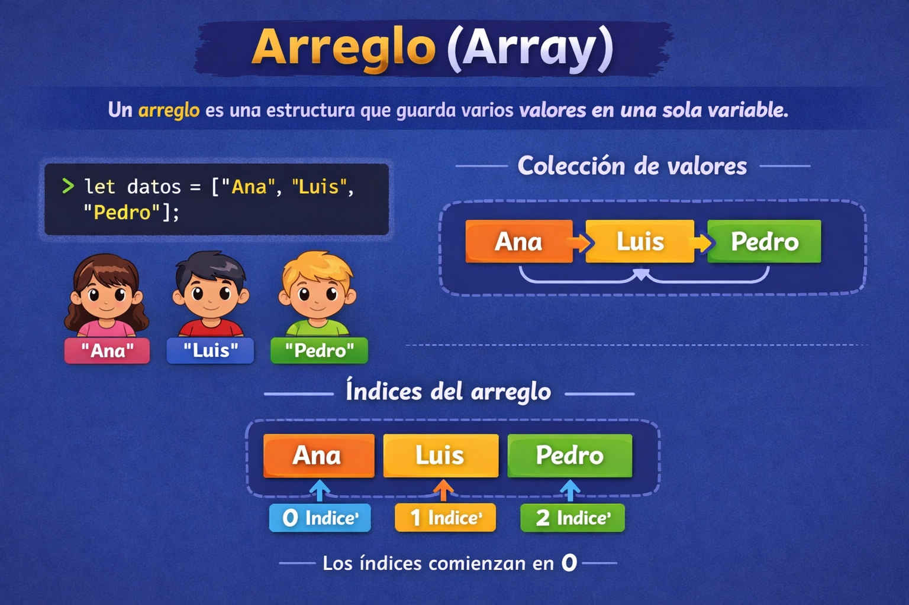
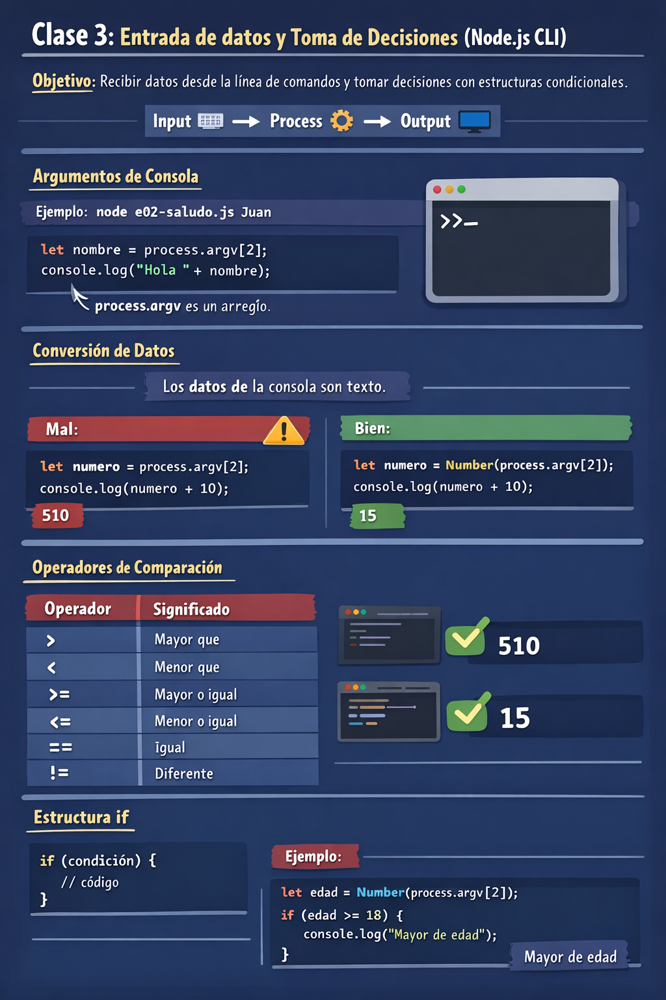

🏠 [← README](../../../README.md) · ⬅️ [← Clase 2](../Clase%2002/resumen.md)

---

# Clase 3 — Entrada de datos y toma de decisiones (Node.js CLI)
**Fecha:** 18 de marzo  
**Duración total:** 2 horas (1 hr revisión + 1 hr contenido)

---

## 🎯 Objetivo de la sesión

Que el alumno comprenda cómo recibir datos desde la línea de comandos y utilizarlos para tomar decisiones mediante estructuras condicionales.

Se introduce el flujo fundamental de la programación:

    Input ⌨️ → Process ⚙️ → Output 🖥️

y se integra con:

- argumentos de consola (`process.argv`)
- operadores de comparación
- estructura `if`

---

# ⏱️ Estructura de la clase

## 📊 Resumen de distribución del tiempo

| Tema | Tiempo |
|-----|------|
| Revisión de exámenes | 60 min |
| Flujo de programación | 10 min |
| Argumentos en línea de comandos | 15 min |
| Conversión de datos con `Number()` | 10 min |
| Operadores de comparación | 10 min |
| Estructura `if` | 15 min |

---

## 📝 Revisión de exámenes

`⏱️ Tiempo 60 min`

- Entrega de resultados
- Retroalimentación general

---

## 🔄 Flujo de programación

`⏱️ Tiempo 10 min`

### 🧪 Ejemplo
`clase-03/e01-flujo-basico.js:`
```js
let numero = 5;
let resultado = numero + 10;
console.log(resultado);
```

---

## 💻 Argumentos en línea de comandos

`⏱️ Tiempo 15 min`

### 🧩 Concepto previo: Arreglo (Array)

```js
let datos = ["Ana", "Luis", "Pedro"];
```

<div align="center">
  
</div>

### 📌 Relación con `process.argv`

`clase-03/e02-saludo.js:`
```js
console.log(process.argv);
```

### 🧪 Ejemplo

`clase-03/e02-saludo.js:`
```js
let nombre = process.argv[2];
console.log("Hola " + nombre);
```

---

## 🔢 Conversión de datos con `Number()`

`⏱️ Tiempo 10 min`

### ❌ Ejemplo sin conversión

`clase-03/e03-error-suma.js:`
```js
let numero = process.argv[2];
console.log(numero + 10);
```

---

### ✅ Ejemplo correcto

`clase-03/e04-suma-correcta.js:`
```js
let numero = Number(process.argv[2]);
console.log(numero + 10);
```

---

### ⚠️ Errores comunes

#### Concatenación

`clase-03/e05-error-concatenacion.js:`
```js
let n = process.argv[2];
console.log(n + 1);
```

#### Valor inválido

`clase-03/e06-numero-invalido.js:`
```js
let n = Number(process.argv[2]);
console.log(n);
```

---

## 🔢 Operadores de comparación

`⏱️ Tiempo 10 min`

`clase-03/e07-operadores-comparacion.js:`
```js
console.log(10 > 5);
console.log(3 < 1);
console.log(8 == 8);
console.log(4 != 4);
```

---

## ⚙️ Estructura `if`

`⏱️ Tiempo 15 min`

`clase-03/e08-mayor-edad.js:`
```js
let edad = Number(process.argv[2]);

if (edad >= 18) {
  console.log("Mayor de edad");
}
```

---

# 🧪 Ejercicios demostrativos

`clase-03/e09-numero-positivo.js:`
```js
let numero = Number(process.argv[2]);

if (numero > 0) {
  console.log("Número positivo");
}
```

---

`clase-03/e10-puede-votar.js:`
```js
let edad = Number(process.argv[2]);

if (edad >= 18) {
  console.log("Puede votar");
}
```

---

`clase-03/e11-puede-comprar.js:`
```js
let dinero = Number(process.argv[2]);

if (dinero > 0) {
  console.log("Puede comprar");
}
```

---

# Ejercicios 

[Ejercicios](ejercicios.md)

# Resumen
<div align="center">
  
</div>

---

# 🚀 Siguiente sesión

- `if` + `else`
- operadores lógicos
- múltiples condiciones
- validación de datos

---

🏠 [← README](../../../README.md) · ⬅️ [← Clase 2](../Clase%2002/resumen.md)
