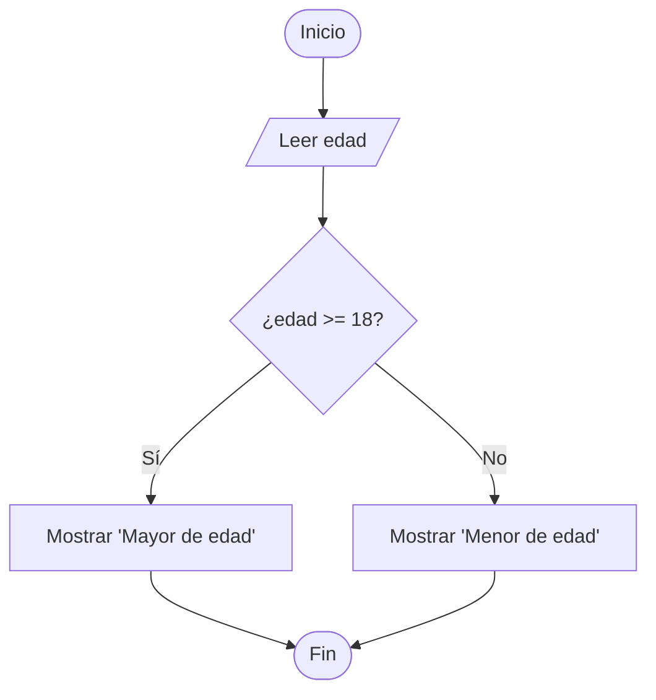
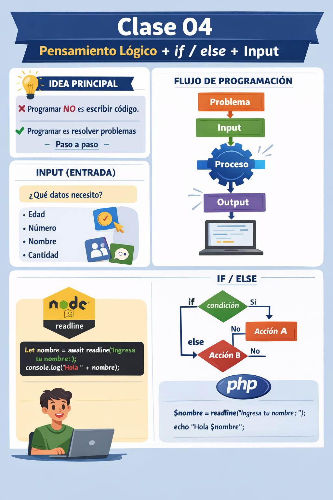

🏠 [← README](../../../README.md) · ⬅️ [← Clase 03](../clase%2003/resumen.md) · Clase 04 · [Clase 05 →](../clase%2005/resumen.md) ➡️ · 🧪 [Ejercicios](ejercicios.md)

---

# Clase 4 — Pensamiento lógico, `if / else` y entrada de datos (JS + PHP CLI)
**Fecha:** 20-marzo-2026  
**Duración total:** 2 horas  
**Modalidad:** 1 hr aula + 1 hr laboratorio (sesión extendida)

---

# 🎯 Objetivo de la sesión

Que el alumno:

- comprenda que programar implica seguir un proceso lógico;
- identifique claramente:
  - **Input (entrada)**
  - **Process (proceso)**
  - **Output (salida)**
- utilice estructuras de decisión con `if / else`;
- desarrolle la capacidad de resolver problemas antes de escribir código;
- construya soluciones en:
  - **JavaScript (Node.js CLI)**
  - **PHP CLI**

---

# 🧠 Enfoque de la clase

En esta sesión se cambia la forma de trabajar:

> ❌ No empezar con código  
> ✅ Empezar con el problema

Se introduce el flujo:

Problema → Input → Process → Output → Código

y se refuerza con:

```text
📌 Problema → 📥 Input → ⚙️ Process → 📤 Output
      ↓
      Algoritmo
            ↓
        Diagrama 🔷
              ↓
        Pseudocódigo 🧠 
                ↓
              Código 💻
```

---
## 📂 Ubicación de archivos base

Ubicacion y estructura recomendada para las practicas:

En la unidad C: crear la siguiente estructura de carpetas

```text
adminitracion-de-basesdedatos/
└── relacional/
    └── libs/
    └── clase-01/
    └── clase-02/
    └── clase-03/
    └── clase-03/
└── no-relacionales
    └── libs/
    └── clase-01/
    └── clase-02/
    └── clase-03/
    └── clase-03/
```

---

# 📥 Entrada de datos en JavaScript (readline)

Antes de comenzar con la lógica, se introduce cómo leer datos desde el teclado en Node.js.

Se utilizará una función personalizada llamada `readline`. **En este momento no nos interesa comprender el código de esta

solo entender que como usarla cuando necesitemos que el usuario no de un dato mediante la consola

---

## 📄 Archivo: `readline.js`

```js
const rl = require("readline");

function readline() {
  const interfaz = rl.createInterface({
    input: process.stdin,
    output: process.stdout
  });

  return new Promise((resolve) => {
    interfaz.question("", (respuesta) => {
      interfaz.close();
      resolve(respuesta);
    });
  });
}

module.exports = readline;
```

---

Para usarlo deberemos crear nuestros siguiendo el siguiente template:

## 📄 Archivo: `template.js`

Este archivo será la base para todos los ejercicios.

```js
const readline = require("./readline");

(async () => {

  // =========================
  // ESCRIBE TU CÓDIGO AQUÍ
  // =========================

})();
```

---

## ⚠️ Nota sobre el template

Las líneas `(async () => {` y `})();` son parte del template que permite usar `readline`.  
**No necesitas entender cómo funcionan por ahora** — solo úsalas como envoltorio de tu código.

> Si alguna vez ves un error que menciona la palabra **`Promise`**, no es un problema dentro de tu lógica.  
> Revisa que tu código esté correctamente escrito **dentro** del bloque, entre los comentarios del template.

---

## 📄 Archivo: `hola.js`

para leer un dato desde teclado en Js ahora podremos hacer lo siguiente 

```js
let dato = await readline("Escribe un valor: ");
```

Ejemplo básico de uso:

```js
const readline = require("../libs/readline");

(async () => {
  let nombre = await readline("Ingresa tu nombre: ");

  console.log("Hola " + nombre);
})();
```

---

# 📁 Organización del repositorio

Coloca los archivos anteriores en las siguientes carpetas:

```text
adminitracion-de-basesdedatos/
└── no-relacionales
    └── tempalte.js
    └── libs/
        └── readline.js 
    └── clase-01/
    └── clase-02/
    └── clase-03/

## 📌 Regla de nombres

Nombre de las practicas, en las practicas se recomendará ese nombre, usalo, para mantener un orden en tus practicas al final 
se hara un recopilado de todas nuestras practicas usa ese nombre y guárdalo en la clase que corresponda, evita mezclarlos y tener tus practicas desordenadas.

se recomienda usar el formato

```text
palabra-palabra
```

Ejemplo:

```text
base-de-datos
no-relacional
clase-04
```

---

## ⚠️ Evitar espacios

Incorrecto:

```text
base de datos
```

Correcto:

```text
base-de-datos
```

---

## ⚠️ ¿Por qué?

Porque en la terminal se tendría que escribir:

```bash
cd "base de datos"
```

```bash
cd base\ de\ datos
```

En cambio:

```bash
cd base-de-datos
```

---


# 🟡 1. Introducción (10 min)

💬 Mensaje clave:

“Un buen programador no empieza escribiendo código,  
empieza entendiendo el problema.”

---

# 🟠 2. Modelo de resolución (15 min)

## 📌 Problema

👉 Preguntas clave:

- ¿Qué me están pidiendo resolver?
- ¿Cuál es la situación?
- ¿Qué resultado esperan?

---

## 📥 Input (entrada)

👉 Preguntas clave:

- ¿Qué datos necesita el programa?
- ¿Qué información va a ingresar el usuario?
- ¿Cuántos datos necesito?

Ejemplos:
- edad
- número
- nombre
- cantidad

---

## ⚙️ Process (proceso)

👉 Preguntas clave:

- ¿Qué tengo que hacer con esos datos?
- ¿Qué comparación debo realizar?
- ¿Hay una decisión que tomar?

Ejemplos:
- comparar
- validar
- decidir

---

## 📤 Output (salida)

👉 Preguntas clave:

- ¿Qué debe mostrar el programa?
- ¿Qué mensaje debe aparecer?
- ¿Cuántos posibles resultados hay?

Ejemplos:
- "Aprobado"
- "Acceso denegado"
- "Número par"

---

## 🔀 Decisión (`if / else`)

👉 Preguntas clave:

- ¿Cuál es la condición?
- ¿Qué pasa si se cumple?
- ¿Qué pasa si no se cumple?

```js
if (condicion) {
  // si se cumple
} else {
  // si no se cumple
}
```

---

# 🔵 3. Ejercicio guiado (20 min)

## 📌 Problema
Determinar si una persona es mayor de edad.

👉 Preguntas clave:

- ¿Qué me están pidiendo?
- ¿Qué decisión debo tomar?

---

## 📥 Input
Edad

👉 Preguntas clave:

- ¿Qué dato necesito?
- ¿Quién lo proporciona?

---

## 📤 Output
"Mayor de edad" o "Menor de edad"

👉 Preguntas clave:

- ¿Qué resultados posibles hay?
- ¿Cuántos mensajes voy a mostrar?

---

## ⚙️ Process

👉 Preguntas clave:

- ¿Qué comparación debo hacer?

Respuesta:

edad >= 18

---

## 🔷 Diagrama de flujo



---

## 🧠 Pseudocódigo

```text
leer edad

si edad >= 18 entonces
    mostrar "Mayor de edad"
si no
    mostrar "Menor de edad"
fin si
```

---

## 💻 Código en JavaScript

```js
const readline = require("./readline");

(async () => {
  // leer edad
  let edad = Number(await readline("Ingresa tu edad: "));

  // si edad >= 18 entonces
  if (edad >= 18) {
    // mostrar "Mayor de edad"
    console.log("Mayor de edad");
  } else {
    // mostrar "Menor de edad"
    console.log("Menor de edad");
  }
  //fin si
  
})();
```

---

## 💻 Código en PHP

```php
<?php

$edad = (int) readline("Ingresa tu edad: ");

if ($edad >= 18) {
    echo "Mayor de edad";
} else {
    echo "Menor de edad";
}
```

---

# 🟣 4. Práctica individual (60 min)

## 📌 Instrucciones

Cada alumno resolverá **un solo problema** siguiendo el proceso completo.

---

## 🚫 Reglas

- trabajo individual;
- no se permite copiar;
- no escribir código sin pseudocódigo;
- el docente valida antes de pasar a código.

---

## 📄 Estructura obligatoria

1. Problema  
2. Input  
3. Output  
4. Diagrama de flujo  
5. Pseudocódigo  
6. Código en JavaScript  
7. Código en PHP  

---

## 🧠 Preguntas guía (usar en TODOS los ejercicios)

Antes de programar, el alumno debe responder:

- ¿Qué me están pidiendo?
- ¿Qué datos necesito?
- ¿Qué decisión debo tomar?
- ¿Cuál es la condición?
- ¿Qué pasa si se cumple?
- ¿Qué pasa si no se cumple?
- ¿Qué voy a mostrar?

---

## 🧩 Problemas disponibles

### Problema 1 — Acceso al sistema
Recibir la edad de una persona.

- Si la edad es mayor o igual a 18 mostrar:
  "Acceso permitido"
- En caso contrario mostrar:
  "Acceso denegado"

---

### Problema 2 — Compra con promoción
Recibir el monto de una compra.

- Si el monto es mayor o igual a 100 mostrar:
  "Aplica promoción"
- En caso contrario mostrar:
  "No aplica promoción"

---

### Problema 3 — Número par o impar
Recibir un número entero.

- Si el número es divisible entre 2 mostrar:
  "Número par"
- En caso contrario mostrar:
  "Número impar"

---

### Problema 4 — Validación de usuario
Recibir un nombre de usuario.

- Si el usuario es igual a "admin" mostrar:
  "Acceso correcto"
- En caso contrario mostrar:
  "Acceso incorrecto"

---

### Problema 5 — Comparación de números
Recibir dos números.

- Si el primer número es mayor que el segundo mostrar:
  "El primer número es mayor"
- En caso contrario mostrar:
  "El segundo número es mayor o son iguales"

---

### Problema 6 — División segura
Recibir dos números.

- Si el segundo número es igual a 0 mostrar:
  "No se puede dividir entre cero"
- En caso contrario mostrar:
  "División posible"

---

### Problema 7 — Control de velocidad
Recibir una velocidad.

- Si la velocidad es mayor a 80 mostrar:
  "Exceso de velocidad"
- En caso contrario mostrar:
  "Velocidad permitida"

---

### Problema 8 — Asistencia
Recibir el porcentaje de asistencia.

- Si es mayor o igual a 80 mostrar:
  "Asistencia suficiente"
- En caso contrario mostrar:
  "Asistencia insuficiente"

---

# 🟢 5. Cierre (15 min)

- resolución de ejercicios en pizarrón;
- retroalimentación general.

---

# ✅ Resultado esperado

El alumno será capaz de:

- analizar un problema antes de programar;
- tomar decisiones con `if / else`;
- estructurar soluciones paso a paso;
- trasladar lógica a código.

---

# 📌 Observación didáctica

El objetivo principal es desarrollar la capacidad de pensar:

1. entender el problema;
2. estructurar la solución;
3. traducirla a código.


#Resumen 




# Ejercicios

[Ejercicios](ejercicios.md)


🏠 [← README](../../../README.md) · ⬅️ [← Clase 03](../clase%2003/resumen.md) · Clase 04 · [Clase 05 →](../clase%2005/resumen.md) ➡️ · 🧪 [Ejercicios](ejercicios.md)