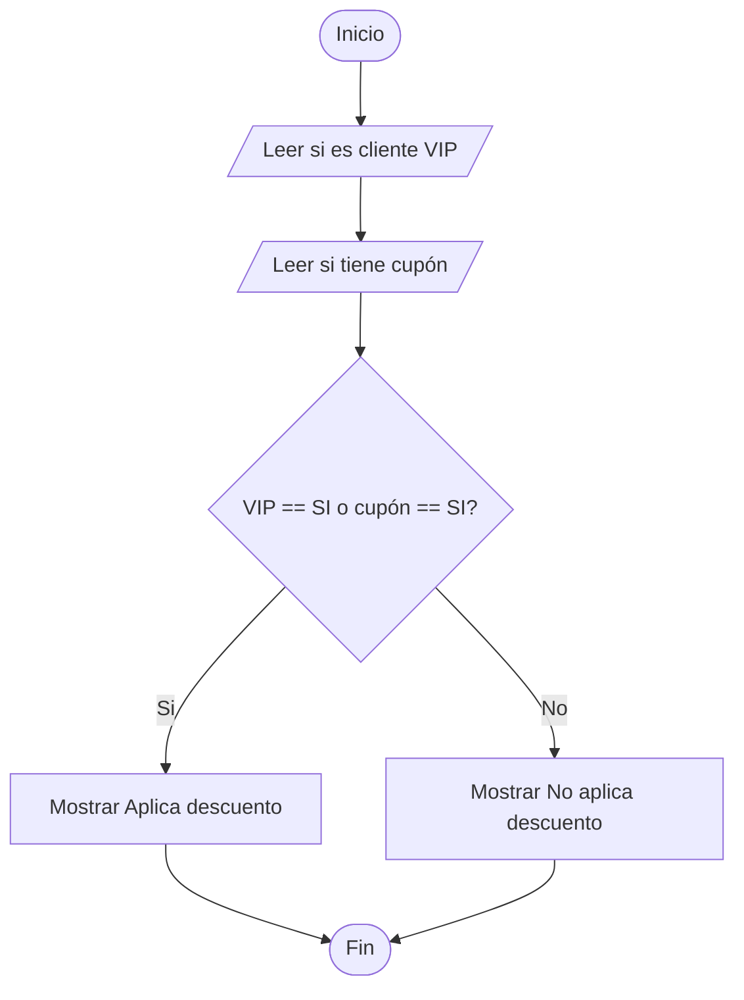
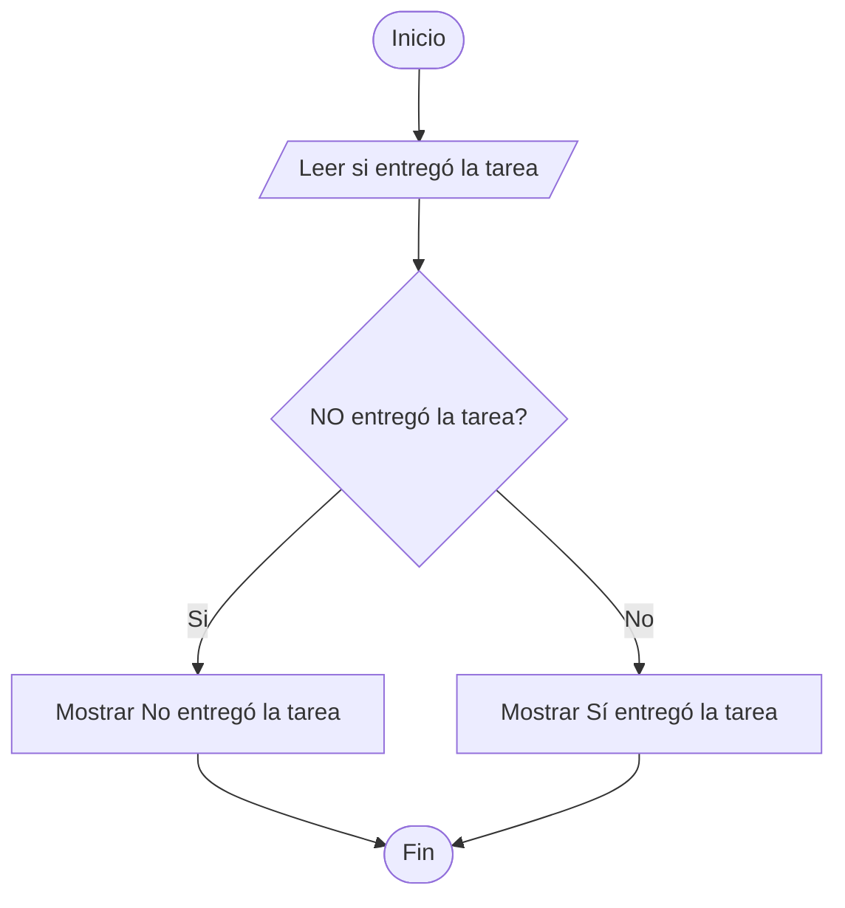
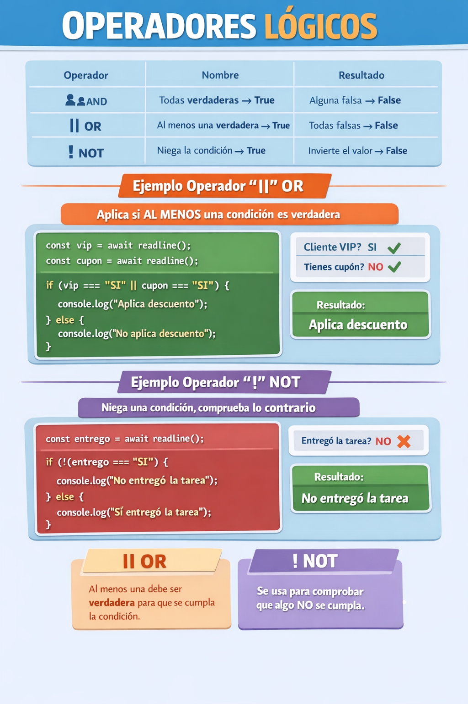

🏠 [← README](../../../README.md) · ⬅️ [← Clase 10](../clase%2010/resumen.md) · 🧪 [Ejercicios](ejercicios.md)

---
# Clase 06 Operadores lógicos, operador `||` or y `!` not

**Fecha:** 25-marzo-2026  
**Materia:** Bases de datos NO relacionales  

---

# 🎯 Objetivo del tema

- Aprender a **combinar condiciones** usando los operadores lógicos or y not dentro de estructuras `if / else`.
  
---

# 🔗 Operadores lógicos

Los operadores lógicos son símbolos que se utilizan para combinar o modificar condiciones en una expresión.

Sirven para evaluar más de una condición al mismo tiempo y obtener como resultado un valor:

- `true (verdadero)`  
- `false (falso)`

| Operador | Nombre   | Evalúa                               | Resultado | Evalúa                             | Resultado |
|----------|----------|--------------------------------------|-----------|------------------------------------|-----------|
| `&&`     | AND (Y)  | Todas las condiciones son verdaderas | **true**  | Al menos una condición es falsa    | **false** |
| `||`     | OR (O)   | Al menos una condición es verdadera  | **true**  | Todas las condiciones son falsas   | **false** |
| `!`      | NOT (NO) | La condición original es falsa       | **true**  | La condición original es verdadera | **false** |

---

# Operador Lógico `||` — OR (O lógico)

OR resulta en verdadero cuando **al menos una condición** es verdadera; de lo contrario, resulta en falso.

|            |      |            |   |            |
|------------|------|------------|---|------------|
| verdadero  | `||` | verdadero  | = | verdadero  |
| verdadero  | `||` | falso      | = | verdadero  |
| falso      | `||` | falso      | = | falso      |

---

## Ejemplo en código JavaScript

```js
const readline = require('../libs/readline');

(async () => {
    
    console.log("¿Eres cliente VIP? (SI/NO)");
    const vip = await readline();

    console.log("¿Tienes cupón de descuento? (SI/NO)");
    const cupon = await readline();

    if (vip === "SI" || cupon === "SI") {
        console.log("Aplica descuento");
    } else {
        console.log("No aplica descuento");
    }

})();
```

---

# 🧩 Tipo de problemas que resuelve el operador `!` NOT

Cuando necesitamos **negar** una condición, es decir, comprobar que algo **no** se cumple.

Ejemplos:

- validar ausencia de una condición
  - no tener acceso
  - no haber iniciado sesión
- detectar lo contrario de un estado
  - no estar activo
  - no estar disponible
- comprobar que algo falta
  - no entregar tarea
  - no presentar identificación
- restringir acciones
  - no tener permiso
  - no aceptar términos

---

# 🧪 Desarrollo del ejemplo `||` OR

## Enunciado del problema

Crear un programa que solicite:

- si es cliente VIP
- si tiene cupón

Si el cliente es `"SI"` o tiene cupón `"SI"`, debe mostrar:

```text
Aplica descuento
```

En caso contrario, debe mostrar:

```text
No aplica descuento
```

---

## Algoritmo

1. Inicio  
2. Pedir si es cliente VIP  
3. Guardar la respuesta  
4. Pedir si tiene cupón  
5. Guardar la respuesta  
6. Comparar si es cliente VIP `"SI"` o si tiene cupón `"SI"`  
7. Si al menos una condición es verdadera, mostrar `"Aplica descuento"`  
8. En caso contrario, mostrar `"No aplica descuento"`  
9. Fin  

---

## Diagrama de flujo



---

## Pseudocódigo

```text
Inicio

  Escribir "¿Es cliente VIP?"
  Leer vip

  Escribir "¿Tiene cupón?"
  Leer cupon

  Si vip = "SI" O cupon = "SI" Entonces
      Escribir "Aplica descuento"
  SiNo
      Escribir "No aplica descuento"
  FinSi

Fin
```

---

## Código en JavaScript CLI

```js
const readline = require('../libs/readline');

(async () => {
    
    console.log("¿Es cliente VIP? (SI/NO)");
    const vip = await readline();

    console.log("¿Tiene cupón? (SI/NO)");
    const cupon = await readline();

    if (vip === "SI" || cupon === "SI") {
        console.log("Aplica descuento");
    } else {
        console.log("No aplica descuento");
    }

})();
```

---

# 📌 Conclusión or

El operador `||` permite tomar decisiones cuando existen varias opciones posibles.

Se utiliza cuando basta con que **al menos una condición** sea verdadera para que la acción se cumpla.

---

# Operador lógico `!` — NOT (No lógico)

Se utiliza para **negar** una condición.

|   |           |             |
|---|-----------|-------------|
| ! | verdadero | = falso     |
| ! | falso     | = verdadero |

---

## Ejemplo en código JavaScript

```js
const readline = require('../libs/readline');

(async () => {
    
    console.log("¿El alumno entregó la tarea? (SI/NO)");
    const entrego = await readline();

    if (!(entrego === "SI")) {
        console.log("No entregó la tarea");
    } else {
        console.log("Sí entregó la tarea");
    }

})();
```

---

# 🧪 Desarrollo del ejemplo `!` NOT

## Enunciado del problema

Crear un programa que solicite:

- si el alumno entregó la tarea

Si el alumno **no** entregó la tarea, debe mostrar:

```text
No entregó la tarea
```

En caso contrario, debe mostrar:

```text
Sí entregó la tarea
```

---

## Algoritmo

1. Inicio  
2. Pedir si el alumno entregó la tarea  
3. Guardar la respuesta  
4. Comparar si **no** entregó la tarea  
5. Si la condición es verdadera, mostrar `"No entregó la tarea"`  
6. En caso contrario, mostrar `"Sí entregó la tarea"`  
7. Fin  

---

## Diagrama de flujo



---

## Pseudocódigo

```text
Inicio

  Escribir "¿Entregó la tarea?"
  Leer entrego

  Si NO (entrego = "SI") Entonces
      Escribir "No entregó la tarea"
  SiNo
      Escribir "Sí entregó la tarea"
  FinSi

Fin
```

---

## Código en JavaScript CLI

```js
const readline = require('../libs/readline');

(async () => {
    
    console.log("¿Entregó la tarea? (SI/NO)");
    const entrego = await readline();

    if (!(entrego === "SI")) {
        console.log("No entregó la tarea");
    } else {
        console.log("Sí entregó la tarea");
    }

})();
```

---

# 📌 Conclusión not

El operador `!` permite negar una condición y evaluar su contrario.

Se utiliza cuando necesitamos comprobar que algo **no** se cumple, invirtiendo el valor de una expresión lógica.

---

# RESUMEN



# Ejercicios/Practicas

[Ejercicios](ejercicios.md)   
[Investigación](investigacion.md)  

🏠 [← README](../../../README.md) · ⬅️ [← Clase 11](../clase%2011/resumen.md)
