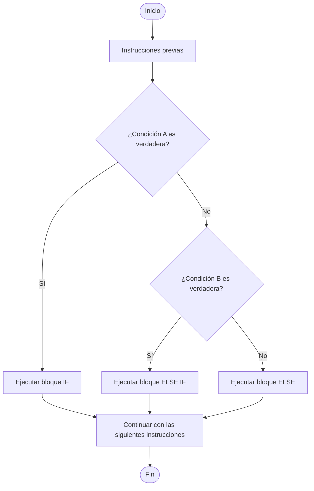
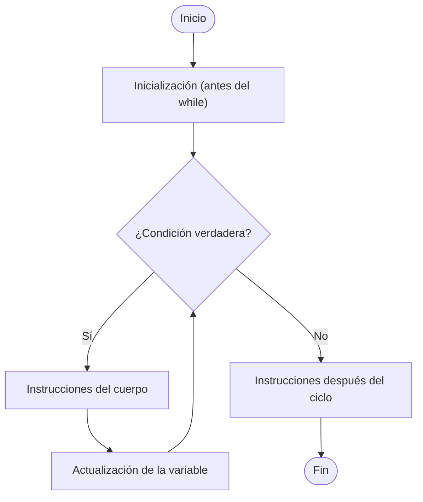
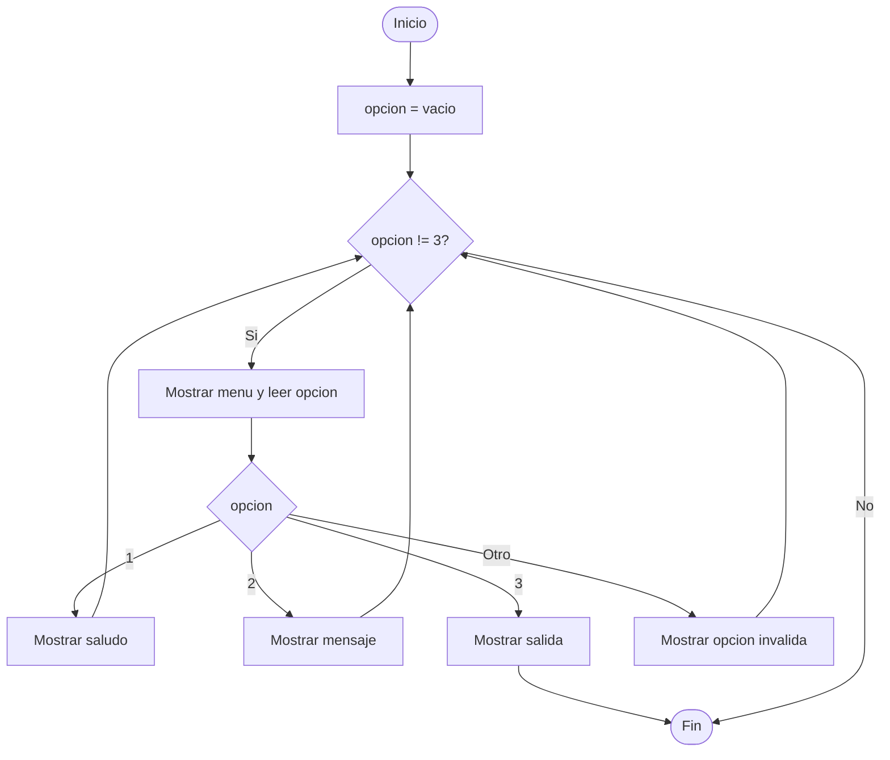

🏠 [← README](../../../README.md) · ⬅️ [← Clase 06](../clase%2006/resumen.md) · Clase 07 · [Clase 08 →](../clase%2008/resumen.md) ➡️ · 🧪 [Ejercicios](ejercicios.md)

---
# Clase 07 - if / else if / else y ciclo while en JavaScript

**Fecha:** 13-abril-2026  
**Materia:** Bases de datos NO relacionales

---

# 🎯 Objetivo del tema

- Comprender cuándo usar `if / else if / else` en lugar de un `if / else` simple.
- Aplicar el ciclo `while` para repetir procesos controlados por condición.
- Integrar decisiones y repeticiones para resolver problemas más cercanos a casos reales.

---

# 🧠 Idea clave

En programación no siempre hay solo dos caminos (sí/no).  
Muchas veces debemos evaluar **varias condiciones** y también **repetir** un proceso hasta cumplir un criterio de salida.

---

# 1) Estructura `if / else if / else`

Se usa cuando existen varias rutas posibles.

## Sintaxis

```js
if (condicion1) {
	// bloque 1
} else if (condicion2) {
	// bloque 2
} else if (condicion3) {
	// bloque 3
} else {
	// bloque por defecto
}
```

## Ejemplo en JavaScript CLI

```js
const readline = require('../libs/readline');

(async () => {
	console.log('Ingresa tu calificación (0-10):');
	const entrada = await readline();
	const calificacion = Number(entrada);

	if (calificacion >= 9) {
		console.log('Excelente');
	} else if (calificacion >= 8) {
		console.log('Muy bien');
	} else if (calificacion >= 6) {
		console.log('Aprobado');
	} else {
		console.log('Reprobado');
	}
})();
```

Diagrama de flujo



---

# 2) Estructuras de ciclo (bucles)

Una **estructura de ciclo** (también llamada **bucle** o **loop**) permite ejecutar un bloque de instrucciones **más de una vez** sin tener que escribirlas repetidamente.

## ¿Por qué existen?

Sin ciclos, si quisiera mostrar los números del 1 al 100 tendría que escribir 100 líneas de `console.log`. Con un ciclo basta con escribir el bloque una vez y decirle cuántas veces repetirlo.

## ¿Cuándo usar un ciclo?

Siempre que en el problema aparezcan frases como:

- *"para cada uno de los alumnos…"*
- *"mientras no ingrese 0…"*
- *"repetir hasta que acierte…"*
- *"sumar los N valores capturados…"*

## Tipos de ciclo en JavaScript

| Ciclo | Cuándo usarlo |
|-------|---------------|
| `while` | Cuando **no sabes** cuántas veces se repetirá (depende de una condición) |
| `for` | Cuando **sí sabes** exactamente cuántas veces se repetirá (tema de clase 08) |

## Partes de cualquier ciclo

Todo ciclo tiene tres responsabilidades:

1. **Inicialización** — preparar la variable que controla el ciclo antes de iniciarlo.
2. **Condición** — la pregunta que se evalúa antes de cada repetición; si es `false`, el ciclo termina.
3. **Actualización** — modificar la variable de control dentro del cuerpo del ciclo para que en algún momento la condición sea `false`.

Si la actualización se omite, la condición nunca cambia y el ciclo se repite sin fin: eso se llama **ciclo infinito** y congela el programa.

---

# 3) Ciclo `while`

`while` evalúa la condición **antes** de cada repetición. Si la condición es `true`, ejecuta el cuerpo; si es `false`, sale del ciclo.

## Sintaxis

```js
while (condicion) {
	// instrucciones que se repiten
}
```

## Partes del `while`

```js
let contador = 1;              // 1. Inicialización (fuera del while)

while (contador <= 5) {        // 2. Condición
	console.log(contador);     //    Cuerpo del ciclo
	contador = contador + 1;   // 3. Actualización (dentro del while)
}
```

## Diagrama de flujo



## ⚠️ Ciclo infinito

Si dentro del `while` no se actualiza la variable de control, la condición siempre será `true` y el programa nunca termina.

```js
// ❌ ESTO ES UN CICLO INFINITO — no ejecutar
let contador = 1;
while (contador <= 5) {
	console.log(contador);
	// falta: contador = contador + 1;
}
```

Para detener un programa colgado en la terminal: presionar `Ctrl + C`.

## Ejemplo en JavaScript CLI

```js
const readline = require('../libs/readline');

(async () => {
	console.log('Ingresa el límite:');
	const entrada = await readline();
	const limite = Number(entrada);

	let contador = 1;                        // 1. Inicialización

	while (contador <= limite) {             // 2. Condición
		console.log('Numero:', contador);    //    Cuerpo
		contador = contador + 1;             // 3. Actualización
	}
})();
```

---

# 🧪 Desarrollo de ejemplo integrador

## Enunciado

Crear un menú que se repita hasta que el usuario elija salir.

- opción 1: saludar
- opción 2: mostrar mensaje
- opción 3: salir

## Algoritmo

1. Inicio.
2. Definir opción vacía.
3. Mientras opción sea distinta de "3":
4. Mostrar menú.
5. Leer opción.
6. Evaluar con `if / else if / else`.
7. Si opción es "3", terminar ciclo.
8. Fin.

## Diagrama de flujo



## Pseudocódigo

```text
Inicio

	opcion <- ""

	Mientras opcion <> "3" Hacer
		Escribir "1) Saludar"
		Escribir "2) Mensaje"
		Escribir "3) Salir"
		Leer opcion

		Si opcion = "1" Entonces
			Escribir "Hola"
		SiNo Si opcion = "2" Entonces
			Escribir "Sigue practicando"
		SiNo Si opcion = "3" Entonces
			Escribir "Hasta luego"
		SiNo
			Escribir "Opcion invalida"
		FinSi
	FinMientras

Fin
```

## Código JavaScript CLI

```js
const readline = require('../libs/readline');

(async () => {
	let opcion = '';

	while (opcion !== '3') {
		console.log('\nMENU');
		console.log('1) Saludar');
		console.log('2) Mensaje');
		console.log('3) Salir');
		console.log('Elige una opcion:');
		opcion = await readline();

		if (opcion === '1') {
			console.log('Hola, bienvenida/o');
		} else if (opcion === '2') {
			console.log('Sigue practicando, vas bien');
		} else if (opcion === '3') {
			console.log('Hasta luego');
		} else {
			console.log('Opcion invalida');
		}
	}
})();
```


---

# 🚀 Enunciados extra de práctica (adelanto)

> Estos enunciados son opcionales para alumnos que quieran practicar más. No forman parte de la lista de `ejercicios.md`.

## 5 enunciados para `if / else if / else`

1. **Nivel de alerta por calidad del aire**
Leer un valor de calidad del aire (AQI).
- Si AQI >= 151: mostrar `Alerta roja`
- Si AQI >= 101: mostrar `Alerta naranja`
- Si AQI >= 51: mostrar `Alerta amarilla`
- En caso contrario: mostrar `Calidad buena`

2. **Costo de boleto por edad y día especial**
Leer edad y día (`normal` o `miércoles`).
- Si edad < 12: mostrar `Boleto infantil`
- Si edad >= 60: mostrar `Boleto adulto mayor`
- Si día es `miércoles`: mostrar `Boleto con promoción`
- En caso contrario: mostrar `Boleto general`

3. **Semáforo académico**
Leer promedio y faltas.
- Si promedio >= 9 y faltas <= 2: mostrar `Verde`
- Si promedio >= 7 y faltas <= 5: mostrar `Amarillo`
- Si promedio >= 6: mostrar `Naranja`
- En caso contrario: mostrar `Rojo`

4. **Diagnóstico de batería + modo ahorro**
Leer porcentaje de batería y estado de ahorro (`si/no`).
- Si batería < 10 y ahorro = `no`: mostrar `Activar ahorro urgente`
- Si batería < 25: mostrar `Batería baja`
- Si batería < 50: mostrar `Batería media`
- En caso contrario: mostrar `Batería suficiente`

5. **Tipo de cliente por compras y antigüedad**
Leer compras del mes y años como cliente.
- Si compras >= 15 y años >= 3: mostrar `Cliente Platino`
- Si compras >= 10: mostrar `Cliente Oro`
- Si compras >= 5: mostrar `Cliente Plata`
- En caso contrario: mostrar `Cliente Base`

## 5 enunciados para `while`

1. **Acumulado de ahorro semanal**
Usar `while` para capturar ahorros diarios (7 días) y mostrar el total y promedio.

2. **Control de intentos con pista**
Pedir una clave secreta con `while` hasta acertar o llegar a 5 intentos. Mostrar intentos usados.

3. **Suma de múltiplos de 3**
Leer un límite N y usar `while` para sumar solo múltiplos de 3 desde 1 hasta N.

4. **Registro de temperaturas hasta centinela**
Capturar temperaturas con `while` hasta ingresar `-99`. Mostrar máxima y mínima.

5. **Mini punto de venta**
Capturar precios con `while` hasta ingresar `0`. Al final mostrar subtotal, IVA (16%) y total.

---

# 📌 Conclusión

`if / else if / else` permite decidir entre múltiples escenarios y `while` permite repetir tareas hasta cumplir una condición de salida.  
La combinación de ambos forma la base para programas interactivos de consola.

# Ejercicios / Practicas

🧪 [Ejercicios](ejercicios.md)  

🏠 [← README](../../../README.md) · ⬅️ [← Clase 06](../clase%2006/resumen.md) · Clase 07 · [Clase 08 →](../clase%2008/resumen.md) ➡️ · 🧪 [Ejercicios](ejercicios.md)