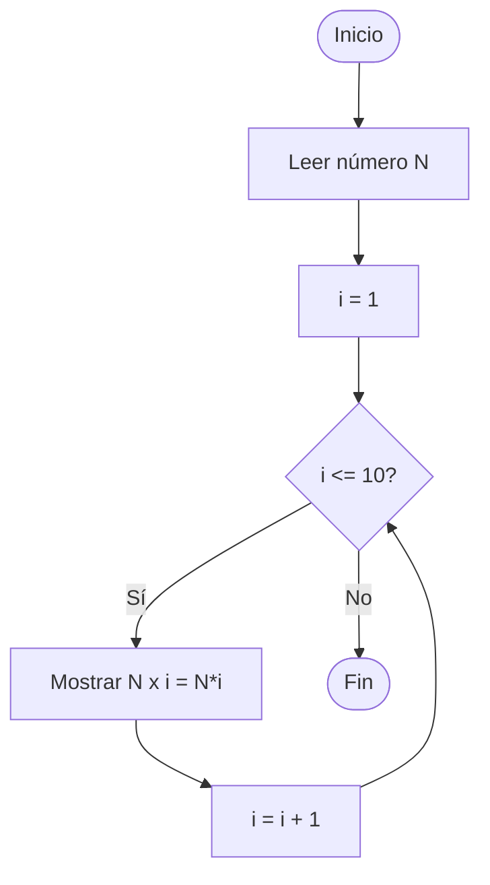

🏠 [← README](../../../README.md) · ⬅️ [← Clase 07](../clase%2007/resumen.md) · Clase 08 · [Clase 09 →](../clase%2009/resumen.md) ➡️ · 🧪 [Ejercicios](ejercicios.md)

---

# Clase 08 — Ciclo `for` en JavaScript

**Fecha:** 14-abril-2026  
**Materia:** Bases de datos NO relacionales

---

# 🎯 Objetivo del tema

- Comprender la estructura del ciclo `for` y cuándo usarlo.
- Diferenciar `for` de `while` para elegir el más adecuado.
- Utilizar `for` con contador creciente y decreciente.
- Combinar `for` con `readline` para programas interactivos.

---

# 🧠 Idea clave

`while` es útil cuando **no sabes** cuántas veces se repetirá el ciclo.  
`for` es ideal cuando **sí sabes exactamente cuántas repeticiones** necesitas.

---

# 1) Sintaxis del ciclo `for`

```js
for (inicialización; condición; incremento) {
	// instrucciones que se repiten
}
```

Cada parte tiene una función:

| Parte | Descripción |
|-------|-------------|
| `inicialización` | Se ejecuta **una sola vez** al inicio. Crea el contador. |
| `condición` | Se evalúa **antes de cada repetición**. Si es `false`, el ciclo termina. |
| `incremento` | Se ejecuta al **final de cada repetición**. Actualiza el contador. |

## Ejemplo: contar del 1 al 5

```js
for (let i = 1; i <= 5; i++) {
	console.log(i);
}
```

Salida:

```
1
2
3
4
5
```

## ¿Cómo se ejecuta paso a paso?

```
1. i = 1  →  1 <= 5 (true)  →  mostrar 1  →  i = 2
2. i = 2  →  2 <= 5 (true)  →  mostrar 2  →  i = 3
3. i = 3  →  3 <= 5 (true)  →  mostrar 3  →  i = 4
4. i = 4  →  4 <= 5 (true)  →  mostrar 4  →  i = 5
5. i = 5  →  5 <= 5 (true)  →  mostrar 5  →  i = 6
6. i = 6  →  6 <= 5 (false) →  TERMINA
```

---

# 2) `for` con decremento

El contador también puede ir de mayor a menor.

```js
for (let i = 5; i >= 1; i--) {
	console.log(i);
}
```

Salida:

```
5
4
3
2
1
```

---

# 3) `for` con paso diferente a 1

Se puede incrementar de 2 en 2, de 5 en 5, etc.

```js
// Múltiplos de 5 del 5 al 25
for (let i = 5; i <= 25; i = i + 5) {
	console.log(i);
}
```

Salida:

```
5
10
15
20
25
```

---

# 4) Operadores unitarios: `++` y `--`

Estos operadores se usan constantemente en la parte de **incremento** del `for`.

## Operador de incremento `++`

Suma **1** al valor actual de una variable.

```js
let i = 5;
i++;            // equivale a: i = i + 1
console.log(i); // 6
```

## Operador de decremento `--`

Resta **1** al valor actual de una variable.

```js
let i = 5;
i--;            // equivale a: i = i - 1
console.log(i); // 4
```

## Tabla comparativa

| Expresión corta | Expresión equivalente | Efecto |
|-----------------|----------------------|--------|
| `i++` | `i = i + 1` | suma 1 |
| `i--` | `i = i - 1` | resta 1 |
| `i += 3` | `i = i + 3` | suma 3 |
| `i -= 3` | `i = i - 3` | resta 3 |
| `i *= 2` | `i = i * 2` | multiplica por 2 |

> Por eso `for (let i = 1; i <= 10; i++)` usa `i++` en lugar de `i = i + 1`: es exactamente lo mismo, pero más compacto.

---

# 5) `for` vs `while`

| Característica | `for` | `while` |
|----------------|-------|---------|
| Cuándo usarlo | Cuando sabes cuántas veces se repetirá | Cuando no sabes cuántas veces |
| Control del contador | En una sola línea | Distribuido en varias líneas |
| Legibilidad | Más compacto para contadores | Más flexible para condiciones complejas |

Ambos producen el mismo resultado; la diferencia es de estilo y claridad.

---

# 🧪 Desarrollo de ejemplo integrador

## Enunciado

Leer un número y mostrar su tabla de multiplicar (del 1 al 10).

## Algoritmo

1. Inicio.
2. Leer número N.
3. Para i desde 1 hasta 10 con paso 1:
4.     Calcular resultado = N × i.
5.     Mostrar `N x i = resultado`.
6. Fin.

## Diagrama de flujo



## Pseudocódigo

```text
Inicio

	Escribir "Ingresa un número:"
	Leer N

	Para i <- 1 Hasta 10 Con Paso 1 Hacer
		resultado <- N * i
		Escribir N + " x " + i + " = " + resultado
	FinPara

Fin
```

## Código JavaScript CLI

```js
const readline = require('../libs/readline');

(async () => {
	console.log('Ingresa un número para ver su tabla de multiplicar:');
	const entrada = await readline();
	const n = Number(entrada);

	console.log('\nTabla del ' + n + ':');
	for (let i = 1; i <= 10; i++) {
		console.log(n + ' x ' + i + ' = ' + (n * i));
	}
})();
```

---

# 🚀 Enunciados extra de práctica (adelanto)

> Estos enunciados son opcionales para alumnos que quieran practicar más. No forman parte de la lista de `ejercicios.md`.

## 5 enunciados con `for` básico

1. **Cuadros de asteriscos**  
Mostrar N líneas donde la línea i contiene i asteriscos: `*`, `**`, `***`, ...

2. **Suma de divisores**  
Leer un número N y mostrar todos sus divisores exactos (números que dividen a N sin residuo).

3. **Pirámide de números**  
Mostrar la secuencia `1, 2, 3, 4, 5, 4, 3, 2, 1` usando dos ciclos `for`.

4. **Serie de potencias**  
Leer una base B y mostrar las primeras 8 potencias: B¹, B², ..., B⁸.

5. **Suma hasta un múltiplo**  
Leer un número M y sumar todos los múltiplos de M menores a 100.

## 5 enunciados con `for` + `readline`

1. **Promedio de asistencia**  
Leer el porcentaje de asistencia de N alumnos. Mostrar el promedio y cuántos están por debajo del 80%.

2. **Inventario de precios**  
Leer N precios de productos. Mostrar el mayor, el menor y el promedio.

3. **Registro de temperaturas**  
Leer temperaturas de 7 días. Mostrar cuántos días superaron los 30°C.

4. **Suma acumulada con detalle**  
Leer N números y mostrar después de cada ingreso la suma acumulada hasta ese momento.

5. **Análisis de calificaciones**  
Leer N calificaciones. Mostrar el promedio, cuántos aprobaron (≥ 6) y cuántos reprobaron.

---

# 📌 Conclusión

El ciclo `for` es la estructura de repetición más compacta cuando el número de iteraciones es conocido de antemano.  
Dominar `for` junto con `while` proporciona control total sobre cualquier tipo de repetición en un programa.

---

🏠 [← README](../../../README.md) · ⬅️ [← Clase 07](../clase%2007/resumen.md) · Clase 08 · [Clase 09 →](../clase%2009/resumen.md) ➡️ · 🧪 [Ejercicios](ejercicios.md)