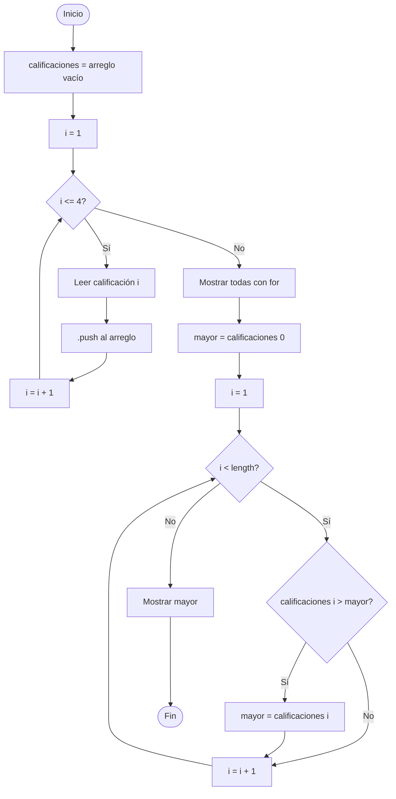

🏠 [← README](../../../README.md) · ⬅️ [← Clase 08](../clase%2008/resumen.md) · Clase 09 · [Clase 10 →](../clase%2010/resumen.md) ➡️ · 🧪 [Ejercicios](ejercicios.md) 

---

# Clase 09 — Arreglos (`array`) y ciclo `for` en JavaScript

**Fecha:** 15-abril-2026
**Materia:** Bases de datos NO relacionales

---

# 🎯 Objetivo del tema

- Comprender qué es un **objeto** en JavaScript y cómo se diferencia de un valor primitivo.
- Identificar que un arreglo **es un objeto** especializado para guardar colecciones ordenadas.
- Comprender qué es un arreglo y cómo almacenar múltiples valores en una sola variable.
- Acceder a elementos de un arreglo mediante índices.
- Usar las propiedades y métodos propios del arreglo: `.length` y `.push()`.
- Utilizar el ciclo `for` para recorrer un arreglo completo.
- Combinar arreglos con `for` para procesar colecciones de datos.

---

# 🧠 Idea clave

Hasta ahora una variable almacenaba **un solo valor**.  
Un arreglo permite guardar **múltiples valores** en una sola variable, organizados por posición.

---

# 1) ¿Qué es un objeto en JavaScript?

En JavaScript existen dos grandes categorías de datos:

| Categoría | Qué es | Ejemplos |
|-----------|--------|----------|
| **Valor primitivo** | Un dato simple, sin propiedades ni métodos. | `42`, `'hola'`, `true` |
| **Objeto** | Una entidad compleja que puede tener **propiedades** (datos) y **métodos** (acciones). | `[]`, `{}`, `Date` |

> Una **propiedad** es una característica del objeto (`frutas.length` → cantidad de elementos).  
> Un **método** es una acción que el objeto puede ejecutar (`frutas.push('uva')` → agrega un elemento).

## ¿Por qué importa esto?

Cuando declaras `let nombre = 'Ana'`, la variable guarda un **valor primitivo**: solo el texto `'Ana'`.  
Cuando declaras `let frutas = ['manzana', 'pera']`, la variable guarda un **objeto**: una estructura con datos y herramientas para manipularlos.

> En JavaScript, **casi todo es un objeto** o puede comportarse como uno.  
> Entender esto es clave para comprender por qué `frutas.length` o `frutas.push()` funcionan.

---

# 2) Arreglos (`array`) — un objeto para guardar colecciones

Un **arreglo** es un tipo especial de objeto diseñado para almacenar **una lista ordenada de valores** bajo un solo nombre de variable.

```
nombre_variable[0]  → primer elemento
nombre_variable[1]  → segundo elemento
nombre_variable[2]  → tercer elemento
     ...
```

En lugar de crear una variable por cada dato:

```js
// Sin arreglo — difícil de manejar con muchos datos
let calif1 = 8;
let calif2 = 9;
let calif3 = 7;
```

Un arreglo agrupa todo bajo un solo nombre:

```js
// Con arreglo — un nombre, múltiples valores
let calificaciones = [8, 9, 7];
```

Como es un **objeto**, el arreglo trae incorporadas herramientas propias:  
`.length` para saber cuántos elementos tiene, y `.push()` para agregar más.

---

# 3) Propiedades y métodos del arreglo

Como objeto, el arreglo expone herramientas integradas para declararlo, acceder a sus elementos y modificarlo.

## Declaración

```js
let frutas = ['manzana', 'pera', 'uva'];
```

Los valores se separan por comas y se escriben entre corchetes `[ ]`.

## Acceso por índice

Cada elemento tiene una **posición** llamada **índice**.  
El índice empieza en **0**.

```js
let frutas = ['manzana', 'pera', 'uva'];

console.log(frutas[0]); // manzana
console.log(frutas[1]); // pera
console.log(frutas[2]); // uva
```

## Propiedad `.length`

`.length` devuelve el número de elementos que tiene el arreglo.

```js
let frutas = ['manzana', 'pera', 'uva'];

console.log(frutas.length); // 3
```

## Método `.push()`

`.push()` agrega un elemento al **final** del arreglo.

```js
let frutas = ['manzana', 'pera'];
frutas.push('uva');

console.log(frutas);        // ['manzana', 'pera', 'uva']
console.log(frutas.length); // 3
```

## Ejemplo en JavaScript CLI

```js
const readline = require('../libs/readline');

(async () => {
	console.log('Ingresa el primer nombre:');
	const nombre1 = await readline();

	console.log('Ingresa el segundo nombre:');
	const nombre2 = await readline();

	let nombres = [nombre1, nombre2];

	console.log('Primer nombre:', nombres[0]);
	console.log('Segundo nombre:', nombres[1]);
	console.log('Total de nombres:', nombres.length);
})();
```

---

# 2) Ciclo `for`

`for` repite un bloque de instrucciones un número **definido** de veces.

## Sintaxis

```js
for (let i = 0; i < limite; i++) {
	// instrucciones
}
```

- `let i = 0` — valor inicial del contador
- `i < limite` — condición de parada
- `i++` — incremento (equivale a `i = i + 1`)

## Ejemplo en JavaScript CLI

```js
for (let i = 1; i <= 5; i++) {
	console.log('Número:', i);
}
```

---

# 3) Arreglos + ciclo `for`

La combinación más natural: usar el índice `i` del `for` para acceder a cada elemento del arreglo.

```js
let colores = ['rojo', 'verde', 'azul'];

for (let i = 0; i < colores.length; i++) {
	console.log('Color:', colores[i]);
}
```

Usando `colores.length` como límite, el ciclo recorre **todos** los elementos sin importar cuántos haya.

---

# 🧪 Desarrollo de ejemplo integrador

## Enunciado

Capturar 4 calificaciones por teclado, guardarlas en un arreglo, mostrarlas todas y mostrar la calificación más alta.

## Algoritmo

1. Inicio.
2. Crear arreglo vacío.
3. Repetir 4 veces: leer calificación y agregarla al arreglo.
4. Mostrar todas las calificaciones con `for`.
5. Encontrar la mayor recorriendo el arreglo con `for`.
6. Mostrar el resultado.
7. Fin.

## Diagrama de flujo



## Pseudocódigo

```text
Inicio

	calificaciones <- arreglo vacío

	Para i desde 1 hasta 4:
		Escribir "Ingresa la calificación " + i
		Leer cal
		calificaciones.agregar(cal)
	FinPara

	Escribir "Calificaciones registradas:"
	Para i desde 0 hasta calificaciones.longitud - 1:
		Escribir "  " + (i + 1) + ": " + calificaciones[i]
	FinPara

	mayor <- calificaciones[0]
	Para i desde 1 hasta calificaciones.longitud - 1:
		Si calificaciones[i] > mayor Entonces
			mayor <- calificaciones[i]
		FinSi
	FinPara

	Escribir "La mayor calificación es: " + mayor

Fin
```

## Código JavaScript CLI

```js
const readline = require('../libs/readline');

(async () => {
	let calificaciones = [];

	for (let i = 1; i <= 4; i++) {
		console.log('Ingresa la calificación ' + i + ':');
		const entrada = await readline();
		calificaciones.push(Number(entrada));
	}

	console.log('\nCalificaciones registradas:');
	for (let i = 0; i < calificaciones.length; i++) {
		console.log('  ' + (i + 1) + ':', calificaciones[i]);
	}

	let mayor = calificaciones[0];
	for (let i = 1; i < calificaciones.length; i++) {
		if (calificaciones[i] > mayor) {
			mayor = calificaciones[i];
		}
	}

	console.log('La mayor calificación es:', mayor);
})();
```

---

# 🚀 Enunciados extra de práctica (adelanto)

> Estos enunciados son opcionales para alumnos que quieran practicar más. No forman parte de la lista de `ejercicios.md`.

## 5 enunciados para arreglos básicos

1. **Lista de materias**
   Declarar un arreglo con 5 materias y mostrar cada una con su número de posición.

2. **Suma de precios**
   Declarar un arreglo con 4 precios, sumarlos con `for` y mostrar el total.

3. **Arreglo de temperaturas**
   Declarar un arreglo con 7 temperaturas (una por día), mostrarlas todas y mostrar el promedio.

4. **Nombres y longitudes**
   Declarar un arreglo con 5 nombres y mostrar cuántas letras tiene cada uno usando `.length` sobre cada string.

5. **Buscar un valor**
   Declarar un arreglo con 5 números y mostrar si el número `7` está en el arreglo.

## 5 enunciados para arreglos + `for` con `readline`

1. **Registro de ventas**
   Leer 5 montos de venta con `for`, guardarlos en arreglo, mostrar el total y el promedio.

2. **Inventario crítico**
   Leer existencias de 6 productos con `for`, guardarlos en arreglo y contar cuántos tienen menos de 5 unidades.

3. **Nombre más largo**
   Leer 5 nombres con `for`, guardarlos en arreglo y mostrar cuál tiene más letras.

4. **Clasificación de edades**
   Leer 5 edades con `for`, mostrar cuántas son menores de 18 y cuántas son 18 o mayores.

5. **Mini lista de compras**
   Leer precios con `while` hasta capturar `0`. Guardar en arreglo, mostrar todos y mostrar el total con IVA (16%).

---

# 📌 Conclusión

Un **arreglo** permite almacenar colecciones de datos en una sola variable.  
El ciclo **`for`** es ideal para recorrerlos de forma ordenada usando índices.  
La combinación de ambos es la base para trabajar con listas de cualquier tamaño.

---

🏠 [← README](../../../README.md) · ⬅️ [← Clase 08](../clase%2008/resumen.md) · Clase 09 · [Clase 10 →](../clase%2010/resumen.md) ➡️ · 🧪 [Ejercicios](ejercicios.md) 

