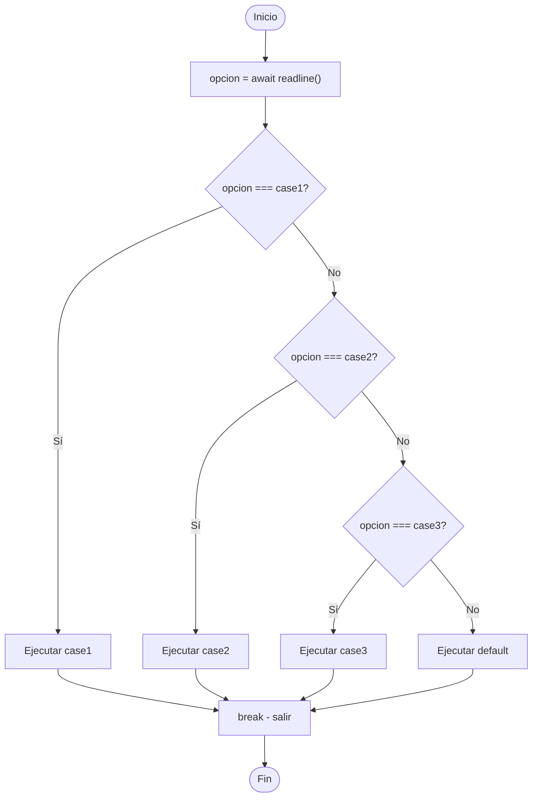

🏠 [← README](../../../README.md) · ⬅️ [← Clase 09](../clase%2009/resumen.md) · Clase 10 · [Clase 11 →](../clase%2011/resumen.md) ➡️ · 🧪 [Ejercicios](ejercicios.md)

---

# Clase 10 — switch/case en JavaScript y GitHub con VSCode

**Fecha:** 17-abril-2026  
**Materia:** Bases de datos NO relacionales

---

# 🎯 Objetivo de la sesión

Aprender a usar estructuras de control `switch/case` en JavaScript para menús interactivos. Configurar el repositorio GitHub que compartiremos entre DBR y BDNR durante todo el semestre.

---

# 🧠 Parte 1: switch/case en JavaScript

## Estructura básica

JavaScript tiene la misma estructura que PHP, pero con algunas diferencias clave:

```js
const readline = require('../libs/readline');

(async () => {
    console.log("Elige una opción:");
    const opcion = await readline();

    switch (opcion) {
        case "1":
            console.log("Seleccionaste: Sumar");
            break;
        case "2":
            console.log("Seleccionaste: Restar");
            break;
        default:
            console.log("Opción no válida");
    }
})();
```

## Comparación con PHP

| Aspecto | PHP | JavaScript |
|---------|-----|-----------|
| Lectura | `$var = readline()` | `const var = await readline()` |
| Salida | `echo` | `console.log()` |
| Comparación | `==` (loose) | `===` (estricta en switch) |
| Break | Obligatorio | Obligatorio |
| Default | `default:` | `default:` |

## Comparación estricta (===) en switch

JavaScript dentro de un switch usa comparación **estricta** (`===`), a diferencia de PHP:

```js
const variable = "1";

switch (variable) {
    case 1:      // ❌ NO coincide: "1" === 1 es false
        console.log("Entero 1");
        break;
    case "1":    // ✅ Coincide: "1" === "1" es true
        console.log("String '1'");
        break;
}
```

Siempre asegúrate de que tu `case` tenga el mismo tipo (string con string, número con número).

## Fall-through sin break

Como en PHP, sin `break` sigue ejecutándose el código del siguiente `case`:

```js
let dia = 1;

switch (dia) {
    case 1:
        console.log("Lunes");
        // ❌ SIN break — sigue
    case 2:
        console.log("Martes");
        break;  // ✅ aquí se detiene
    default:
        console.log("Día no válido");
}

// Salida:
// Lunes
// Martes
```

## Ejemplo 1: Menú de Calculadora

```js
const readline = require('../libs/readline');

(async () => {
    console.log("--- Calculadora Simple ---");
    console.log("1) Sumar");
    console.log("2) Restar");
    console.log("3) Multiplicar");
    console.log("4) Dividir");
    console.log("5) Salir");
    console.log("Elige una opción: ");

    const opcion = await readline();

    console.log("Número 1: ");
    const n1 = parseFloat(await readline());
    console.log("Número 2: ");
    const n2 = parseFloat(await readline());

    switch (opcion) {
        case "1":
            console.log("Resultado: " + (n1 + n2));
            break;
        case "2":
            console.log("Resultado: " + (n1 - n2));
            break;
        case "3":
            console.log("Resultado: " + (n1 * n2));
            break;
        case "4":
            if (n2 === 0) {
                console.log("Error: no se puede dividir entre cero");
            } else {
                console.log("Resultado: " + (n1 / n2));
            }
            break;
        case "5":
            console.log("Hasta luego");
            break;
        default:
            console.log("Opción no válida");
    }
})();
```

## Ejemplo 2: Días de la semana

```js
const readline = require('../libs/readline');

(async () => {
    console.log("Ingresa un número de día (1-7): ");
    const dia = await readline();

    switch (dia) {
        case "1":
            console.log("Lunes");
            break;
        case "2":
            console.log("Martes");
            break;
        case "3":
            console.log("Miércoles");
            break;
        case "4":
            console.log("Jueves");
            break;
        case "5":
            console.log("Viernes");
            break;
        case "6":
            console.log("Sábado");
            break;
        case "7":
            console.log("Domingo");
            break;
        default:
            console.log("Número no válido. Ingresa un día entre 1 y 7");
    }
})();
```

## Diagrama de flujo



---

# 🐙 Parte 2: Git y GitHub con VSCode

## Tu repositorio ya está listo

En la clase de DBR (Clase 16) ya creaste tu repositorio GitHub y lo clonaste en tu computadora. Hoy **usaremos el MISMO repositorio** para BDNR.

### Estructura del repositorio compartido

```
[tu-apellido]-programacion-4g/
  dbr/
    clase-16/     ← código PHP que ya subiste
    clase-17/     ← próximas clases DBR
  bdnr/
    clase-10/     ← código JavaScript de hoy va aquí
    clase-11/     ← próximas clases BDNR
```

## Pasos para hoy

### 1️⃣ Abrir tu repositorio en VSCode

Si ya lo tienes abierto: excelente.

Si no:
1. VSCode → `Ctrl+Shift+G` (Source Control)
2. Botón **↓ Pull** para sincronizar (trae cambios del maestro si hay)
3. Crea la carpeta `bdnr/clase-10/` si no existe

### 2️⃣ Crear carpeta para hoy

Abre Terminal en VSCode: `Ctrl+`` ` (acento grave)

```bash
mkdir -p bdnr/clase-10
```

### 3️⃣ Escribir tus archivos JavaScript

En `bdnr/clase-10/`:
- `p501-dia-habil.js`
- `p502-estacion-por-mes.js`
- etc.

### 4️⃣ Stage, Commit, Push (igual que en DBR)

1. **Stage:** `Ctrl+Shift+G` → click en **+** junto a tu archivo
2. **Commit:** escribir mensaje `clase-10: p501 switch dia-habil` → `Ctrl+Enter`
3. **Push:** botón **↑ Sync Changes**

## Importancia del mismo repositorio

- Tu maestro tiene **un solo lugar** para revisar todo tu trabajo
- El historial completo (DBR + BDNR) está junto
- Cuando termines el semestre, tu portafolio completo está en GitHub
- Las prácticas en pareja se ven claramente (quién hizo qué)

---

# 📌 Conclusión

- **switch/case en JavaScript** funciona igual que en PHP, pero con comparación estricta (`===`)
- Tu repositorio es **compartido** entre DBR y BDNR — organizados en carpetas `dbr/` y `bdnr/`
- Los commits de hoy van a `bdnr/clase-10/`, los de DBR a `dbr/clase-16/`
- **Un repositorio, dos materias, un semestre de código profesional**

A partir de hoy, tu repositorio contiene el código de ambas materias. Mantén la estructura clara y los commits descriptivos.

---

🏠 [← README](../../../README.md) · ⬅️ [← Clase 09](../clase%2009/resumen.md) · Clase 10 · [Clase 11 →](../clase%2011/resumen.md) ➡️ · 🧪 [Ejercicios](ejercicios.md)
