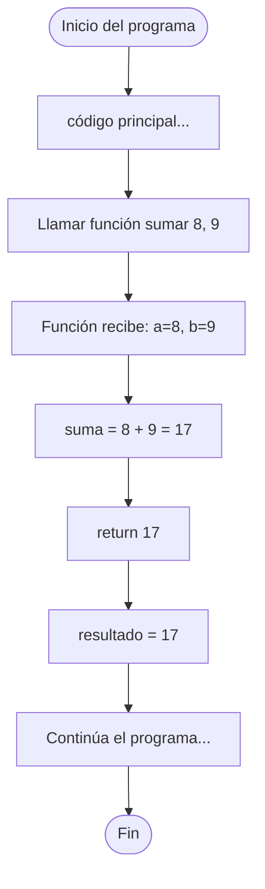

🏠 [← README](../../../README.md) · ⬅️ [← Clase 10](../clase%2010/resumen.md) · Clase 11 · [Clase 12 →](../clase%2012/resumen.md) ➡️ · 🧪 [Ejercicios](ejercicios.md)

---

# Clase 11 — Funciones en JavaScript

**Fecha:** 22-abril-2026
**Materia:** Bases de datos NO relacionales

---

# 🎯 Objetivo de la sesión

Aprender a crear y usar funciones en JavaScript. Las funciones son bloques de código reutilizable, especialmente importantes en Node.js donde todo es basado en funciones y callbacks. Comprender las diferentes sintaxis de funciones en JavaScript.

---

# 🧠 Parte 1: Funciones en JavaScript

## Función declaration (Declaración tradicional)

```js
function sumar(a, b) {
    return a + b;
}

console.log(sumar(3, 5));  // 8
```

Igual que PHP en concepto: recibe parámetros, realiza operación, retorna resultado.

## Function expression (Expresión de función)

```js
const sumar = function(a, b) {
    return a + b;
};

console.log(sumar(3, 5));  // 8
```

Aquí la función se asigna a una variable. Es más común en JavaScript moderno.

## Arrow function (Función flecha) - FORMA MODERNA

```js
// Versión completa con llaves
const sumar = (a, b) => {
    return a + b;
};

// Versión corta (shorthand) — si es una sola expresión
const sumar = (a, b) => a + b;

console.log(sumar(3, 5));  // 8
```

Las arrow functions `=>` son la forma moderna preferida. Son más compactas y tienen otras ventajas (como `this` binding) que veremos después.

## Tabla comparativa PHP vs JavaScript

| Aspecto | PHP | JavaScript |
|---------|-----|-----------|
| Declaración básica | `function nombre($p)` | `function nombre(p)` |
| Sin $ en parámetros | No | Sí |
| Retorno | `return $valor;` | `return valor;` |
| Arrow function | No existe | `const f = (p) => valor` |
| Parámetro con defecto | `function f($p = 0)` | `function f(p = 0)` |
| Retorno corto (arrow) | Debe ser explícito | `(p) => p * 2` |

## Parámetros con valor por defecto

```js
function saludar(nombre, saludo = "Hola") {
    return saludo + ", " + nombre + "!";
}

console.log(saludar("Ana"));                    // Hola, Ana!
console.log(saludar("Luis", "Buenos días"));    // Buenos días, Luis!
```

O con arrow function:

```js
const saludar = (nombre, saludo = "Hola") => saludo + ", " + nombre + "!";
```

## Scope (Alcance de variables)

Igual que PHP: las variables dentro de una función son locales.

```js
let x = 10;  // variable global

function ejemplo() {
    let x = 99;  // Esta NO es la misma x de arriba
    console.log(x);  // 99
}

ejemplo();
console.log(x);  // 10
```

## Funciones asincrónicas (Mención breve)

En Node.js, a menudo usamos funciones que necesitan `await`:

```js
async function leerDatos() {
    const nombre = await readline();
    return nombre;
}
```

La palabra `async` indica que la función contiene operaciones asincrónicas. **No te preocupes por esto todavía** — lo veremos a detalle cuando conectemos a MongoDB en semanas posteriores.

## Ejemplo integrador: Calculadora con funciones

```js
const readline = require('../libs/readline');

(async () => {
    function sumar(a, b) {
        return a + b;
    }

    function restar(a, b) {
        return a - b;
    }

    function multiplicar(a, b) {
        return a * b;
    }

    function dividir(a, b) {
        if (b === 0) {
            return "Error: división entre cero";
        }
        return a / b;
    }

    console.log("--- Calculadora ---");
    console.log("Número 1: ");
    const n1 = parseFloat(await readline());

    console.log("Número 2: ");
    const n2 = parseFloat(await readline());

    console.log("Operación (1=sumar, 2=restar, 3=multiplicar, 4=dividir): ");
    const op = await readline();

    let resultado;

    switch (op) {
        case "1":
            resultado = sumar(n1, n2);
            console.log("Resultado: " + resultado);
            break;
        case "2":
            resultado = restar(n1, n2);
            console.log("Resultado: " + resultado);
            break;
        case "3":
            resultado = multiplicar(n1, n2);
            console.log("Resultado: " + resultado);
            break;
        case "4":
            resultado = dividir(n1, n2);
            console.log("Resultado: " + resultado);
            break;
        default:
            console.log("Opción no válida");
    }
})();
```

## Diagrama de flujo: Llamada y retorno



## Comparación de sintaxis de funciones

```js
// 1. Declaración tradicional
function sumar(a, b) {
    return a + b;
}

// 2. Function expression
const sumar = function(a, b) {
    return a + b;
};

// 3. Arrow function completa
const sumar = (a, b) => {
    return a + b;
};

// 4. Arrow function shorthand
const sumar = (a, b) => a + b;

// Todas hacen lo mismo: sumar(3, 5) retorna 8
```

**En este curso usaremos principalmente arrow functions** porque son más modernas y compactas.

---

# 📌 Conclusión

- **Funciones en JavaScript** funcionan igual que en PHP en concepto: reciben parámetros, hacen operaciones, retornan resultados.
- Las **arrow functions** `(p) => p * 2` son la forma moderna preferida.
- Las variables dentro de funciones son locales (scope).
- Cuando conectes **MongoDB en Node.js**, verás que el driver devuelve funciones callback — ahora entenderás cómo funcionan.
- La calculadora que hiciste hoy es un preludio a operaciones más complejas: en semanas posteriores, cada CRUD de MongoDB será una función asincrónica.

Las funciones son el corazón de cualquier programa. Dominalas bien en ambos lenguajes.
