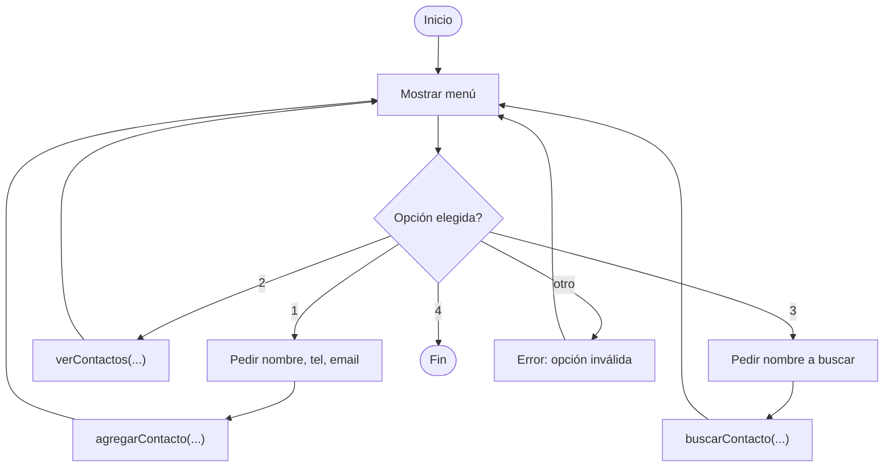

🏠 [← README](../../../README.md) · ⬅️ [← Clase 12](../clase%2012/resumen.md) · Clase 13 · [Clase 14 →](../clase%2014/resumen.md) ➡️ · 🧪 [Ejercicios](ejercicios.md)

---

# Clase 13 — Mini-app integradora Node.js (sin base de datos)

**Fecha:** 27-abril-2026  
**Materia:** Bases de datos NO relacionales  
**Tipo:** 🧪 LAB integrador

---

# 🎯 Objetivo de la sesión

Construir una aplicación CLI completa en Node.js que funciona en memoria, integrando todo lo aprendido hasta ahora: objetos, arrays, funciones, async/await y readline. Esta app es el puente exacto antes de conectar a MongoDB: los datos que hoy manejas en arrays, pronto vendrán de la BD.

---

# 🧠 Fundamentos de la app

Construiremos una **agenda de contactos** interactiva en JavaScript/Node.js con menú principal, donde el usuario puede agregar, listar, buscar y salir. Los datos viven en un array de objetos — exactamente el formato que MongoDB devolverá.

---

# 📌 Estructura de datos

Cada contacto es un objeto con varios campos:

```js
const contacto_ejemplo = {
    id: 1,
    nombre: 'Ana García',
    telefono: '5551234567',
    email: 'ana@mail.com'
};

// Varios contactos en un array:
const contactos = [
    { id: 1, nombre: 'Ana García', telefono: '5551234567', email: 'ana@mail.com' },
    { id: 2, nombre: 'Carlos López', telefono: '5559876543', email: 'carlos@mail.com' },
    { id: 3, nombre: 'María González', telefono: '5552468135', email: 'maria@mail.com' }
];
```

Este es el **mismo formato** que MongoDB devolverá con `find()` (con un `_id` adicional generado automáticamente).

---

# 🔧 Funciones de la app

## 1. agregarContacto()

Agrega un nuevo contacto al array:

```js
function agregarContacto(contactos, nombre, telefono, email) {
    // Calcular el siguiente ID
    let max_id = 0;
    for (const contacto of contactos) {
        if (contacto.id > max_id) {
            max_id = contacto.id;
        }
    }
    const nuevo_id = max_id + 1;

    // Crear el contacto
    const contacto_nuevo = {
        id: nuevo_id,
        nombre: nombre,
        telefono: telefono,
        email: email
    };

    // Agregar al array
    contactos.push(contacto_nuevo);
    console.log('✓ Contacto agregado con ID: ' + nuevo_id);
}
```

**Nota en JS:** Los arrays se pasan por referencia automáticamente. No necesitas `&` como en PHP.

## 2. verContactos()

Lista todos los contactos:

```js
function verContactos(contactos) {
    if (contactos.length === 0) {
        console.log('No hay contactos.');
        return;
    }

    console.log('\n--- CONTACTOS ---');
    for (const contacto of contactos) {
        console.log('[ID ' + contacto.id + '] ' + contacto.nombre);
        console.log('  Teléfono: ' + contacto.telefono);
        console.log('  Email: ' + contacto.email);
    }
    console.log();
}
```

## 3. buscarContacto()

Busca un contacto por nombre (búsqueda parcial):

```js
function buscarContacto(contactos, nombre) {
    const resultados = [];
    for (const contacto of contactos) {
        if (contacto.nombre.toLowerCase().includes(nombre.toLowerCase())) {
            resultados.push(contacto);
        }
    }

    if (resultados.length === 0) {
        console.log('✗ No se encontraron contactos con ese nombre.\n');
        return;
    }

    console.log('\n--- RESULTADOS DE BÚSQUEDA ---');
    for (const contacto of resultados) {
        console.log('[ID ' + contacto.id + '] ' + contacto.nombre);
        console.log('  Teléfono: ' + contacto.telefono);
        console.log('  Email: ' + contacto.email);
    }
    console.log();
}
```

---

# 💻 Código completo de la app

```js
const readline = require('./libs/readline');

// ============ FUNCIONES ============

function agregarContacto(contactos, nombre, telefono, email) {
    let max_id = 0;
    for (const contacto of contactos) {
        if (contacto.id > max_id) {
            max_id = contacto.id;
        }
    }
    const nuevo_id = max_id + 1;

    const contacto_nuevo = {
        id: nuevo_id,
        nombre: nombre,
        telefono: telefono,
        email: email
    };

    contactos.push(contacto_nuevo);
    console.log('✓ Contacto agregado con ID: ' + nuevo_id);
}

function verContactos(contactos) {
    if (contactos.length === 0) {
        console.log('No hay contactos.');
        return;
    }

    console.log('\n--- CONTACTOS ---');
    for (const contacto of contactos) {
        console.log('[ID ' + contacto.id + '] ' + contacto.nombre);
        console.log('  Teléfono: ' + contacto.telefono);
        console.log('  Email: ' + contacto.email);
    }
    console.log();
}

function buscarContacto(contactos, nombre) {
    const resultados = [];
    for (const contacto of contactos) {
        if (contacto.nombre.toLowerCase().includes(nombre.toLowerCase())) {
            resultados.push(contacto);
        }
    }

    if (resultados.length === 0) {
        console.log('✗ No se encontraron contactos con ese nombre.\n');
        return;
    }

    console.log('\n--- RESULTADOS DE BÚSQUEDA ---');
    for (const contacto of resultados) {
        console.log('[ID ' + contacto.id + '] ' + contacto.nombre);
        console.log('  Teléfono: ' + contacto.telefono);
        console.log('  Email: ' + contacto.email);
    }
    console.log();
}

// ============ PROGRAMA PRINCIPAL ============

(async () => {
    let contactos = [];

    let corriendo = true;
    while (corriendo) {
        console.log('\n=== AGENDA DE CONTACTOS ===');
        console.log('1. Agregar contacto');
        console.log('2. Ver contactos');
        console.log('3. Buscar por nombre');
        console.log('4. Salir');
        console.log('Elige opción: ');

        const opcion = await readline();

        switch (opcion.trim()) {
            case '1':
                console.log('Nombre: ');
                const nombre = await readline();

                console.log('Teléfono: ');
                const telefono = await readline();

                console.log('Email: ');
                const email = await readline();

                agregarContacto(contactos, nombre, telefono, email);
                break;

            case '2':
                verContactos(contactos);
                break;

            case '3':
                console.log('Nombre a buscar: ');
                const nombreBuscar = await readline();
                buscarContacto(contactos, nombreBuscar);
                break;

            case '4':
                console.log('¡Hasta luego!');
                corriendo = false;
                break;

            default:
                console.log('Opción no válida.');
        }
    }
})();
```

**Para ejecutar:**
```bash
node app.js
```

---

# 🔗 Conexión con MongoDB

> **Dato crítico:** El array de objetos que ves aquí es **exactamente** lo que devolverá MongoDB cuando hagas una consulta `find()`.
>
> Hoy trabajas con datos duros en memoria (`let contactos = []`). En próximas clases:
> ```js
> // En lugar de datos duros, estos vendrán de MongoDB
> const resultado = await db.contactos.find({});
> const contactos = resultado;  // Cada documento ES un objeto JS
> ```
>
> El único cambio: MongoDB agregará un campo `_id` automáticamente a cada documento.
> ```js
> // Objeto de tu app hoy:
> { id: 1, nombre: 'Ana', telefono: '555...', email: 'ana@...' }
>
> // Documento de MongoDB:
> { _id: ObjectId("..."), id: 1, nombre: 'Ana', telefono: '555...', email: 'ana@...' }
> ```

---

# 📊 Tabla comparativa: PHP vs JavaScript/Node.js

| Concepto | PHP | JavaScript |
|----------|-----|-----------|
| **Array asociativo** | `$arr = ['nombre' => 'Ana']` | `obj = {nombre: 'Ana'}` |
| **Acceso a propiedad** | `$arr['nombre']` | `obj.nombre` o `obj['nombre']` |
| **Foreach** | `foreach ($arr as $val)` | `for (const val of arr)` |
| **Pasar por referencia** | `function foo(&$arr)` | Automático (objetos/arrays) |
| **Operación asincrónica** | Callback/Promesa | `async/await` |
| **Leer consola** | `readline()` | `require('./libs/readline')` |
| **Devolver datos** | `return` | `return` |

---

# 🎯 Diagrama de flujo del menú principal



---

# 📌 Conclusión

Hoy construiste una **aplicación completa en Node.js**. Aplicaste:

- **Objetos** → propiedades de cada contacto
- **Arrays** → lista de contactos
- **Funciones** → agregar, listar, buscar
- **Loops (for, while)** → recorrer y buscar
- **async/await** → entrada del usuario sin bloqueo
- **Strings y métodos** → búsqueda con `includes()` y `toLowerCase()`

En próximas clases, reemplazarás el array local con datos de MongoDB. **La lógica y estructura permanecen idénticas; solo cambia la fuente de datos.**

Este es el patrón que seguirán todos tus apps Node.js: entrada → procesamiento → almacenamiento/lectura → salida.

---

🏠 [← README](../../../README.md) · ⬅️ [← Clase 12](../clase%2012/resumen.md) · Clase 13 · [Clase 14 →](../clase%2014/resumen.md) ➡️ · 🧪 [Ejercicios](ejercicios.md)
