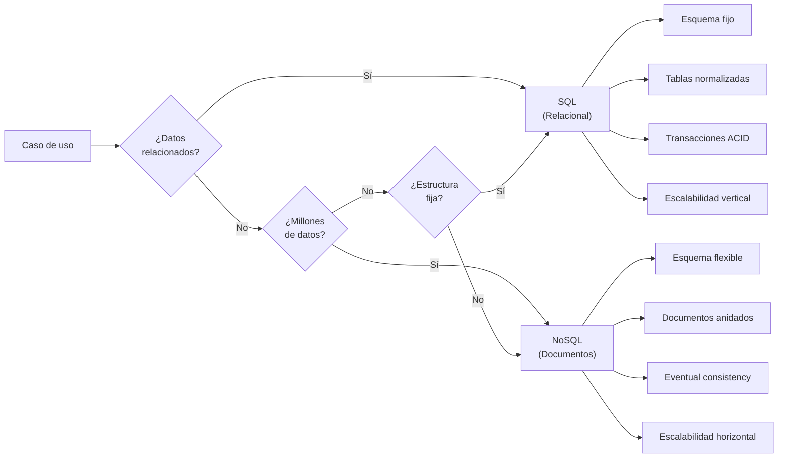

🏠 [← README](../../../README.md) · ⬅️ [← Clase 13](../clase%2013/resumen.md) · Clase 14 · [Clase 15 →](../clase%2015/resumen.md) ➡️

---

# Clase 14 — ¿Qué es NoSQL? Tipos de bases de datos y MongoDB

**Fecha:** 28-abril-2026 (aprox.)
**Materia:** Bases de datos NO relacionales
**Tipo:** 📚 Teoría

---

# 🎯 Objetivo de la sesión

Entender por qué existen las bases de datos NoSQL, cuándo usarlas, cuándo usar SQL, y qué es MongoDB específicamente. NoSQL no reemplaza SQL; resuelve problemas distintos.

---

# 🗄️ Parte 1: SQL vs NoSQL

## Tabla comparativa

| Aspecto | SQL (Relacional) | NoSQL (No relacional) |
|--------|------------------|------------------------|
| **Esquema** | Fijo y definido antes de insertar | Flexible, se define mientras se inserta |
| **Estructura** | Tablas con filas y columnas | Documentos, pares clave-valor, grafos, etc. |
| **Escalabilidad** | Vertical (más poder en un servidor) | Horizontal (distribuir entre muchos servidores) |
| **Transacciones ACID** | Sí, garantizadas | Eventual consistency (no siempre garantizadas) |
| **Consultas complejas** | Joins, GROUP BY, agregaciones | Agregaciones, mapreduce, pipeline |
| **Ejemplos** | MySQL, PostgreSQL, SQL Server | MongoDB, Redis, Neo4j, Cassandra |

## Esquema fijo (SQL) vs flexible (NoSQL)

### SQL - Esquema fijo

Antes de insertar datos, defines la estructura:

```sql
CREATE TABLE usuario (
    id INT PRIMARY KEY,
    nombre VARCHAR(100),
    edad INT
);

-- Si quieres agregar un campo nuevo, necesitas ALTER TABLE
ALTER TABLE usuario ADD COLUMN email VARCHAR(100);

-- Todos los registros DEBEN tener esos campos
INSERT INTO usuario (id, nombre, edad) VALUES (1, 'Ana', 25);
```

**Ventaja:** Integridad y consistencia garantizadas.
**Desventaja:** Cambios de estructura requieren migraciones complejas.

### NoSQL - Esquema flexible

En MongoDB puedes insertar cualquier estructura:

```js
db.usuarios.insertOne({
    id: 1,
    nombre: 'Ana',
    edad: 25
});

// Luego agregar un documento con más campos sin problema:
db.usuarios.insertOne({
    id: 2,
    nombre: 'Carlos',
    edad: 30,
    email: 'carlos@mail.com',
    telefono: '555...'  // Este documento tiene más campos
});

// E incluso mezclar estructuras completamente diferentes:
db.usuarios.insertOne({
    id: 3,
    nombre: 'María',
    preferencias: { tema: 'oscuro', idioma: 'es' }  // Sub-documentos
});
```

**Ventaja:** Flexibilidad para evolucionar la estructura sin downtime.
**Desventaja:** Menos garantías de integridad.

---

# 🗄️ Parte 2: Tipos de bases de datos NoSQL

### 1. Bases de datos de documentos (MongoDB)

Almacenan documentos JSON (BSON). Ideal para datos con estructura variable.

**Uso:** CMS, aplicaciones web, catálogos de productos.

```js
db.productos.insertOne({
    _id: ObjectId(),
    nombre: 'Laptop',
    precio: 15000,
    especificaciones: {
        procesador: 'Intel i7',
        ram: '16GB',
        almacenamiento: '512GB SSD'
    },
    en_stock: true
});
```

### 2. Bases de datos clave-valor (Redis)

Almacenan pares clave-valor. Muy rápidas. Ideal para caché y sesiones.

**Uso:** Caché, sesiones de usuario, colas de trabajo.

```
SET usuario:123 '{"nombre":"Ana","edad":25}'
GET usuario:123
DEL usuario:123
```

### 3. Bases de datos de grafos (Neo4j)

Almacenan nodos y relaciones. Ideal para redes sociales y recomendaciones.

**Uso:** Redes sociales, sistemas de recomendación, análisis de redes.

```
(Ana) --SIGUE--> (Carlos)
(Ana) --SIGUE--> (María)
(Carlos) --SIGUE--> (María)

MATCH (a)-[:SIGUE]->(b)-[:SIGUE]->(c)
WHERE a.nombre = 'Ana'
RETURN c;  // Recomendaciones para Ana
```

### 4. Bases de datos columnares (Cassandra)

Almacenan datos por columna, no por fila. Ideal para big data y análisis.

**Uso:** Time-series, análisis de logs, big data.

```
Columna 'temperatura': [25, 26, 24, 23, ...]
Columna 'humedad': [60, 62, 58, 55, ...]
```

---

# 🍃 Parte 3: MongoDB como BD de documentos

MongoDB es una base de datos **NoSQL de documentos**. Los datos se organizan en **colecciones** (como tablas en SQL) que contienen **documentos** (como registros JSON).

## Conceptos clave

| Concepto SQL | Concepto MongoDB |
|--------------|-----------------|
| Base de datos | Base de datos |
| Tabla | Colección |
| Fila/Registro | Documento |
| Columna | Campo |
| Índice | Índice |

## Documento BSON

MongoDB almacena documentos en formato **BSON** (Binary JSON). Es como JSON pero con tipos adicionales:

```json
{
    "_id": ObjectId("507f1f77bcf86cd799439011"),
    "nombre": "Ana",
    "edad": 25,
    "email": "ana@mail.com",
    "fechas": {
        "creacion": ISODate("2026-04-27T10:30:00Z"),
        "ultimo_acceso": ISODate("2026-04-28T15:45:00Z")
    },
    "activo": true,
    "etiquetas": ["admin", "usuario_verificado"],
    "dinero": NumberDecimal("1250.50")
}
```

**El campo `_id`:** MongoDB lo genera automáticamente si no lo especificas. Es el identificador único de cada documento.

## Colecciones en MongoDB

Una **colección** es un grupo de documentos (como una tabla en SQL).

```js
// Crear e insertar en una colección
db.usuarios.insertOne({
    nombre: 'Ana',
    edad: 25
});

// MongoDB crea automáticamente la colección "usuarios" si no existe
// La colección y la BD se crean con la primera inserción
```

---

# 🎯 Parte 4: ¿Cuándo usar SQL y cuándo NoSQL?

## Usa SQL si:

- **Datos relacionados:** Usuarios con pedidos, clientes con cuentas bancarias
- **Transacciones complejas:** Transferencias de dinero (todo o nada)
- **Integridad de datos:** Instituciones financieras, hospitales
- **Consultas complejas:** JOINs, agregaciones complejas
- **Datos estructurados:** Estructura fija y bien definida

**Ejemplos:** Banco, hospital, sistema académico, ecommerce tradicional

## Usa NoSQL si:

- **Escalabilidad horizontal:** Millones de usuarios simultáneos
- **Datos sin estructura fija:** Redes sociales, IoT, logs
- **Crecimiento rápido:** Startup con cambios frecuentes en estructura
- **Velocidad de lectura/escritura:** Caché, sesiones, analítica en tiempo real
- **Documentos anidados:** Datos con sub-estructuras complejas

**Ejemplos:** Red social (Facebook), IoT (sensores), Streaming (Netflix), Redes (Twitter)

## Casos reales de uso combinado

### Instagram

- **SQL:** Información de usuarios, autenticación, relaciones (follower/following)
- **NoSQL (MongoDB):** Feed de posts (documentos anidados con comentarios), fotos
- **NoSQL (Redis):** Caché de posts populares, sesiones activas
- **NoSQL (Graph):** Recomendaciones de usuarios a seguir

### Sistema bancario

- **SQL:** Cuentas, transacciones, políticas de cumplimiento
- **NoSQL (Redis):** Caché de saldos frecuentes, sesiones

---

# 📊 Diagrama comparativo: SQL vs MongoDB



---

# 💡 Analogía: SQL vs NoSQL

**SQL es como un archivo Excel:**
- Columnas definidas desde el inicio
- Todas las filas tienen los mismos campos
- Búsquedas precisas
- Cambiar estructura es complicado

**NoSQL es como una carpeta de documentos:**
- Cada documento puede tener una estructura diferente
- Flexible para agregar nuevos tipos de información
- Fácil de escalar
- Menos garantías de coherencia

---

# 📌 Conexión pedagógica con Clase 13

En la clase anterior construiste una app con un array de objetos en memoria:

```js
const contactos = [
    { id: 1, nombre: 'Ana', telefono: '555...', email: 'ana@...' },
    { id: 2, nombre: 'Carlos', telefono: '555...', email: 'carlos@...' }
];
```

**Eso es exactamente un documento de MongoDB.** MongoDB ES un contenedor para esos arrays de objetos. Cuando conectes a MongoDB en próximas clases, esos mismos objetos vendrán de la BD, con un campo `_id` adicional.

---

# 📌 Conclusión

**NoSQL no es mejor que SQL.** Cada uno resuelve problemas distintos:

- **SQL:** Cuando necesitas garantías ACID y estructura definida
- **NoSQL:** Cuando necesitas flexibilidad y escalabilidad

El buen programador conoce ambos y elige según el problema:
- **Banco:** SQL (transacciones críticas)
- **Red social:** NoSQL (millones de usuarios, datos variados)
- **Netflix:** Ambos (usuarios con SQL, contenido con NoSQL)

En próximas clases usarás MongoDB en Node.js. Ya sabes cómo funcionan los objetos JS; MongoDB es solo almacenaje y recuperación de esos mismos objetos a escala.

---

🏠 [← README](../../../README.md) · ⬅️ [← Clase 13](../clase%2013/resumen.md) · Clase 14 · [Clase 15 →](../clase%2015/resumen.md) ➡️
