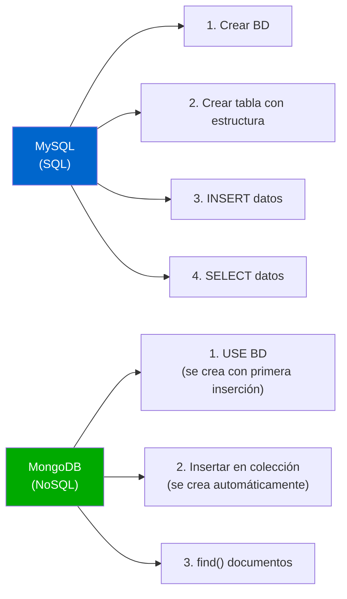

🏠 [← README](../../../README.md) · ⬅️ [← Clase 14](../clase%2014/resumen.md) · Clase 15 · [Clase 16 →](../clase%2016/resumen.md) ➡️ · 🧪 [Ejercicios](ejercicios.md)

---

# Clase 15 — MongoDB: instalación, mongosh y primeras operaciones

**Fecha:** 29-abril-2026 (aprox.)
**Materia:** Bases de datos NO relacionales
**Tipo:** 📚 Teoría + 🧪 LAB

---

# 🎯 Objetivo de la sesión

Aprender a conectar a MongoDB, crear colecciones e insertar documentos. Usarás `mongosh` (el shell de MongoDB) para ver cómo funcionan las operaciones básicas.

---

# 🧠 Parte 1: Iniciar MongoDB

## Windows, macOS, Linux

Asegúrate de que MongoDB esté instalado. Luego, abre una terminal y ejecuta:

```bash
# Inicia el servidor de MongoDB (en background)
mongod
```

El servidor debe decir algo como:

```
[initandlisten] Waiting for connections on port 27017
```

---

# 🧠 Parte 2: Abrir mongosh (shell de MongoDB)

En otra terminal:

```bash
mongosh
```

Verás el prompt:

```
test>
```

Estás conectado a MongoDB. El nombre `test>` significa que estás en la base de datos `test` (por defecto).

---

# 🔍 Parte 3: Comandos básicos de navegación

```bash
# Ver todas las BDs existentes
show dbs

# Ver la BD actual
db
# Devuelve: test

# Cambiar de BD (crea automáticamente si no existe)
use escuela
# Devuelve: switched to db escuela

# Ver todas las colecciones en la BD actual
show collections

# Salir de mongosh
exit
```

---

# 📝 Parte 4: insertOne — Insertar un documento individual

## Sintaxis

```js
db.nombre_coleccion.insertOne({
    campo1: valor1,
    campo2: valor2,
    ...
});
```

## Ejemplo

```js
use contactos;

db.personas.insertOne({
    nombre: 'Ana García',
    edad: 25,
    email: 'ana@mail.com',
    telefono: '5551234567'
});
```

**Respuesta esperada:**

```json
{
  "acknowledged": true,
  "insertedId": ObjectId("...")
}
```

MongoDB **genera automáticamente un `_id`** único para cada documento si no lo especificas.

---

# 📝 Parte 5: insertMany — Insertar múltiples documentos

## Sintaxis

```js
db.nombre_coleccion.insertMany([
    { campo1: valor1, ... },
    { campo1: valor1, ... },
    ...
]);
```

## Ejemplo

```js
db.personas.insertMany([
    {
        nombre: 'Carlos López',
        edad: 30,
        email: 'carlos@mail.com',
        telefono: '5559876543'
    },
    {
        nombre: 'María González',
        edad: 28,
        email: 'maria@mail.com',
        telefono: '5552468135'
    },
    {
        nombre: 'Juan Martínez',
        edad: 35,
        email: 'juan@mail.com',
        telefono: '5551111111'
    }
]);
```

**Respuesta esperada:**

```json
{
  "acknowledged": true,
  "insertedIds": [
    ObjectId("..."),
    ObjectId("..."),
    ObjectId("...")
  ]
}
```

---

# 🔍 Parte 6: find() — Recuperar documentos

## Traer todos los documentos

```js
db.personas.find()
```

Devuelve todos los documentos de la colección `personas`.

## Traer el primer documento

```js
db.personas.findOne()
```

Devuelve un único documento (el primero).

## Formatear la salida

```js
db.personas.find().pretty()  // Formateado bonito
db.personas.find().limit(2)   // Solo 2 documentos
```

---

# 🔄 Diferencias clave: MySQL vs MongoDB

## Insertar datos

```sql
-- MySQL: DDL + DML separados
CREATE TABLE personas (
    id INT PRIMARY KEY,
    nombre VARCHAR(100),
    edad INT
);

INSERT INTO personas (nombre, edad)
VALUES ('Ana', 25);
```

```js
// MongoDB: Insertar directamente (colección y campos creados automáticamente)
db.personas.insertOne({
    nombre: 'Ana',
    edad: 25
    // _id se genera automáticamente
});
```

## Recuperar datos

```sql
-- MySQL
SELECT * FROM personas;
SELECT nombre, edad FROM personas WHERE edad > 25;
```

```js
// MongoDB
db.personas.find()              // Todos los documentos
db.personas.find({edad: {$gt: 25}})  // Documentos con edad > 25
```

---

# 🧠 Parte 7: Tipos de datos en MongoDB

MongoDB soporta más tipos que SQL:

| Tipo | Ejemplo |
|------|---------|
| String | `"Ana"`, `"ana@mail.com"` |
| Number | `25`, `3.14` |
| Boolean | `true`, `false` |
| Date | `ISODate("2026-04-27")` |
| Array | `["rojo", "azul", "verde"]` |
| Object/Subdocumento | `{ciudad: "México", país: "México"}` |
| Null | `null` |
| ObjectId | `ObjectId("...")` (generado automáticamente como `_id`) |

## Ejemplo con tipos variados

```js
db.usuarios.insertOne({
    _id: 1,  // Especificar ID manualmente (si quieres)
    nombre: 'Ana García',      // String
    edad: 25,                  // Number
    activo: true,              // Boolean
    fecha_registro: new Date(),// Date
    etiquetas: ['premium', 'verificado'],  // Array
    ubicacion: {               // Subdocumento
        ciudad: 'México',
        pais: 'México'
    }
});
```

---

# 📊 Estructura comparativa: SQL vs MongoDB



---

# 💻 Ejemplo completo: Sesión MongoDB

```js
// 1. Cambiar a BD "tienda"
use tienda;

// 2. Insertar un producto individual
db.productos.insertOne({
    nombre: 'Laptop',
    precio: 15000,
    stock: 5,
    disponible: true
});

// 3. Insertar varios productos
db.productos.insertMany([
    {
        nombre: 'Mouse inalámbrico',
        precio: 350,
        stock: 20,
        disponible: true
    },
    {
        nombre: 'Teclado mecánico',
        precio: 2000,
        stock: 10,
        disponible: true
    },
    {
        nombre: 'Monitor 24 pulgadas',
        precio: 5000,
        stock: 3,
        disponible: false  // Agotado
    }
]);

// 4. Ver todos los productos
db.productos.find()

// 5. Ver un solo producto
db.productos.findOne()

// 6. Ver formateado
db.productos.find().pretty()
```

---

# ⚠️ Notas sobre ObjectId

**Cada documento tiene un `_id` único:**

```js
db.personas.insertOne({ nombre: 'Ana' });
// MongoDB genera automáticamente:
// {
//     _id: ObjectId("507f1f77bcf86cd799439011"),
//     nombre: "Ana"
// }
```

**Puedes especificar tu propio `_id`:**

```js
db.personas.insertOne({
    _id: 1,
    nombre: 'Ana'
});

db.personas.insertOne({
    _id: 2,
    nombre: 'Carlos'
});
```

Pero es más común dejar que MongoDB lo genere.

---

# 📌 Conclusión

MongoDB elimina la complejidad inicial de SQL:

- **Sin DDL:** No necesitas `CREATE TABLE` ni definir columnas
- **Sin tipado estricto:** Puedes tener documentos con estructura variable
- **Auto-incremento de ID:** MongoDB genera `_id` automáticamente
- **Documentos anidados:** Puedes guardar sub-estructuras sin normalización

En próximas clases:
- Escribirás scripts `.js` para conectar desde Node.js
- Usarás operadores de filtro (`$gt`, `$lt`, `$in`, etc.)
- Harás agregaciones complejas
- Combinarás MongoDB con Express para crear APIs

Por ahora, domina `insertOne()`, `insertMany()` y `find()` en mongosh.

---

🏠 [← README](../../../README.md) · ⬅️ [← Clase 14](../clase%2014/resumen.md) · Clase 15 · [Clase 16 →](../clase%2016/resumen.md) ➡️ · 🧪 [Ejercicios](ejercicios.md)
