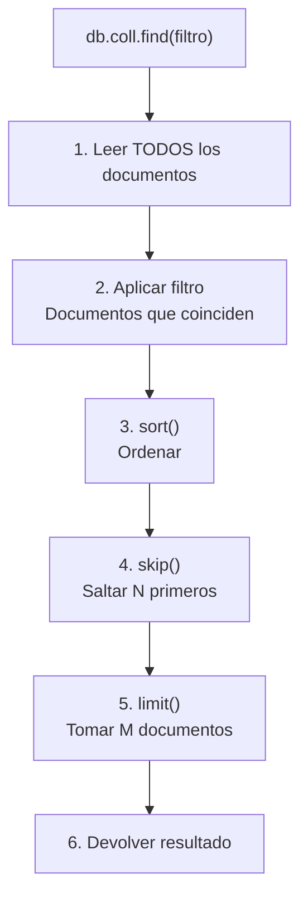

🏠 [← README](../../../README.md) · ⬅️ [← Clase 15](../clase%2015/resumen.md) · Clase 16 · [Clase 17 →](../clase%2017/resumen.md) ➡️ · 🧪 [Ejercicios](ejercicios.md)

---

# Clase 16 — Consultas en MongoDB: find, findOne y filtros

**Fecha:** 6-mayo-2026 (aprox.)  
**Materia:** Bases de datos NO relacionales  
**Tipo:** 📚 Teoría + 🧪 LAB

---

# 🎯 Objetivo de la sesión

Aprender a consultar documentos en MongoDB usando `find()`, `findOne()` y filtros con operadores de comparación. Es el equivalente a `SELECT ... WHERE` en SQL.

---

# 🧠 Parte 1: find() — Recuperar documentos

## Traer todos

```js
db.personas.find()
```

Devuelve todos los documentos de la colección `personas`.

## Encontrar con filtro exacto

```js
db.personas.find({
    nombre: 'Ana'
})
```

Devuelve documentos donde el nombre es exactamente `'Ana'`.

## Múltiples condiciones (AND implícito)

```js
db.personas.find({
    nombre: 'Ana',
    edad: 25
})
```

Devuelve documentos donde nombre = 'Ana' Y edad = 25.

---

# 🔍 Parte 2: Operadores de comparación

| Operador | SQL | MongoDB | Ejemplo |
|----------|-----|---------|---------|
| Mayor que | `>` | `$gt` | `{edad: {$gt: 25}}` |
| Menor que | `<` | `$lt` | `{edad: {$lt: 30}}` |
| Mayor o igual | `>=` | `$gte` | `{edad: {$gte: 25}}` |
| Menor o igual | `<=` | `$lte` | `{edad: {$lte: 30}}` |
| No igual | `!=` | `$ne` | `{nombre: {$ne: 'Ana'}}` |

## Ejemplos

```js
// Personas mayores de 25
db.personas.find({
    edad: {$gt: 25}
})

// Personas menores de 30
db.personas.find({
    edad: {$lt: 30}
})

// Personas de 25 a 30 años (combinando)
db.personas.find({
    edad: {$gte: 25, $lte: 30}
})

// Personas que NO son Ana
db.personas.find({
    nombre: {$ne: 'Ana'}
})
```

---

# 📋 Parte 3: Operador `$in` — Buscar en una lista

```js
// Personas cuyo nombre es 'Ana' O 'Carlos' O 'María'
db.personas.find({
    nombre: {$in: ['Ana', 'Carlos', 'María']}
})

// Equivalente en SQL:
// WHERE nombre IN ('Ana', 'Carlos', 'María')
```

---

# 🎯 Parte 4: findOne() — Obtener un único documento

```js
// Obtener el primer documento
db.personas.findOne()

// Obtener el primer documento que cumpla la condición
db.personas.findOne({
    nombre: 'Ana'
})

// Si no encuentra, devuelve null
db.personas.findOne({
    nombre: 'NoExiste'
})  // null
```

---

# 🔦 Parte 5: Proyección — Seleccionar solo ciertos campos

```js
// Traer solo nombre y edad, sin _id
db.personas.find(
    {},  // filtro (vacío = todos)
    {    // proyección
        nombre: 1,
        edad: 1,
        _id: 0  // excluir el _id
    }
)

// Resultado: solo nombre y edad
// { nombre: 'Ana', edad: 25 }
// { nombre: 'Carlos', edad: 30 }
```

**Sintaxis de proyección:**
- `1` = incluir campo
- `0` = excluir campo

---

# 📊 Parte 6: sort() — Ordenar resultados

```js
// Ordenar por nombre ascendente (A a Z)
db.personas.find().sort({nombre: 1})

// Ordenar por edad descendente (mayor a menor)
db.personas.find().sort({edad: -1})

// Ordenar por múltiples campos
db.personas.find().sort({edad: 1, nombre: 1})
// Primero por edad (menor a mayor), luego por nombre
```

**Sintaxis:**
- `1` = ascendente
- `-1` = descendente

---

# 🔢 Parte 7: limit() — Limitar cantidad de documentos

```js
// Traer solo los primeros 3 documentos
db.personas.find().limit(3)

// Traer 3 documentos a partir del segundo (saltar 1, tomar 3)
db.personas.find().skip(1).limit(3)

// Saltar los 2 primeros y traer 5
db.personas.find().skip(2).limit(5)
```

---

# 💻 Parte 8: Combinar operaciones

Las operaciones se pueden encadenar:

```js
// Personas mayores de 25, ordenadas por nombre, solo los 3 primeros
db.personas.find({
    edad: {$gt: 25}
})
.sort({nombre: 1})
.limit(3)

// Personas de 'Sistemas' o 'Ventas', sin _id
db.empleados.find({
    departamento: {$in: ['Sistemas', 'Ventas']}
},
{
    _id: 0,
    nombre: 1,
    puesto: 1
})
.sort({nombre: 1})
```

---

# 📊 Tabla comparativa: SQL vs MongoDB

| Operación | SQL | MongoDB |
|-----------|-----|---------|
| **Seleccionar todo** | `SELECT * FROM table` | `db.coll.find()` |
| **Seleccionar columnas** | `SELECT col1, col2 FROM table` | `db.coll.find({}, {col1: 1, col2: 1})` |
| **Filtrar** | `WHERE edad > 25` | `{edad: {$gt: 25}}` |
| **Filtrar exacto** | `WHERE nombre = 'Ana'` | `{nombre: 'Ana'}` |
| **Múltiples valores** | `WHERE nombre IN (...)` | `{nombre: {$in: [...]}}` |
| **Ordenar** | `ORDER BY nombre ASC` | `.sort({nombre: 1})` |
| **Limitar** | `LIMIT 3` | `.limit(3)` |
| **Combinar** | `SELECT ... WHERE ... ORDER BY ... LIMIT ...` | `find(...).sort(...).limit(...)` |

---

# 🎯 Diagrama de flujo: Ejecución de find()



---

# 💡 Diferencia crítica: MongoDB vs SQL

**MongoDB es flexible:**
```js
// Estos documentos pueden existir juntos en la misma colección:
{ nombre: 'Ana', edad: 25, email: 'ana@...' }
{ nombre: 'Carlos', edad: 30 }  // Sin email
{ nombre: 'María', edad: 28, ciudad: 'México' }  // Con ciudad
```

**SQL es rígido:**
```sql
-- Todos deben tener las mismas columnas
CREATE TABLE personas (
    nombre VARCHAR(100),
    edad INT,
    email VARCHAR(100)  -- TODOS tienen esta columna
);
```

---

# 📌 Conclusión

Con `find()` tienes todo para consultar datos en MongoDB:

- **find()** → seleccionar documentos (con o sin filtro)
- **Operadores** → `$gt`, `$lt`, `$in`, etc.
- **Proyección** → elegir qué campos mostrar
- **sort()** → ordenar
- **limit() + skip()** → paginar

En próximas clases usarás estas operaciones desde Node.js con async/await para construir APIs que consulten MongoDB.

---

🏠 [← README](../../../README.md) · ⬅️ [← Clase 15](../clase%2015/resumen.md) · Clase 16 · [Clase 17 →](../clase%2017/resumen.md) ➡️ · 🧪 [Ejercicios](ejercicios.md)
