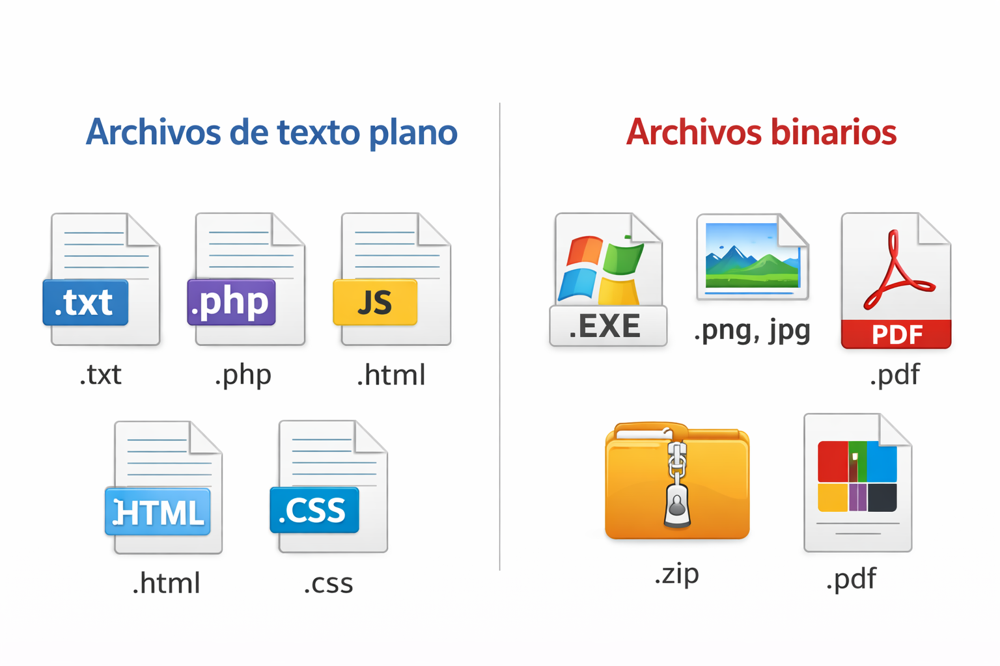
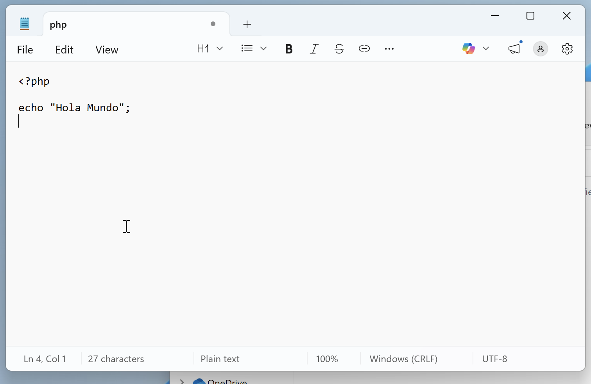
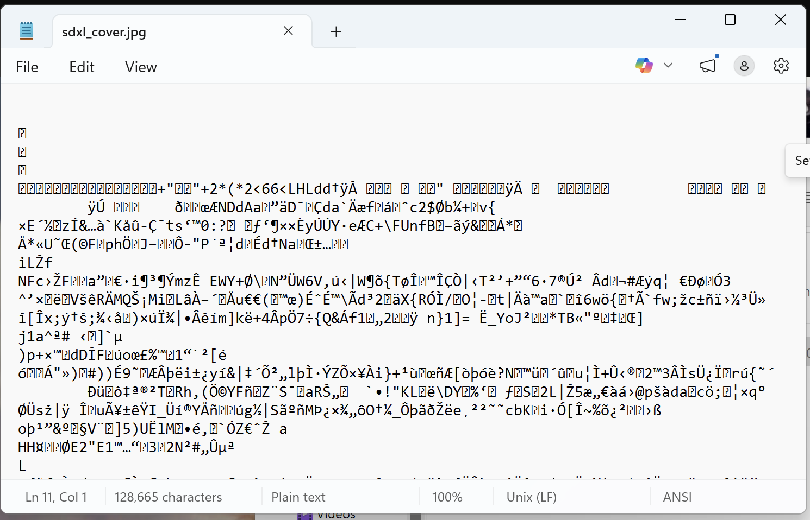
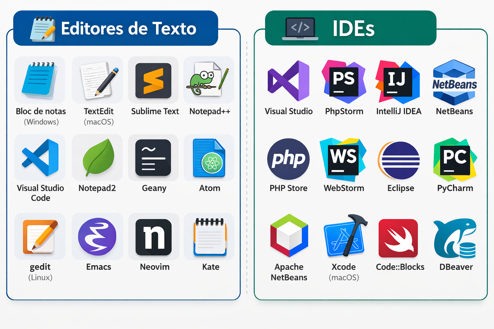
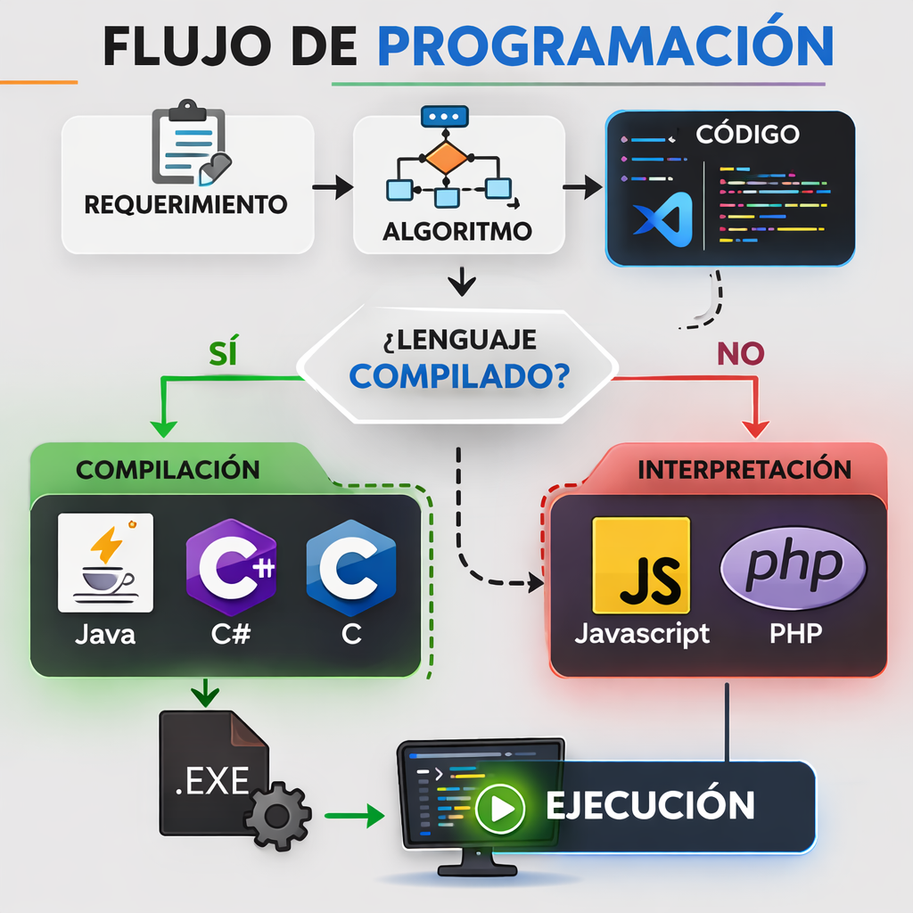

[← README](../../../README.md) · [← Clase 1](../clase%2001/resumen.md) · [Clase 3 →](../clase%2003/resumen.md)

---

# Clase 2 — Entorno de desarrollo y flujo de programación  
**Fecha:** 3 de marzo

---

## Objetivo de la sesión

Introducir a los alumnos en las herramientas básicas utilizadas para programar y explicar el **flujo general del desarrollo de software**, desde el planteamiento de un problema hasta la ejecución de un programa.

---

## Tipos de archivos en computación

Antes de hablar de las herramientas utilizadas para programar, se explicó que en una computadora existen diferentes **tipos de archivos**, dependiendo de cómo está almacenada la información.

De manera general podemos distinguir dos tipos principales:

### Archivos de texto plano

Un **archivo de texto plano** es un archivo que contiene información representada mediante **caracteres de texto**, como letras, números y símbolos.

Este tipo de archivos puede abrirse y leerse fácilmente utilizando un **editor de texto**.

Ejemplos de archivos de texto plano:

- `.txt`
- `.php`
- `.js`
- `.html`
- `.css`

El **código fuente de los programas** normalmente se guarda en este tipo de archivos.

---

### Archivos binarios

Un **archivo binario** es un archivo cuyo contenido está almacenado en un formato diseñado para ser interpretado por un programa específico y no directamente por una persona.

Cuando estos archivos se abren con un editor de texto, normalmente aparecen **caracteres sin sentido**, ya que la información no está organizada como texto.

Ejemplos de archivos binarios:

- programas ejecutables `.exe`
- imágenes `.png`, `.jpg`
- archivos comprimidos `.zip`
- documentos `.pdf`

  

---

### Importancia para la programación

El **código fuente** de un programa se guarda en **archivos de texto plano**, lo que permite que puedan ser creados y modificados usando herramientas simples como un editor de texto.

Posteriormente, ese código puede ser **interpretado o compilado** para producir resultados en la computadora.

---

> **Nota**
>
> Si un **archivo de texto plano** se abre en un editor de texto simple, como el **Bloc de notas**, podremos ver su contenido sin problema, ya que está compuesto por caracteres de texto.
>
> En cambio, si abrimos un **archivo binario**, normalmente veremos **caracteres extraños o símbolos sin sentido**. Esto ocurre porque la información del archivo no está organizada como texto, sino como una **secuencia de datos binarios diseñada para ser interpretada por un programa específico**.
>
> Si un archivo binario se abre en un editor de texto y posteriormente se guarda, es muy probable que el archivo quede **corrupto**, ya que el editor puede modificar la estructura original de los datos al intentar guardarlos como texto.
>
> Por esta razón, los archivos binarios deben abrirse únicamente con el **programa adecuado que sabe cómo interpretar su contenido**.

[Texto plano abierto en un editor de texto]

[Binario abierto en un editor de texto]

---

## ¿Qué es un editor de texto?

Un **editor de texto** es una herramienta que permite crear y modificar archivos de texto. En programación se utiliza para **escribir el código fuente de un programa**.

A diferencia de los procesadores de texto tradicionales (como Word), los editores de texto no agregan formatos especiales al contenido, lo que permite trabajar únicamente con **texto plano**, que es el formato utilizado por los lenguajes de programación.

Durante el curso se utilizará **Visual Studio Code** como editor de texto principal para escribir los programas.

---

## ¿Qué es un IDE?

Un **IDE (Integrated Development Environment)** o **Entorno de Desarrollo Integrado** es una aplicación que reúne diversas herramientas necesarias para desarrollar software en un solo entorno.

Un IDE generalmente incluye:

- un editor de código
- herramientas para ejecutar programas
- herramientas para detectar errores
- autocompletado de código
- integración con sistemas de control de versiones

Los IDE facilitan el desarrollo de software al centralizar estas herramientas en una sola aplicación.

[Video: IDE vs Editor de texto para principiantes](https://www.youtube.com/watch?v=HN92iVPa1l4)

  

---

## Flujo de programación

Se explicó a los alumnos que el desarrollo de software generalmente sigue una serie de etapas que permiten resolver un problema de manera estructurada.

### Requerimiento

El **requerimiento** describe el problema que se desea resolver o la necesidad que debe cubrir el programa.  
En esta etapa se define **qué debe hacer el sistema**, pero aún no se describe cómo hacerlo.

---

### Algoritmo

Un **algoritmo** es una serie de pasos ordenados que permiten resolver un problema.  
En esta etapa se define **la lógica o procedimiento que se seguirá para llegar a la solución**.

---

### Código

En esta etapa el algoritmo se traduce a un **lenguaje de programación**, permitiendo que las instrucciones puedan ser interpretadas o ejecutadas por la computadora.

---

### Compilación

La **compilación** es el proceso mediante el cual el código escrito por el programador se transforma en un formato que la computadora puede ejecutar.

En algunos lenguajes, este proceso genera un **programa ejecutable** antes de poder correr el software.

Lenguajes que comúnmente utilizan compilación incluyen:

- C  
- C++  
- Java  
- C#

En estos casos, primero se genera un **programa compilado** y posteriormente ese programa puede ejecutarse.

---

### Lenguajes interpretados

También existen lenguajes llamados **interpretados**.

En estos lenguajes el código **no se convierte primero en un programa ejecutable independiente**.

En lugar de eso, el código fuente es **leído directamente por un programa llamado intérprete**, que se encarga de analizar y ejecutar las instrucciones del programa.

El intérprete toma el código escrito por el programador y lo ejecuta **instrucción por instrucción**.

Esto significa que:

- no es necesario generar un archivo ejecutable previamente
- el programa puede ejecutarse directamente desde el código fuente
- el intérprete se encarga de traducir las instrucciones mientras el programa se está ejecutando

Ejemplos de lenguajes interpretados:

- PHP
- JavaScript
- Python
- Ruby

---

### Ejecución

La **ejecución** es el proceso mediante el cual el programa se ejecuta en la computadora y produce un resultado.

  

---

## Introducción a PHP

 

**PHP (PHP: Hypertext Preprocessor)** es un lenguaje de programación interpretado y de alto nivel que se utiliza principalmente para el desarrollo de aplicaciones web.

Este lenguaje permite procesar información, interactuar con bases de datos y generar contenido dinámico.

---

## ¿Por qué usar PHP CLI?

En este curso se utilizará **PHP CLI (Command Line Interface)**.

PHP CLI permite ejecutar programas escritos en PHP directamente desde la **consola del sistema operativo**, sin necesidad de utilizar un servidor web o un navegador.

Esto permite enfocarse principalmente en:

- la lógica del programa
- los conceptos fundamentales de programación
- la interacción con bases de datos

De esta manera se evita el "ruido" que pueden generar otros elementos del desarrollo web en las primeras etapas de aprendizaje.

---

## Práctica — Algoritmos con el cubo Rubik

Al final de la sesión se utilizó el **cubo Rubik** como ejemplo práctico para explicar el concepto de **algoritmo**.

Se explicó que resolver el cubo implica seguir **secuencias específicas de movimientos**, las cuales funcionan de manera similar a los algoritmos en programación: una serie de pasos que, ejecutados en el orden correcto, producen un resultado.

Esta actividad permitió reforzar la idea de que:

- un algoritmo es una **serie de pasos ordenados**
- el **orden de los pasos es importante**
- cambiar el orden puede producir un resultado diferente.

---

## Temas vistos

- Tipos de archivos (texto plano y binarios)
- Editor de texto
- IDE
- Flujo de programación
  - Requerimiento
  - Algoritmo
  - Código
  - Compilación
  - Interpretación
  - Ejecución
- Introducción a PHP
- PHP CLI
- Algoritmos utilizando el cubo Rubik

---

# Resumen:

<image src="clase2.png" width="500">

---

[← README](../../../README.md) · [← Clase 1](../clase%2001/resumen.md) · [Clase 3 →](../clase%2003/resumen.md)
