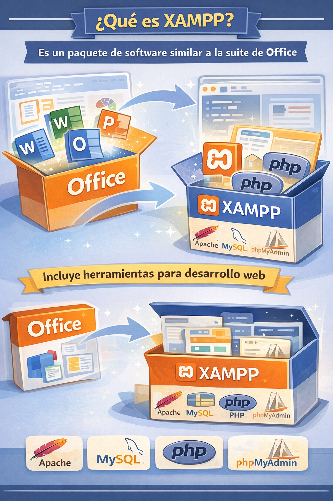
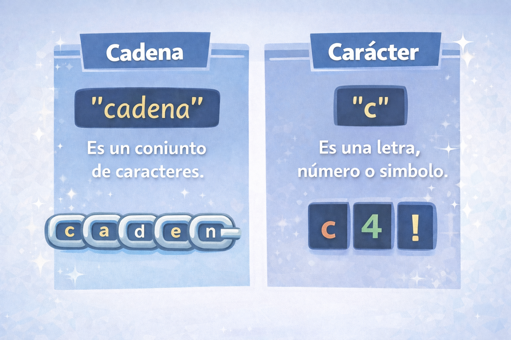
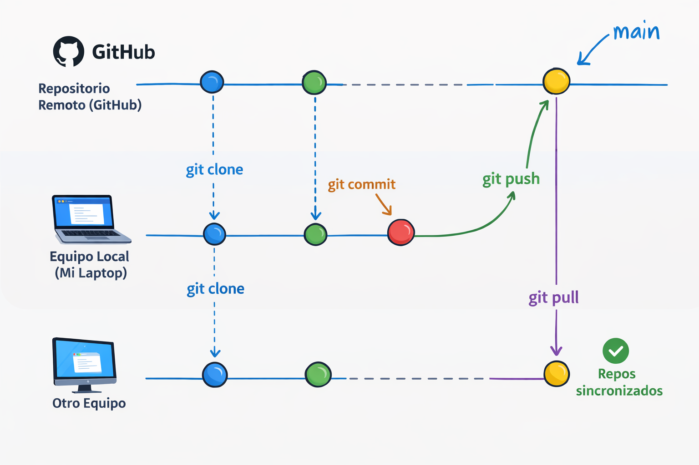
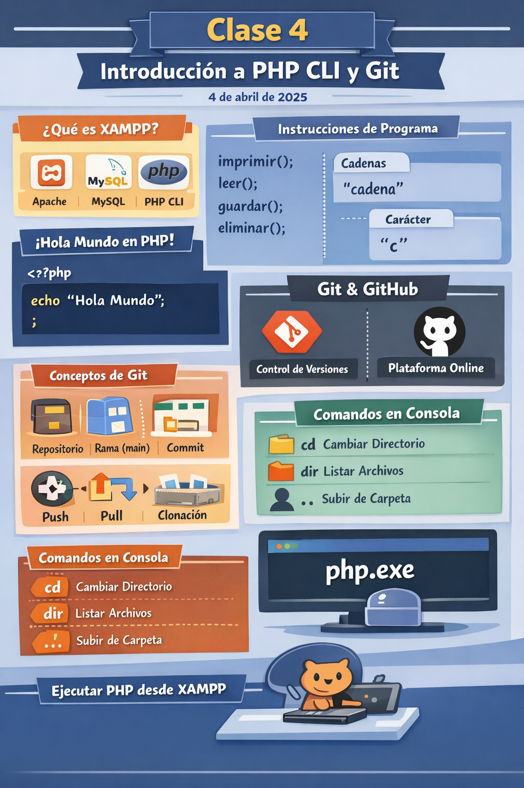

[← README](../../../README.md) &nbsp;·&nbsp; [← Clase 2](../clase%2002/resumen-2026-03-03.md) &nbsp;·&nbsp; [Clase 4 →](../clase%2004/resumen-2026-03-06.md)

---

# Clase 3 — Introducción a PHP CLI y Git
**Fecha:** 4 de abril

---

# Objetivo de la sesión

Comprender cómo ejecutar un programa simple en **PHP desde la línea de comandos**, identificar la estructura básica de una instrucción en programación y conocer herramientas fundamentales utilizadas por los desarrolladores como **Git y GitHub**.

---

# ¿Qué es XAMPP?

Se explicó que **XAMPP** es un paquete de software que incluye varias herramientas utilizadas para el desarrollo web.

Entre los componentes principales que incluye se encuentran:

- **Apache** (servidor web)
- **MySQL / MariaDB** (gestor de bases de datos)
- **PHP** (lenguaje de programación)
- **phpMyAdmin** (herramienta para administrar bases de datos)

En esta etapa del curso se utiliza principalmente **PHP**, específicamente su versión para **línea de comandos (PHP CLI)**.

<div align="center">
    
</div>

---

# ¿Qué es una instrucción o sentencia?

En programación, una **instrucción** o **sentencia** es una orden que se le da al programa para que realice una acción.

Un programa está compuesto por una serie de instrucciones que se ejecutan una tras otra.

Algunos ejemplos simples de acciones que puede realizar un programa son:

- imprimir información en pantalla  
- leer datos  
- guardar información  
- eliminar datos  

Ejemplos conceptuales de estas acciones:

```php
imprimir();
leer();
guardar();
eliminar();
```

Estas expresiones representan acciones que un programa podría ejecutar.

---

# Cadenas y caracteres

También se explicó cómo representar texto dentro de un programa.

## Cadena (string)

Una **cadena** es un conjunto de caracteres.

Ejemplo:

```php
"cadena"
```

Las cadenas generalmente se utilizan para representar **texto**.

---

## Carácter

Un **carácter** es una sola letra, número o símbolo.

Ejemplo:

```php
'c'
```

Un carácter representa una **unidad individual de texto**.

<div align="center">
    
</div>


---

# Primer programa en PHP

Se mostró el ejemplo clásico conocido como **Hola Mundo**, utilizado tradicionalmente para introducir un lenguaje de programación.

```php
<?php

echo "Hola Mundo";
```

Posteriormente se explicó cada una de sus partes.

### `<?php`

Indica el **inicio del código PHP**.

### `echo`

Es una instrucción de PHP que permite **mostrar texto en pantalla**.

### `"Hola Mundo"`

Es una **cadena de texto** que será enviada a la salida del programa.

### `;`

El punto y coma indica el **final de una instrucción**.

# Introducción a Git y GitHub

También se introdujeron herramientas utilizadas para el **control de versiones del código**.

## Git

**Git** es un sistema que permite registrar los cambios que se realizan en un proyecto a lo largo del tiempo.

Esto permite:

- guardar versiones del proyecto
- ver cambios realizados
- trabajar en equipo
- recuperar versiones anteriores

---

## GitHub

**GitHub** es una plataforma en línea que permite **almacenar repositorios Git en internet**.

Esto facilita compartir proyectos y colaborar con otros desarrolladores.

---

# Conceptos básicos de Git

Durante la clase se explicaron algunos conceptos fundamentales.

### Repositorio

Un **repositorio** es una carpeta donde se guarda un proyecto y el historial de cambios realizados.

### Rama principal (main)

Es la **rama principal del proyecto**, donde normalmente se encuentra la versión estable del código.

### Commit

Un **commit** es un registro de los cambios realizados en el proyecto.

### Push

Permite **enviar los cambios locales hacia el repositorio remoto**.

### Pull

Permite **descargar cambios desde el repositorio remoto**.

### Clonación

La **clonación** consiste en copiar un repositorio remoto a una computadora local.

<div align="center">
    
</div>

---

# Comandos en la consola

Se explicó que muchos programas se pueden ejecutar mediante **comandos escritos en la consola**.

Un comando es una instrucción que se escribe en la terminal para que el sistema operativo realice una acción.

---

## Comandos básicos vistos

### `cd`

Permite **cambiar de directorio**.

Ejemplo conceptual:

```
cd carpeta
```

---

### `dir`

Permite **listar los archivos y carpetas del directorio actual**.

---

### `..`

Se explicó que `..` representa el **directorio padre** o **carpeta superior**.

Esto significa que permite moverse **un nivel hacia atrás en la estructura de carpetas**.

Ejemplo conceptual:

```
cd ..
```

Este comando hace que la consola regrese a la **carpeta anterior en la jerarquía de directorios**.

---
# El intérprete de PHP

Se explicó que PHP es un lenguaje interpretado.

Esto significa que el código no se compila previamente, sino que es interpretado y ejecutado por un programa especial llamado intérprete.

En el caso de PHP, el intérprete es el archivo:

```cmd
php.exe
````

Este programa lee el archivo .php, interpreta sus instrucciones y ejecuta el código.

Por esta razón, cuando se ejecuta PHP desde la terminal, en realidad se está utilizando el intérprete de PHP.

---

# Ejecutar PHP desde XAMPP

Se explicó cómo ejecutar el **PHP incluido dentro de XAMPP** utilizando la consola.

Para ello es necesario ejecutar el archivo:

```
C:\wampp\php\php.exe
```

Esto permite correr scripts de PHP desde la terminal.

---


# Actividad de laboratorio

Durante el laboratorio los alumnos realizaron las siguientes actividades:

1. Ejecutar php.exe --version para verficar la version de PHP
    El estudiante mediante la consola debe de ubicarse en la carpta `C:\xampp\php`, la ubicacion comun en instalaciones xampp en windows y ejecutar el ejecutable `php.exe` con el flag `--version`

    ```cm
    cd C:\xampp\php 
    php.exe --version
    ```
2. Crear una cuenta en **GitHub**
3. Crear su **primer repositorio**
4. Clonar el repositorio en su computadora


Esta actividad permitió introducir a los alumnos en el **flujo básico de trabajo con Git y GitHub**.

# RESUMEN

<div align="center">
    
</div>

---

[← README](../../../README.md) &nbsp;·&nbsp; [← Clase 2](../clase%2002/resumen-2026-03-03.md) &nbsp;·&nbsp; [Clase 4 →](../clase%2004/resumen-2026-03-06.md)
