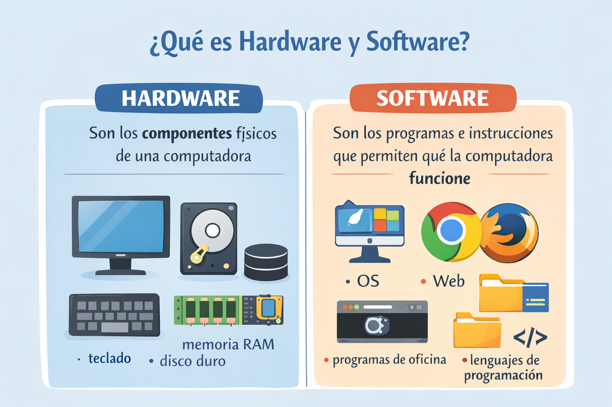
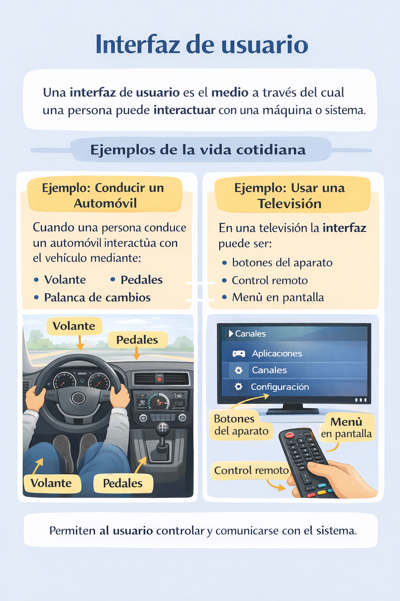
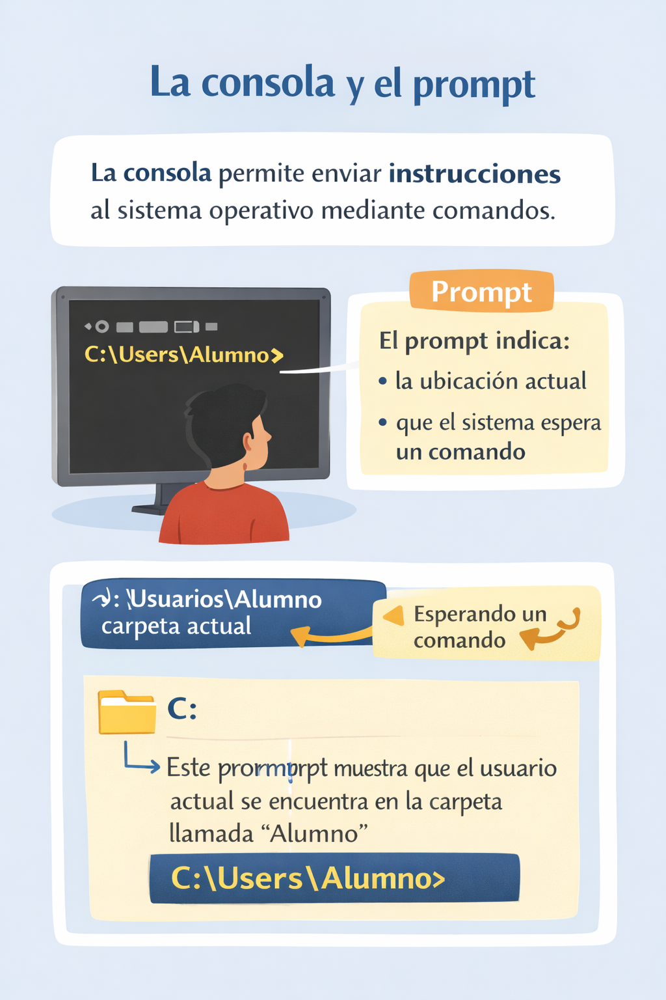
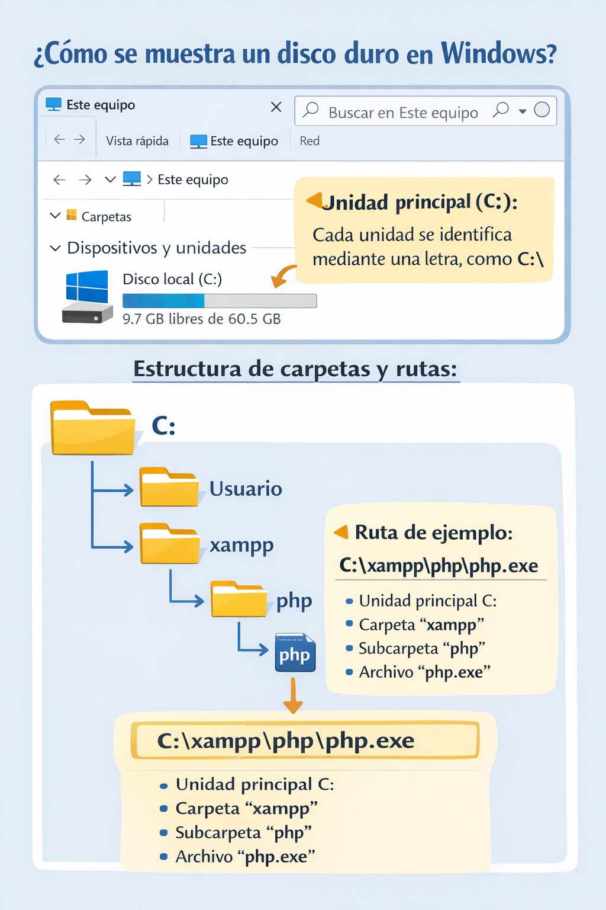
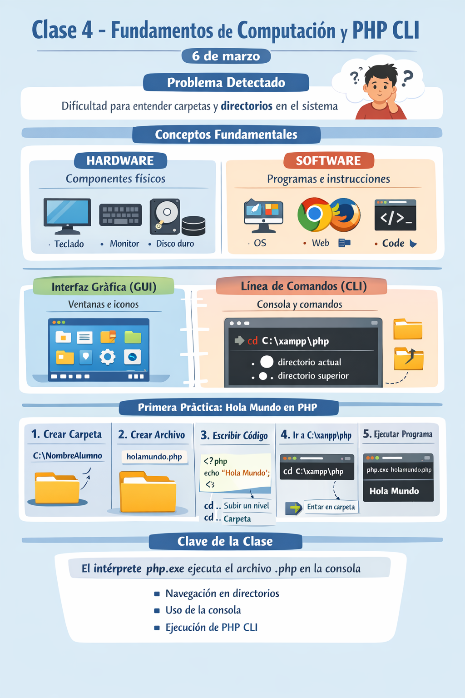

🏠 [← README](../../../README.md) · ⬅️ [← Clase 3](../clase%2003/resumen.md) · ➡️ [Clase 5 →](../clase%2005/resumen.md)

---

# Clase 4 — Fundamentos de computación y primer programa en PHP CLI  
**Fecha:** 6 de marzo

---

# Objetivo de la sesión

Fortalecer conocimientos básicos de computación necesarios para trabajar con herramientas de desarrollo.

Además, realizar la **primera ejecución de un programa en PHP desde la consola**, comprendiendo el uso de rutas, directorios y comandos básicos del sistema.

---

# Diagnóstico inicial

Durante la primera práctica se detectó que varios alumnos presentan **dificultades para comprender la estructura de directorios en Windows**.

En particular se observaron problemas para:

- comprender cómo se organizan las carpetas dentro del sistema
- identificar en qué ubicación se encuentran
- navegar entre directorios desde la consola

Esto evidenció que algunos alumnos tienen **conocimientos limitados de computación básica**, por lo que fue necesario reforzar conceptos fundamentales antes de continuar con programación.

---

# Hardware y Software

Se explicó la diferencia entre **hardware** y **software**.

**Hardware**

Se refiere a los **componentes físicos** de una computadora.

Ejemplos:

- teclado  
- monitor  
- disco duro  
- memoria RAM  
- procesador  

**Software**

Es el **conjunto de programas e instrucciones** que permiten que la computadora realice tareas.

Ejemplos:

- sistema operativo  
- navegadores  
- programas de oficina  
- lenguajes de programación  

<div align="center">
    
</div>


---

# Interfaz de usuario

Se explicó el concepto de **interfaz de usuario**.

Una interfaz de usuario es el **medio a través del cual una persona puede interactuar con una máquina o sistema**.

Se utilizaron ejemplos de la vida cotidiana para entender este concepto.

**Ejemplo: conducir un automóvil**

Cuando una persona conduce un automóvil interactúa con el vehículo mediante:

- volante
- pedales
- palanca de cambios
- tablero de indicadores

Estos elementos funcionan como la **interfaz que permite al conductor controlar el automóvil**.

**Ejemplo: usar una televisión**

En una televisión la interfaz puede ser:

- botones del aparato
- control remoto
- menú en pantalla

A través de esta interfaz el usuario puede cambiar canales, ajustar volumen o apagar el dispositivo.

<div align="center">
    
</div>

---

# Interfaces en la computadora

En computación existen diferentes tipos de interfaces que permiten al usuario comunicarse con la computadora.

Las dos más comunes son:

**Interfaz gráfica (GUI)**

Es la interfaz que utiliza **ventanas, iconos y botones**.

Ejemplos:

- el escritorio de Windows
- explorador de archivos
- aplicaciones con menús y botones

**Interfaz de línea de comandos (CLI)**

En lugar de usar botones, el usuario interactúa con la computadora **escribiendo comandos en una consola**.

En este curso se utilizará la **consola de comandos** para ejecutar programas.

---

# La consola y el prompt

Se explicó que la **consola** es una herramienta que permite interactuar con el sistema operativo mediante comandos.

Dentro de la consola aparece el **prompt**, que es el texto que indica:

- la ubicación actual en el sistema
- que la consola está esperando un comando del usuario

Ejemplo de prompt:

```
C:\Users\Alumno>
```

Esto significa que actualmente el usuario se encuentra dentro de la carpeta `Alumno`.

<div align="center">
    
</div>

---

# Unidades en Windows

Se explicó que en Windows los dispositivos de almacenamiento se organizan mediante **unidades**.

Cada unidad se identifica mediante una **letra seguida de dos puntos**.

Ejemplos comunes:

- `C:` unidad principal del sistema  
- `D:` unidad secundaria o partición  
- `E:` memoria USB o dispositivo externo  

Las carpetas y archivos se almacenan dentro de estas unidades.

---

# Rutas de archivo

Una **ruta de archivo** indica la ubicación exacta de un archivo dentro del sistema.

Ejemplo:

```
C:\xampp\php\php.exe
```

Esta ruta indica:

- unidad `C:`  
- carpeta `xampp`  
- subcarpeta `php`  
- archivo `php.exe`

Las rutas permiten localizar y ejecutar archivos desde la consola.

<div align="center">
    
</div>

---

# Comando `cd`

Se explicó el comando **cd** (change directory).

Este comando permite **cambiar de directorio dentro de la consola**.

El usuario debe indicar **a qué carpeta desea moverse**.

Ejemplo:

```
cd C:\xampp\php
```

Este comando cambia la ubicación actual de la consola a la carpeta indicada.

---

# Directorio actual y directorio superior

También se explicó el significado de los símbolos utilizados para navegar entre directorios.

```
.   directorio actual
..  directorio superior
```

Esto permite moverse dentro de la estructura de carpetas.

Ejemplos:

Subir un nivel en la estructura de carpetas:

```
cd ..
```

Entrar a una carpeta:

```
cd carpeta
```

De esta forma el usuario puede navegar entre carpetas desde la consola.

---

# Primera práctica — Hola Mundo en PHP

En esta práctica los alumnos ejecutaron su **primer programa en PHP desde la consola**.

---

## Paso 1 — Crear carpeta personal

Cada alumno debía crear una carpeta con su nombre dentro de la unidad `C:`.

Ejemplo:

```
C:\Juan
```

---

## Paso 2 — Crear archivo PHP

Dentro de esa carpeta debían crear el archivo:

```
holamundo.php
```

El archivo fue creado usando **Notepad (Bloc de notas)**.

---

## Paso 3 — Escribir el código

Dentro del archivo debían escribir el siguiente código:

```php
<?php
echo "Hola Mundo";
```

Luego guardar y cerrar el archivo.

---

## Paso 4 — Ir a la carpeta de PHP

Desde la consola se debía navegar a la carpeta donde se encuentra el **interprete de PHP** dentro de XAMPP:

```
C:\xampp\php
```

---

## Paso 5 — Ejecutar el programa

Finalmente se ejecutó el archivo creado por el alumno usando el interprete `php.exe`.

```cmd
php.exe C:\Juan\holamundo.php
```

Al ejecutar el comando, el programa muestra en pantalla:

```
Hola Mundo
```

---

# Concepto clave aprendido

Un programa escrito en **PHP** puede ejecutarse desde la consola utilizando el **interprete `php.exe`**, el cual lee el archivo `.php` y ejecuta las instrucciones que contiene.

Esta actividad permitió a los alumnos:

- comprender la estructura de directorios
- navegar usando la consola
- entender cómo interactuar con la computadora mediante una interfaz
- ejecutar su primer programa desde línea de comandos
- entender el papel del **interprete de PHP** en la ejecución del código.

# RESUMEN

<div align="center">
    
</div>


# NOTA **IMPORTANTE** y RECOMENDACIÓN

En esta clase se notó un **déficit muy grave**: los alumnos no comprenden la **estructura de directorios**, ni son capaces de entender cómo se forma una **ruta a un archivo en Windows**.

También se observó que **no conocen la terminal** ni son capaces de moverse en la consola entre directorios, debido a que presentan un **déficit en la comprensión del sistema de archivos**.

Esto es algo **grave**, ya que es un conocimiento base de la **informática básica**.

Para todo alumno que tenga problema con esto, les recomiendo ver los siguientes videos:

- [¿Cómo se usa la TERMINAL? | Tutorial de CMD/Powershell para PRINCIPIANTES](https://www.youtube.com/watch?v=kfEpjj2NZxU)
- [CURSO BASICO DE CMD](https://www.youtube.com/watch?v=ArJ-UCfZNhQ&list=PLr4IjHlzo00CrJUgGUtqVBLTSlT3WKTUB)
  
---

🏠 [← README](../../../README.md) · ⬅️ [← Clase 3](../clase%2003/resumen.md) · ➡️ [Clase 5 →](../clase%2005/resumen.md)
