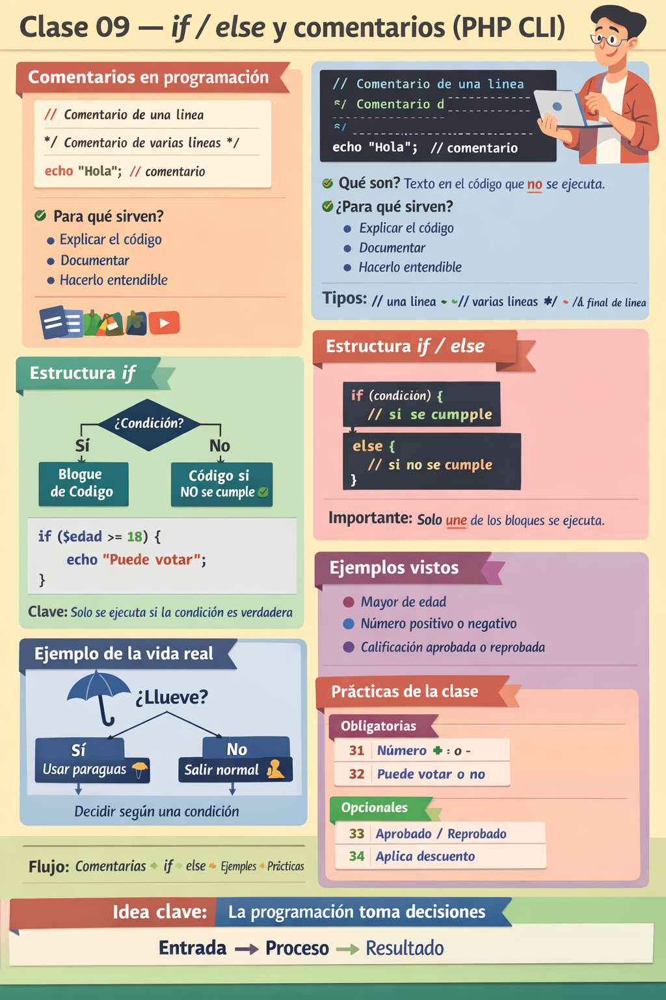

🏠 [← README](../../../README.md) · ⬅️ [← Clase 08](../clase%2008/resumen.md) · Clase 09 · [Clase 10 →](../clase%2010/resumen.md) ➡️

---

# Clase 09 — Comentarios, else y prácticas de if/else (PHP CLI)
**Fecha:** 18 de marzo  
**Duración total:** 2 horas (1 hr tema en aula + 1 hr práctica)

---

## 🎯 Objetivo de la sesión

1. Comprender qué son los **comentarios en programación** y para qué se utilizan.
2. Reforzar el uso de **if** e introducir la estructura **else**.
3. Practicar la toma de decisiones en programas con ejercicios cortos.

---

# ⏱️ Estructura de la clase

## 📊 Resumen de distribución del tiempo

| Tema | Tiempo |
|-----|------|
| Comentarios en programación | 10 min |
| Repaso de if | 10 min |
| Introducción a else | 15 min |
| Ejemplos guiados | 20 min |
| Explicación de práctica y dudas | 5 min |
| Practicas de laboratorio (31 a 34) | 55 min |

---

## 📝 Comentarios en programación

`⏱️ Tiempo 10 min`

Un **comentario** es texto dentro del código que sirve para explicar lo que hace el programa.

Los comentarios **no se ejecutan**.

Sirven para:

- documentar el programa
- explicar la lógica
- facilitar la lectura del código

## Comentario de una línea

`clase-09/e01-comentario-una-linea.php:`

```php
// Este es un comentario
```

## Comentario después de una instrucción

`clase-09/e02-comentario-despues-instruccion.php:`

```php
echo "Hola"; // imprime texto
```

## Comentario de varias líneas

`clase-09/e03-comentario-varias-lineas.php:`

```php
/*
Este es un comentario
de varias líneas
*/
```

Se recomienda iniciar cada práctica con un comentario indicando:

- número de práctica
- objetivo del programa

Ejemplo:

`clase-09/e04-comentario-encabezado-practica.php:`

```php
// Practica 31
// Determinar si un numero es positivo o negativo
```

---

## 🔄 Repaso de la estructura `if`

`⏱️ Tiempo 10 min`

La estructura `if` permite ejecutar código **si una condición se cumple**.

Ejemplo:

`clase-09/e05-repaso-if.php:`

```php
<?php

$edad = 20;

if ($edad >= 18) {
    echo "Puede votar";
}
```

Si la condición es verdadera, el bloque se ejecuta.

---

## ⚙️ Introducción a `else`

`⏱️ Tiempo 15 min`

`else` permite indicar qué hacer cuando la condición **no se cumple**.

Estructura general:

`clase-09/e06-estructura-if-else.php:`

```php
<?php

if (condicion) {
    // instrucciones si se cumple
} else {
    // instrucciones si no se cumple
}
```

Solo uno de los dos bloques se ejecuta.

---

### 🧠 Ejemplo conceptual

¿Llueve?

Sí → usar paraguas  
No → salir normal  

Esto representa cómo un programa puede **tomar decisiones**.

---

## 💻 Ejemplos de código

`⏱️ Tiempo 20 min`

## Mayor de edad

`clase-09/e07-mayor-edad.php:`

```php
<?php

$edad = 16;

if ($edad >= 18) {
    echo "Puede votar";
} else {
    echo "No puede votar";
}
```

## Número positivo o negativo

`clase-09/e08-numero-positivo-negativo.php:`

```php
<?php

$numero = -4;

if ($numero > 0) {
    echo "Número positivo";
} else {
    echo "Número cero o negativo";
}
```

## Calificación

`clase-09/e09-calificacion.php:`

```php
<?php

$calificacion = 65;

if ($calificacion >= 70) {
    echo "Aprobado";
} else {
    echo "Reprobado";
}
```

---

## 🧪 Ejercicios guiados previos a la práctica

`⏱️ Tiempo 5 min`

Resolver de forma rapida, en grupo:

- edad para votar
- número positivo o negativo

Estas consignas sirven como puente antes de comenzar las practicas individuales.

---

## 🧾 Práctica en clase

`⏱️ Tiempo 60 min`

En esta sesión la prioridad es completar las prácticas obligatorias y validar la lógica de decisión con `if/else`.

[Ejercicios](ejercicios.md)

# Resumen
<div align="center">
    
</div>

---

🏠 [← README](../../../README.md) · ⬅️ [← Clase 08](../clase%2008/resumen.md) · Clase 09 · [Clase 10 →](../clase%2010/resumen.md) ➡️

