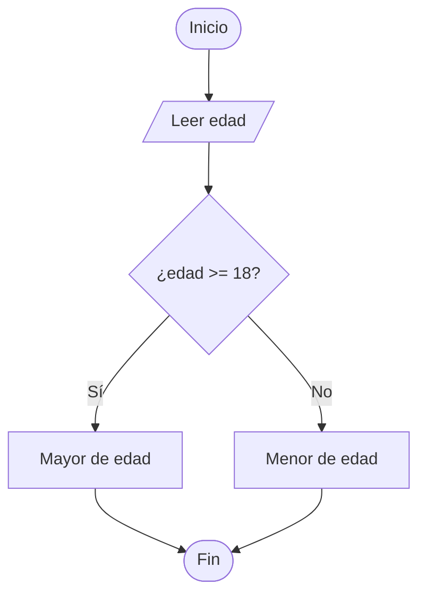
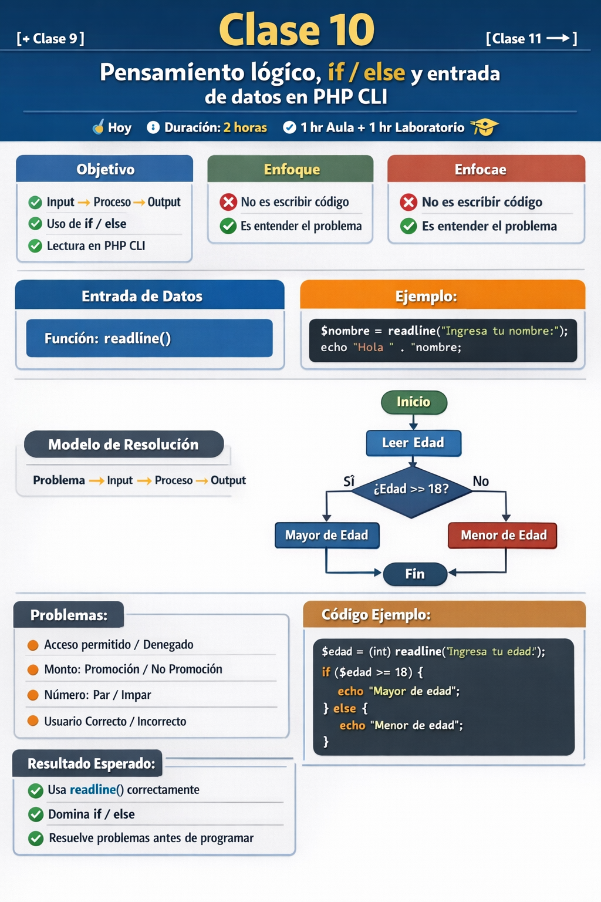

[← Clase 9](../clase%2009/resumen.md) · [Clase 11 →](../clase%2011/plan.md)

---

# Clase 10 — Pensamiento lógico, `if / else` y entrada de datos en PHP CLI
**Fecha:** hoy  
**Duración total:** 2 horas  
**Modalidad:** 1 hr aula + 1 hr laboratorio

---

# 🎯 Objetivo de la sesión

Que el alumno:

- comprenda que programar implica seguir un proceso lógico;
- identifique claramente:
  - **Input (entrada)**
  - **Process (proceso)**
  - **Output (salida)**
- utilice estructuras de decisión con `if / else`;
- aprenda a recibir datos desde teclado en **PHP CLI**;
- desarrolle la capacidad de resolver problemas antes de escribir código;
- construya soluciones completas en **PHP CLI**.

---

# 🧠 Enfoque de la clase

> ❌ Programar no es empezar escribiendo código  
> ✅ Programar es entender primero el problema

---

# 📥 Entrada de datos en PHP CLI

Se utiliza la función:

```php
readline()
```

---

## 📄 Ejemplo básico

```php
<?php

$nombre = readline("Ingresa tu nombre: ");
echo "Hola " . $nombre;
```

---

## 📌 Conversión de tipos

```php
$edad = (int) readline("Edad: ");
$precio = (float) readline("Precio: ");
```

---

# 🧠 Modelo de resolución

📌 Problema → 📥 Input → ⚙️ Process → 📤 Output  

---

# 🔷 Diagrama



---

# 💻 Código ejemplo

```php
<?php

$edad = (int) readline("Ingresa tu edad: ");

if ($edad >= 18) {
    echo "Mayor de edad";
} else {
    echo "Menor de edad";
}
```

---

# 🧩 Problemas

1. Edad → acceso permitido / denegado  
2. Monto → promoción / no promoción  
3. Número → par / impar  
4. Usuario → correcto / incorrecto  
5. Dos números → mayor  
6. División → válida / error  
7. Velocidad → exceso / normal  
8. Asistencia → suficiente / insuficiente  

---




# ✅ Resultado esperado

El alumno:

- usa `readline()` correctamente
- entiende if/else
- resuelve problemas antes de programar


