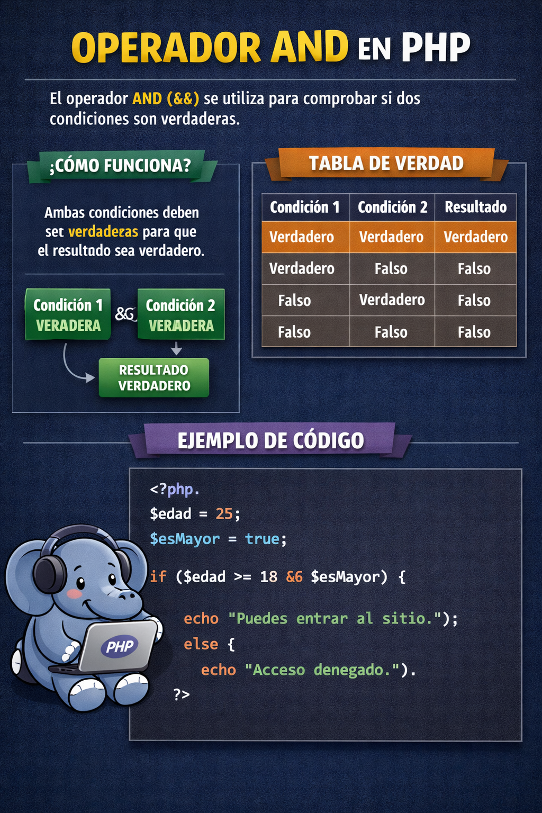
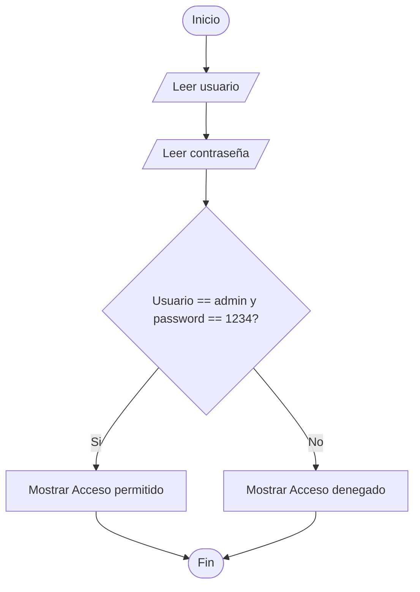
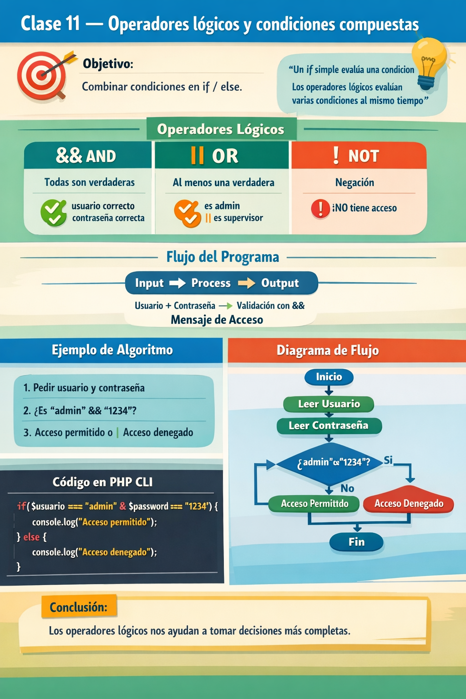

🏠 [← README](../../../README.md) · ⬅️ [← Clase 10](../clase%2010/resumen.md) · Clase 11 · [Clase 12 →](../clase%2012/resumen.md) ➡️ · 🧪 [Ejercicios](ejercicios.md)

---
# Clase 11 Operadores lógicos, operador `&&`   

**Fecha:** 23-marzo-2026  
**Materia:** Bases de datos relacionales  

---

# 🎯 Objetivo del tema

Aprender a **combinar condiciones** usando operadores lógicos dentro de estructuras `if / else`.

---

# 🧠 Idea clave

> Un `if` simple evalúa el resutlado condición boleana 
> Los operadores lógicos permiten evaluar **varias condiciones al mismo tiempo**

---

# 🔗 Operadores lógicos


Los operadores lógicos son símbolos que se utilizan para combinar o modificar condiciones en una expresión.

Sirven para evaluar más de una condición al mismo tiempo y obtener como resultado un valor:

- `true (verdadero)`  
- `false (falso)`

| Operador | Nombre | Evalua | Resutlado| Evalua | Resutlado |
|----------|--------|--------|----------|--------|-----------|
| &&       | AND (Y)   | Si ambas expresiones bolenas sean verdaderas | **true** | si una es falsa | **false** |
| \|\|     | OR  (Ó)   | . | . | . | . |
| !        | NOT (NO) | . | . | . | . |

# Operador Lógico `&&`  — AND (Y lógico) :

Se cumple cuando **todas las condiciones son verdaderas**

|    |    |    |   |   |
|----|----|----|---|---|
| verdadero | && | verdadero | = | verdadero | 
| verdadero | && | falso | = | falso |  
| falso     | && | falso | = | falso |


Ejemplo en código PHP

```php
<?php

echo "¿Cuantos años tienes? \n";
$edad = (int) readline();

echo "¿Tienes tu INE? (SI/NO) \n";

$ine = readLine();

if($edad == 18 && $ine == "SI") {
    echo "Puedes pasar";
} else {
    echo "NO puedes pasar";
}

```

<div align="center">
    
</div>
---

# 🧩 Tipo de problemas que resuelve

Cuando necesitamos que en un grupo codiciones **TODAS** sean ciertas

Ej:

- validación de acceso (login)
  - usaurio valido
  - contraseña valida

- descuentos con condiciones
  - un monto de compra minimo
  - ser miembro de la tienda

---

# 🧪 Desarrollo del ejemplo

## Enunciado del problema

Crear un programa que solicite:

- usuario
- contraseña

Si el usuario es igual a `"admin"` y la contraseña es igual a `"1234"`, debe mostrar:

```text
Acceso permitido
```

En caso contrario, debe mostrar:

```text
Acceso denegado
```

---

## Algoritmo

1. Inicio  
2. Pedir el usuario  
3. Guardar el usuario  
4. Pedir la contraseña  
5. Guardar la contraseña  
6. Comparar si el usuario es `"admin"` y la contraseña es `"1234"`  
7. Si ambas condiciones son verdaderas, mostrar `"Acceso permitido"`  
8. En caso contrario, mostrar `"Acceso denegado"`  
9. Fin  

---

## Diagrama de flujo



---

## Pseudocódigo

```text
Inicio

  Escribir "Ingresa el usuario:"
  Leer usuario

  Escribir "Ingresa la contraseña:"
  Leer contrasena

  Si usuario = "admin" Y contrasena = "1234" Entonces
      Escribir "Acceso permitido"
  SiNo
      Escribir "Acceso denegado"
  FinSi

Fin
```

---

## Código en PHP CLI

```php
<?php

echo "Ingresa el usuario: \n";
$usuario = readline();

echo "Ingresa la contraseña: \n";
$password = readline();

if ($usuario === "admin" && $password === "1234") {
    echo "Acceso permitido\n";
} else {
    echo "Acceso denegado\n";
}
```

---

# 📌 Conclusión

Los operadores lógicos permiten construir decisiones más completas y acercarse a problemas reales de programación.


# RESUMEN 




# Ejercicios/Practicas

[Ejercicios](ejercicios.md)


🏠 [← README](../../../README.md) · ⬅️ [← Clase 11](../clase%2010/resumen.md)  | [Clase 12 →](../clase%2012/resumen.md) ➡️ 
