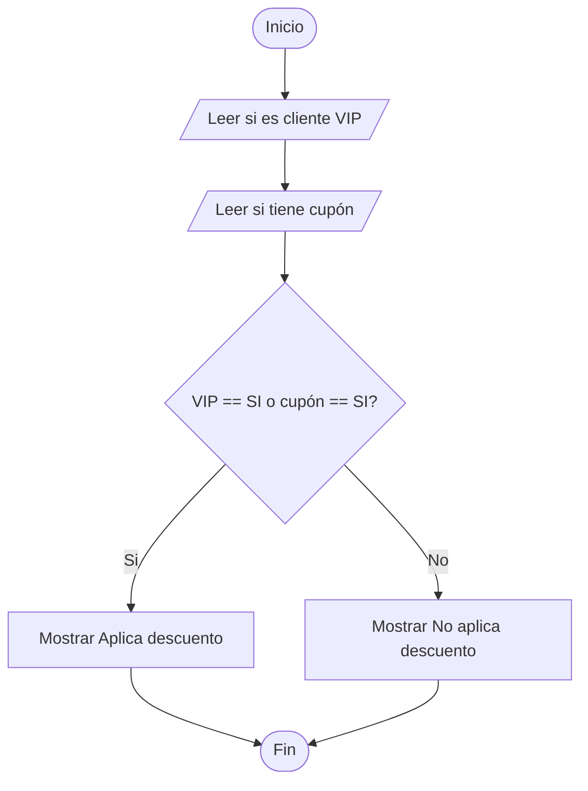
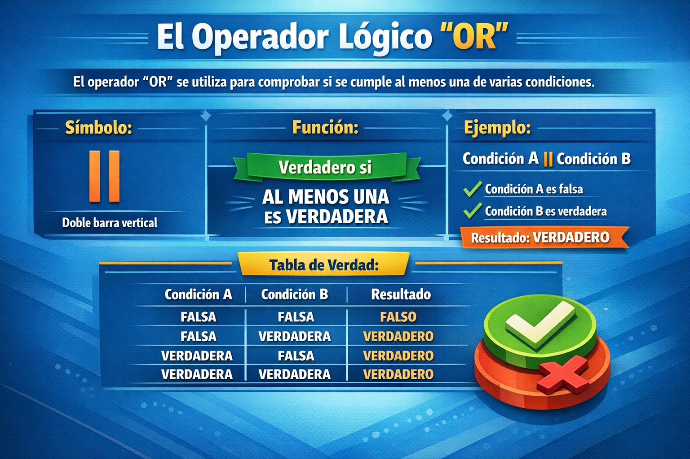
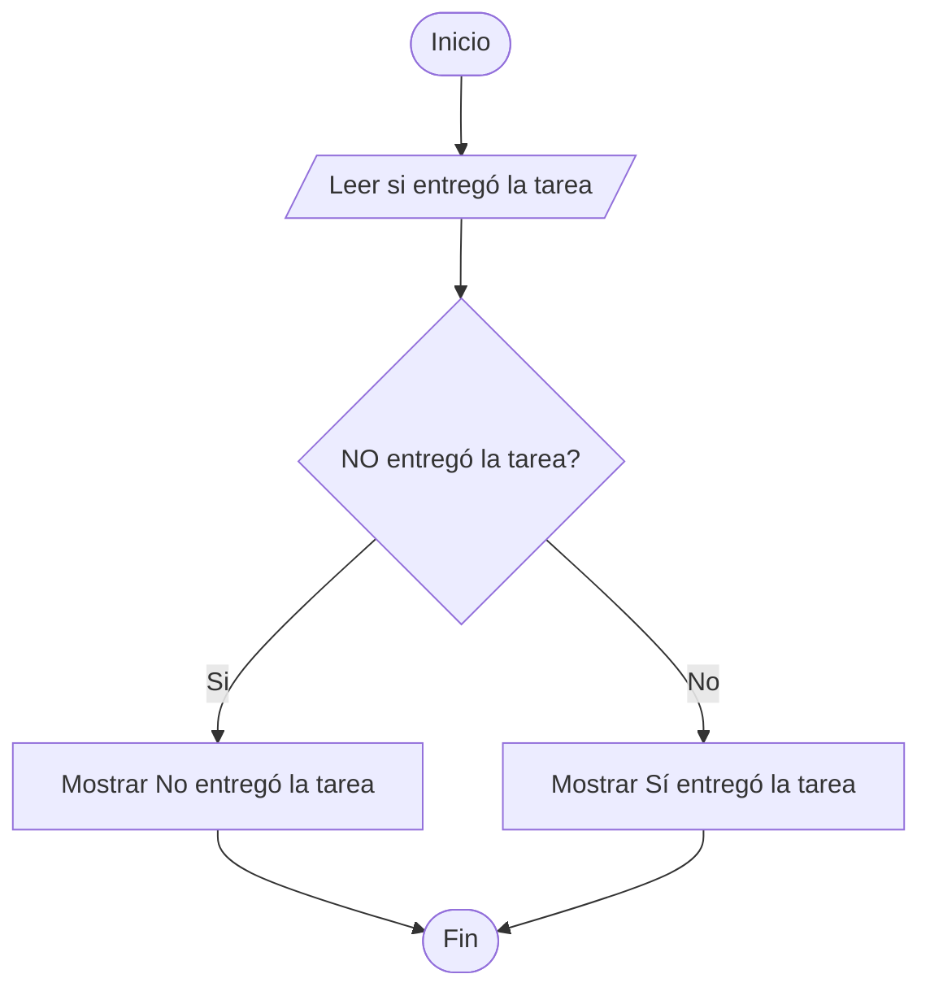
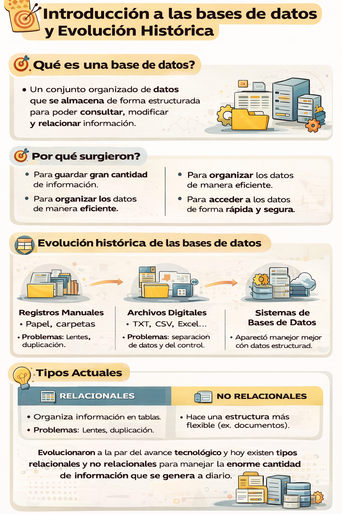

🏠 [← README](../../../README.md) · ⬅️ [← Clase 10](../clase%2010/resumen.md) · 🧪 [Ejercicios](ejercicios.md)

---
# Clase 12 Operadores lógicos, operador `||` or y `!` not, Introducción a las bases de datos y evolución histórica  

**Fecha:** 25-marzo-2026  
**Materia:** Bases de datos relacionales  

---

# 🎯 Objetivo del tema

- Aprender a **combinar condiciones** usando los operadores lógicos or y not dentro de estructuras `if / else`.
- Definir que es una base de datos 
- Definir que es un DBSM/SGBD
  
---

# 🔗 Operadores lógicos


Los operadores lógicos son símbolos que se utilizan para combinar o modificar condiciones en una expresión.

Sirven para evaluar más de una condición al mismo tiempo y obtener como resultado un valor:

- `true (verdadero)`  
- `false (falso)`

| Operador | Nombre   | Evalúa                               | Resultado | Evalúa                             | Resultado |
| -------- | -------- | ------------------------------------ | --------- | ---------------------------------- | --------- |
| &&       | AND (Y)  | Todas las condiciones son verdaderas | **true**  | Al menos una condición es falsa    | **false** |
| \|\|       | OR (O)   | Al menos una condición es verdadera  | **true**  | Todas las condiciones son falsas   | **false** |
| !        | NOT (NO) | La condición original es falsa       | **true**  | La condición original es verdadera | **false** |


# Operador Lógico `||`  — OR (Ó lógico) :

OR resulta en verdero cuando **al menos una condición** es verdadera de lo contrario resulta en falso

|    |    |    |   |   |
|----|----|----|---|---|
| verdadero | \|\| | verdadero | = | verdadero | 
| verdadero | \|\| | falso | = | verdadero |  
| falso     | \|\| | falso | = | falso |


Ejemplo en código PHP

```php
<?php

echo "¿Eres cliente VIP? (SI/NO) \n";
$vip = readline();

echo "¿Tienes cupón de descuento? (SI/NO) \n";
$cupon = readline();

if ($vip == "SI" || $cupon == "SI") {
    echo "Aplica descuento";
} else {
    echo "No aplica descuento";
}

```

---

# 🧩 Tipo de problemas que resuelve el operador `!` NOT

Cuando necesitamos **negar** una condición, es decir, comprobar que algo **no** se cumple.

Ej:
 - validar ausencia de una condición
    - no tener acceso
    - no haber iniciado sesión
 - detectar lo contrario de un estado
    - no estar activo
    - no estar disponible
 - comprobar que algo falta
    - no entregar tarea
    - no presentar identificación
 - restringir acciones
    - no tener permiso
    - no aceptar términos
---

# 🧪 Desarrollo del ejemplo `||`  OR 

## Enunciado del problema

Crear un programa que solicite:

- si es cliente VIP
- si tiene cupón

Si el cliente es `"SI"` o tiene cupón `"SI"`, debe mostrar:
```text
Aplica descuento
```

En caso contrario, debe mostrar:

```text
No aplica descuento
```

---

## Algoritmo

1. Inicio  
2. Pedir si es cliente VIP  
3. Guardar la respuesta  
4. Pedir si tiene cupón  
5. Guardar la respuesta  
6. Comparar si es cliente VIP `"SI"` o si tiene cupón `"SI"`  
7. Si al menos una condición es verdadera, mostrar `"Aplica descuento"`  
8. En caso contrario, mostrar `"No aplica descuento"`  
9. Fin  

---

## Diagrama de flujo



---

## Pseudocódigo

```text
Inicio

  Escribir "¿Es cliente VIP?"
  Leer vip

  Escribir "¿Tiene cupón?"
  Leer cupon

  Si vip = "SI" O cupon = "SI" Entonces
      Escribir "Aplica descuento"
  SiNo
      Escribir "No aplica descuento"
  FinSi

Fin
```

---

## Código en PHP CLI

```php
<?php

echo "¿Es cliente VIP? (SI/NO)\n";
$vip = readline();

echo "¿Tiene cupón? (SI/NO)\n";
$cupon = readline();

if ($vip === "SI" || $cupon === "SI") {
    echo "Aplica descuento\n";
} else {
    echo "No aplica descuento\n";
}
```


---

# 📌 Conclusión or

El operador `||` permite tomar decisiones cuando existen varias opciones posibles.

Se utiliza cuando basta con que **al menos una condición** sea verdadera para que la acción se cumpla.

<div align="center">
    
</div>
---

# Operador lógico `!` — NOT (No lógico)

Se utiliza para **negar** una condición.

|   |   |   |
|---|---|---|
| ! | verdadero | = falso |
| ! | falso     | = verdadero |


Ejemplo en código PHP

```php
<?php

echo "¿El alumno entregó la tarea? (SI/NO)\n";
$entrego = readline();

if (!($entrego == "SI")) {
    echo "No entregó la tarea\n";
} else {
    echo "Sí entregó la tarea\n";
}

```

# 🧪 Desarrollo del ejemplo `!` NOT

## Enunciado del problema

Crear un programa que solicite:

- si el alumno entregó la tarea

Si el alumno **no** entregó la tarea, debe mostrar:

```text
No entregó la tarea
```

En caso contrario, debe mostrar:

```text
Sí entregó la tarea
```

---

## Algoritmo

1. Inicio  
2. Pedir si el alumno entregó la tarea  
3. Guardar la respuesta  
4. Comparar si **no** entregó la tarea  
5. Si la condición es verdadera, mostrar `"No entregó la tarea"`  
6. En caso contrario, mostrar `"Sí entregó la tarea"`  
7. Fin  

---

## Diagrama de flujo



---

## Pseudocódigo

```text
Inicio

  Escribir "¿Entregó la tarea?"
  Leer entrego

  Si NO (entrego = "SI") Entonces
      Escribir "No entregó la tarea"
  SiNo
      Escribir "Sí entregó la tarea"
  FinSi

Fin
```

---

## Código en PHP CLI

```php
<?php

echo "¿Entregó la tarea? (SI/NO)\n";
$entrego = readline();

if (!($entrego === "SI")) {
    echo "No entregó la tarea\n";
} else {
    echo "Sí entregó la tarea\n";
}
```

# 📌 Conclusión Not

El operador `!` permite negar una condición y evaluar su contrario.

Se utiliza cuando necesitamos comprobar que algo **no** se cumple, invirtiendo el valor de una expresión lógica.

<div align="center">
    
</div>


---

# Introducción a las bases de datos y evolución histórica

---

# 🎯 Objetivo del tema

Que el alumno:

- comprenda qué es una base de datos;
- identifique por qué surgieron las bases de datos;
- reconozca de forma general la evolución histórica del almacenamiento de información;
- distinga entre formas antiguas y modernas de organizar datos;
- se prepare para el estudio de bases de datos relacionales y no relacionales.

---

# 🧠 Idea central

Las bases de datos no surgieron por casualidad.

Aparecieron como respuesta a una necesidad muy importante:

> guardar grandes cantidades de información de forma ordenada, segura y fácil de consultar.

A lo largo del tiempo, la forma de almacenar datos fue cambiando conforme crecieron las necesidades de las personas, las empresas y la tecnología.

---

# 📌 Recordatorio: dato e información

Antes de hablar de bases de datos, es importante recordar:

## Dato
Es un valor aislado, sin contexto completo.

Ejemplos:

- José
- 18
- León
- 95

## Información
Es el resultado de organizar e interpretar datos.

Ejemplo:

- José tiene 18 años y vive en León.
- El alumno obtuvo 95 de calificación.

---

# 🗂️ ¿Qué es una base de datos?

Una base de datos es un conjunto de datos organizados que se almacenan de manera estructurada para poder:

- consultarlos;
- modificarlos;
- relacionarlos;
- actualizarlos;
- utilizarlos cuando sea necesario.

---

# 💡 ¿Para qué sirve una base de datos?

Una base de datos sirve para organizar información de manera eficiente.

Permite:

- guardar muchos datos;
- encontrarlos rápidamente;
- evitar desorden;
- actualizar información;
- relacionar datos entre sí;
- mejorar el control de la información.

---

# 🌎 Ejemplos de uso en la vida real

Las bases de datos están presentes en muchos lugares:

- escuelas  
  - alumnos  
  - materias  
  - calificaciones  

- hospitales  
  - pacientes  
  - médicos  
  - citas  

- bancos  
  - cuentas  
  - clientes  
  - movimientos  

- tiendas  
  - productos  
  - ventas  
  - empleados  

- aplicaciones y redes sociales  
  - usuarios  
  - mensajes  
  - publicaciones  

---

# 🕰️ Evolución histórica de las bases de datos

## 1. Registros manuales

Antes de las computadoras, la información se guardaba en:

- hojas
- libretas
- carpetas
- archivos físicos
- formularios en papel

Ejemplos:

- listas de alumnos
- expedientes médicos
- registros de ventas
- directorios de clientes

### Problemas de este método

- buscar información era lento;
- se podía perder fácilmente;
- ocupaba mucho espacio físico;
- era difícil actualizar;
- se repetía información;
- no era práctico para grandes cantidades de datos.

---

## 2. Archivos digitales

Con la llegada de las computadoras, la información comenzó a almacenarse en archivos como:

- `.txt`
- `.csv`
- hojas de cálculo
- archivos creados por programas específicos

Esto representó un avance importante porque ya no todo dependía del papel.

### Ventajas

- más rapidez para guardar datos;
- menos espacio físico;
- posibilidad de copiar información;
- uso de computadoras para consultar archivos.

### Problemas

- los datos estaban separados en muchos archivos;
- podía existir duplicidad;
- era difícil relacionar información;
- el control dependía mucho del programa usado;
- si había muchos archivos, se volvía desordenado.

---

## 3. Nacimiento de los sistemas de bases de datos DBMS/SGBD (Database Management Systems o Sistemas de Gestión de Bases de Datos)

Con el tiempo, las organizaciones comenzaron a manejar mucha más información.

Entonces surgió la necesidad de contar con sistemas especializados para administrarla de mejor forma.

Así nacen los sistemas de bases de datos.

Estos sistemas permiten:

- almacenar información organizada;
- hacer búsquedas más rápidas;
- modificar datos sin rehacer todo;
- compartir información;
- controlar acceso y seguridad;
- mantener orden en grandes volúmenes de datos.

---

## 4. Bases de datos relacionales

Después apareció un modelo muy importante: el modelo relacional.

En este modelo, la información se organiza en tablas.

Cada tabla puede representar algo diferente, por ejemplo:

- alumnos
- materias
- docentes
- calificaciones

Las tablas se pueden relacionar entre sí.

### Ejemplo simple

Un alumno pertenece a un grupo.  
Una materia puede ser cursada por varios alumnos.  
Una calificación pertenece a un alumno y a una materia.

### Ventajas del modelo relacional

- organización clara;
- estructura definida;
- facilidad para relacionar datos;
- buen control de la información;
- muy utilizado en empresas, escuelas, bancos y sistemas administrativos.

---

## 5. Bases de datos no relacionales

Con el crecimiento de internet, las redes sociales, las aplicaciones móviles y los grandes volúmenes de datos, comenzaron a surgir nuevas necesidades.

No toda la información encajaba fácilmente en tablas.

Por eso aparecieron las bases de datos no relacionales.

Estas pueden trabajar con estructuras más flexibles, por ejemplo:

- documentos
- clave-valor
- grafos
- columnas

### ¿Por qué surgieron?

Porque muchas aplicaciones modernas necesitan:

- velocidad;
- flexibilidad;
- escalabilidad;
- manejo de datos no estructurados o semiestructurados.

### Ejemplos de uso

- aplicaciones web modernas;
- chats;
- redes sociales;
- catálogos dinámicos;
- sistemas con datos en formato JSON.

---

# 📊 Cuadro histórico resumido

| Etapa | Forma de almacenamiento | Características | Problema principal |
|------|--------------------------|-----------------|-------------------|
| Registros manuales | Papel, carpetas, libretas | Método tradicional | Lento, desordenado, difícil de actualizar |
| Archivos digitales | TXT, CSV, Excel | Primer paso en computadora | Datos separados y repetidos |
| Bases de datos | Sistemas especializados | Organización y control | Requieren estructura y administración |
| Bases de datos relacionales | Tablas relacionadas | Orden y relaciones claras | Menor flexibilidad para ciertos tipos de datos |
| Bases de datos no relacionales | Documentos, clave-valor, grafos | Flexibilidad y escalabilidad | No siempre siguen estructura tabular |

---

# 🔍 Diferencia general entre antes y ahora

## Antes
- los datos estaban en papel o archivos sueltos;
- era difícil buscar;
- se repetía información;
- había mayor riesgo de pérdida;
- no era fácil compartir ni relacionar datos.

## Ahora
- los datos pueden estar organizados en sistemas;
- se consultan más rápido;
- se actualizan con mayor facilidad;
- se controlan mejor;
- se pueden relacionar entre sí.

---

# 🧩 Importancia de estudiar esta evolución

Conocer esta evolución ayuda a entender que:

- la tecnología responde a necesidades reales;
- las bases de datos existen para resolver problemas de organización;
- no todos los datos se guardan de la misma forma;
- existen distintos tipos de bases de datos según el problema a resolver.

---

# 📝 Resumen

- Un dato es un valor aislado.
- La información surge cuando los datos se organizan y adquieren significado.
- Una base de datos es un conjunto de datos organizados para su almacenamiento, consulta y actualización.
- Antes, la información se guardaba en papel.
- Después se comenzó a guardar en archivos digitales.
- Más tarde surgieron los sistemas de bases de datos para mejorar el control y la organización.
- Las bases de datos relacionales organizaron la información en tablas relacionadas.
- Las bases de datos no relacionales surgieron para resolver necesidades de flexibilidad y escalabilidad.
- La evolución de las bases de datos ocurrió porque cada vez fue necesario guardar más información y consultarla mejor.

---

# 📌 Conclusión

Las bases de datos son el resultado de una evolución en la forma de almacenar información.

Su desarrollo permitió pasar del desorden de registros manuales y archivos sueltos a sistemas organizados capaces de guardar, consultar y relacionar grandes cantidades de datos.

Comprender esta evolución ayuda a entender por qué las bases de datos son fundamentales en la actualidad.

---

# ❓ Preguntas de repaso

1. ¿Qué es un dato?
2. ¿Qué diferencia existe entre dato e información?
3. ¿Qué es una base de datos?
4. ¿Qué problemas tenían los registros manuales?
5. ¿Qué ventajas ofrecieron los archivos digitales?
6. ¿Por qué surgieron los sistemas de bases de datos?
7. ¿Cómo organizan la información las bases de datos relacionales?
8. ¿Por qué aparecieron las bases de datos no relacionales?

---


# RESUMEN 

<div align="center">
    
</div>

# Ejercicios/Practicas

[Ejercicios](ejercicios.md)  
[Investigación](investigacion.md)  

🏠 [← README](../../../README.md) · ⬅️ [← Clase 11](../clase%2011/resumen.md)