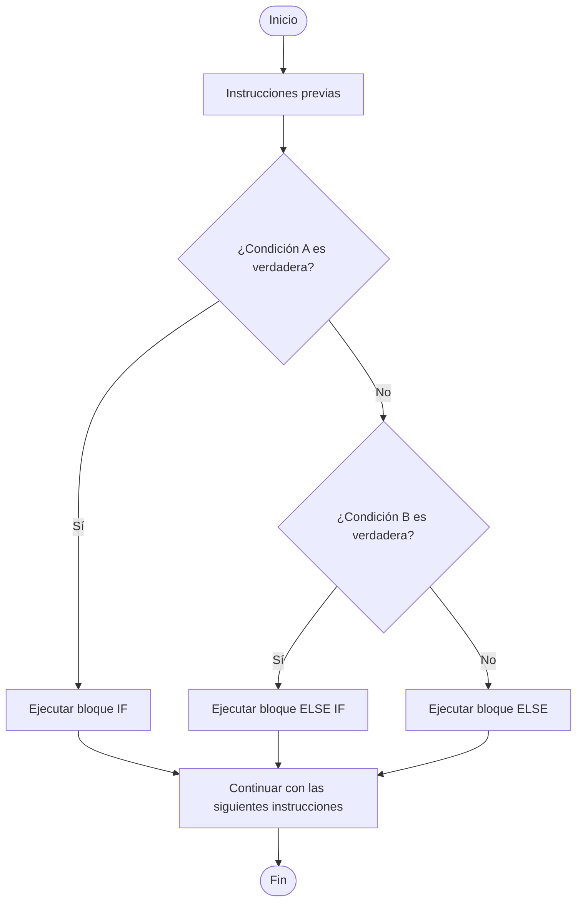
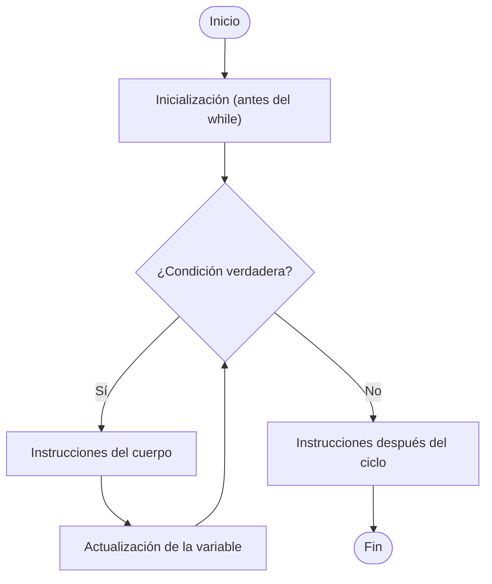
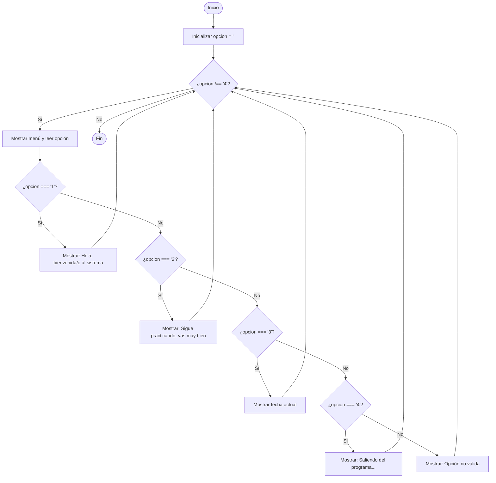

🏠 [← README](../../../README.md) · ⬅️ [← Clase 12](../clase%2012/resumen.md) · 🧪 [Ejercicios](ejercicios.md) · [Clase 14 →](../clase%2014/resumen.md) ➡️

---
# Clase 13 - if / else if / else, while e introducción práctica a MySQL

**Fecha:** 13-abril-2026  
**Materia:** Bases de datos relacionales

---

# 🎯 Objetivo de la sesión

Que el alumno:

- utilice correctamente estructuras de decisión con múltiples caminos (`if / else if / else`);
- comprenda el uso del ciclo `while` para repetir procesos;
- identifique qué es un **SGBD** y para qué se utiliza;
- realice conexión básica a MySQL desde consola;
- consulte y cree bases de datos desde línea de comandos.

---

# 🧠 Parte 1: Programación

## 1) Estructura `if / else if / else`

Se usa cuando no hay solo 2 opciones, sino varias rutas posibles según una condición. Con esta instrucción ejecutamos bloques de código cuando una expresión no se cumple y necesitamos evaluar otras condiciones. Si una condición resulta verdadera, solo se ejecuta su bloque correspondiente.

## Sintaxis

```php
if (condicion1) {
	// bloque 1
} elseif (condicion2) {
	// bloque 2
} elseif (condicion3) {
	// bloque 3
} else {
	// bloque por defecto
}
```




## Ejemplo práctico en PHP CLI

Problema: clasificar una calificación capturada por teclado.

```php
<?php
// Se pide una calificación
echo "Ingresa tu calificación (0-10):\n";
// Se lee la entrada del usuario, se convierte a tipo float y se guarda en la variable calificacion
$calificacion = (float) readline(); 
// Si la calificación es mayor o igual a 9
if ($calificacion >= 9) {
	echo "Excelente\n"; // Se imprime Excelente
} elseif ($calificacion >= 8) { // Si no, preguntamos si la calificación es mayor o igual a 8
	echo "Muy bien\n"; // Se imprime Muy Bien
} elseif ($calificacion >= 6) { // Si no, preguntamos si la calificación es mayor o igual a 6
	echo "Aprobado\n"; // Se imprime Aprobado
} else { // Si no es mayor o igual a 6
    echo "Reprobado\n"; // Se imprime Reprobado
}
```

---

## 2) Estructuras de ciclo (bucles)

Una **estructura de ciclo** (también llamada **bucle** o **loop**) permite ejecutar un bloque de instrucciones **más de una vez** sin tener que escribirlas repetidamente.

### ¿Por qué existen?

Sin ciclos, si quisiera mostrar los números del 1 al 100 tendría que escribir 100 líneas de `echo`. Con un ciclo basta con escribir el bloque una vez y decirle cuántas veces repetirlo.

### ¿Cuándo usar un ciclo?

Siempre que en el problema aparezcan frases como:

- *"para cada uno de los alumnos…"*
- *"mientras no ingrese 0…"*
- *"repetir hasta que acierte…"*
- *"sumar los N valores capturados…"*

### Tipos de ciclo en PHP

| Ciclo | Cuándo usarlo |
|-------|---------------|
| `while` | Cuando **no sabes** cuántas veces se repetirá (depende de una condición) |
| `for` | Cuando **sí sabes** exactamente cuántas veces se repetirá (tema de clase 14) |

### Partes de cualquier ciclo

Todo ciclo tiene tres responsabilidades:

1. **Inicialización** — preparar la variable que controla el ciclo antes de iniciarlo.
2. **Condición** — la pregunta que se evalúa antes de cada repetición; si es `false`, el ciclo termina.
3. **Actualización** — modificar la variable de control dentro del cuerpo del ciclo para que en algún momento la condición sea `false`.

Si la actualización se omite, la condición nunca cambia y el ciclo se repite sin fin: eso se llama **ciclo infinito** y congela el programa.

---

## 3) Ciclo `while`

`while` evalúa la condición **antes** de cada repetición. Si la condición es `true`, ejecuta el cuerpo; si es `false`, sale del ciclo.

## Sintaxis

```php
while (condicion) {
	// instrucciones que se repiten
}
```

## Partes del `while`

```php
$contador = 1;                          // 1. Inicialización (fuera del while)

while ($contador <= 5) {                // 2. Condición
	echo $contador . "\n";              //    Cuerpo del ciclo
	$contador = $contador + 1;          // 3. Actualización (dentro del while)
}
```

## Diagrama de flujo



## ⚠️ Ciclo infinito

Si dentro del `while` no se actualiza la variable de control, la condición siempre será `true` y el programa nunca termina.

```php
// ❌ ESTO ES UN CICLO INFINITO — no ejecutar
$contador = 1;
while ($contador <= 5) {
	echo $contador . "\n";
	// falta: $contador = $contador + 1;
}
```

Para detener un programa colgado en la terminal: presionar `Ctrl + C`.

## Ejemplo práctico en PHP CLI

Problema: mostrar del 1 a un límite capturado por teclado.

```php
<?php

echo "Ingresa el límite:\n";
$limite = (int) readline();

$contador = 1;                          // 1. Inicialización

while ($contador <= $limite) {          // 2. Condición
	echo "Numero: " . $contador . "\n"; //    Cuerpo
	$contador = $contador + 1;          // 3. Actualización
}
```

---

## 🧪 Integración de `if / elseif / else` con `while`

```php
<?php

$opcion = "";

while ($opcion !== "4") {
	echo "\nMENU\n";
	echo "1) Saludar\n";
	echo "2) Ver mensaje motivacional\n";
	echo "3) Ver fecha\n";
	echo "4) Salir\n";
	echo "Elige una opción:\n";
	$opcion = readline();

	if ($opcion === "1") {
		echo "Hola, bienvenida/o al sistema\n";
	} elseif ($opcion === "2") {
		echo "Sigue practicando, vas muy bien\n";
	} elseif ($opcion === "3") {
		echo date("Y-m-d H:i:s") . "\n";
	} elseif ($opcion === "4") {
		echo "Saliendo del programa...\n";
	} else {
		echo "Opción no válida\n";
	}
}
```



---

# 🗄️ Parte 2: Base de datos relacional

## ¿Qué es un SGBD?

**SGBD** significa **Sistema de Gestión de Bases de Datos**.  
Es el software que permite crear, consultar, modificar y administrar bases de datos.

Ejemplos: MySQL, PostgreSQL, SQL Server, Oracle.

---

## MySQL y conceptos básicos de red

- **MySQL**: motor de base de datos relacional muy utilizado.
- Para conectarnos a una base de datos debemos saber **dónde vive el servidor**: en nuestra máquina o en un equipo remoto.

---

## 🌐 IP (Internet Protocol)

Una **IP** es la dirección numérica de un equipo dentro de una red.

Ejemplos:

- `127.0.0.1` (loopback/local)
- `192.168.1.50` (red local)
- `34.121.88.10` (posible IP pública)

En bases de datos, la IP nos dice a qué servidor debemos conectarnos.

Ejemplo MySQL por IP:

```bash
mysql -h 192.168.1.50 -u root -p
```

---

## 🧭 DNS (Domain Name System)

El **DNS** traduce nombres fáciles de recordar a direcciones IP.

Ejemplo:

- `db.escuela.local` -> `192.168.1.50`

Ventaja: si cambia la IP, el cliente sigue usando el mismo nombre del servidor.

Ejemplo MySQL por nombre DNS:

```bash
mysql -h db.escuela.local -u root -p
```

---

## 🖥️ localhost

`localhost` es el nombre que apunta a la propia computadora.

- En IPv4 normalmente equivale a `127.0.0.1`.
- Se usa cuando el servidor MySQL está instalado en la misma máquina.

Conexión local típica:

```bash
mysql -u root -p
```

Conexión local explícita:

```bash
mysql -h localhost -u root -p
```

---

## 🌍 Host remoto

Un **host remoto** es un servidor diferente a tu computadora local.

Puede estar:

- en otro equipo de la misma red local;
- en un servidor de internet (nube/VPS);
- en una red de la escuela o empresa.

Para conectar a un host remoto, normalmente necesitas:

1. Dirección del servidor (IP o DNS).
2. Usuario y contraseña válidos.
3. Puerto abierto (en MySQL suele ser `3306`).
4. Permisos de red y de usuario en MySQL.

Ejemplo remoto con puerto:

```bash
mysql -h 192.168.1.50 -P 3306 -u alumno -p
```

Ejemplo remoto por DNS:

```bash
mysql -h bd.miempresa.com -P 3306 -u alumno -p
```

---

## ✅ Resumen rápido de conexión

| Escenario | Host a usar | Ejemplo |
|---|---|---|
| Servidor en mi PC | `localhost` o `127.0.0.1` | `mysql -h localhost -u root -p` |
| Servidor en red local | IP privada | `mysql -h 192.168.1.50 -u root -p` |
| Servidor en internet | DNS o IP pública | `mysql -h bd.miempresa.com -u alumno -p` |

---

## Conexión a MySQL desde consola

Comando típico:

```bash
mysql -u root -p
```

### Conexión local sin password (laboratorio)

Si los equipos del laboratorio están configurados para acceso local sin contraseña, se puede usar:

```bash
mysql -u root
```

También de forma explícita con host local:

```bash
mysql -h localhost -u root
```

Ejemplo con otro usuario local sin password:

```bash
mysql -h localhost -u alumno
```

> Nota: esta configuración es útil para prácticas en laboratorio. En entornos reales/producción se recomienda usar contraseña y permisos restringidos.

Si el servidor está en otra máquina:

```bash
mysql -h 192.168.1.10 -u root -p
```

---

## Ver bases de datos existentes

```sql
SHOW DATABASES;
```

---

## Crear una base de datos nueva

```sql
CREATE DATABASE escuela_db;
```

Entrar a la base de datos:

```sql
USE escuela_db;
```

Verificar en qué base estamos trabajando:

```sql
SELECT DATABASE();
```

---

# 📌 Flujo recomendado en laboratorio

1. Abrir terminal.
2. Conectarse a MySQL en local (sin password): `mysql -u root`.
3. Ejecutar `SHOW DATABASES;`.
4. Crear una base nueva con `CREATE DATABASE nombre_db;`.
5. Seleccionarla con `USE nombre_db;`.
6. Verificar con `SELECT DATABASE();`.

---

# ⚠️ Errores comunes en laboratorio (y solución rápida)

## 1) `mysql: command not found`

**Causa:** MySQL cliente no está instalado o no está en el PATH.  
**Solución rápida:** verificar instalación del cliente y abrir una terminal nueva.

---

## 2) `ERROR 2002 (HY000): Can't connect to local MySQL server`

**Causa:** el servicio MySQL está apagado.  
**Solución rápida:** iniciar el servicio y volver a intentar.

En macOS (si fue instalado con Homebrew):

```bash
brew services start mysql
```

---

## 3) `ERROR 1045 (28000): Access denied for user`

**Causa:** usuario incorrecto o permisos no configurados para ese host.  
**Solución rápida:** confirmar usuario del laboratorio (`root` o `alumno`) y el host (`localhost`).

Ejemplo correcto en laboratorio:

```bash
mysql -h localhost -u root
```

---

## 4) No aparecen mis bases de datos

**Causa:** conectaste con otro usuario o a otro servidor.  
**Solución rápida:** ejecutar `SELECT USER();` y `SELECT @@hostname;` para confirmar sesión y servidor.

---

## 5) `ERROR 1007 (HY000): Can't create database ...; database exists`

**Causa:** la base ya fue creada antes.  
**Solución rápida:** usar otro nombre o eliminarla si es de práctica.

```sql
DROP DATABASE nombre_db;
CREATE DATABASE nombre_db;
```

---

## 6) Escribí mal un comando SQL

**Causa:** error de sintaxis (por ejemplo, olvidar `;`).  
**Solución rápida:** revisar el mensaje de error, corregir y ejecutar de nuevo.

Regla útil: en consola MySQL, casi todas las instrucciones terminan con `;`.

---

# 🚀 Enunciados extra de práctica (adelanto)

> Estos enunciados son opcionales para alumnos que quieran practicar más. No forman parte de la lista de `ejercicios.md`.

## 5 enunciados para `if / elseif / else`

1. **Nivel de alerta por calidad del aire**
Leer un valor de calidad del aire (AQI).
- Si AQI >= 151: mostrar `Alerta roja`
- Si AQI >= 101: mostrar `Alerta naranja`
- Si AQI >= 51: mostrar `Alerta amarilla`
- En caso contrario: mostrar `Calidad buena`

2. **Costo de boleto por edad y día especial**
Leer edad y día (`normal` o `miércoles`).
- Si edad < 12: mostrar `Boleto infantil`
- Si edad >= 60: mostrar `Boleto adulto mayor`
- Si día es `miércoles`: mostrar `Boleto con promoción`
- En caso contrario: mostrar `Boleto general`

3. **Semáforo académico**
Leer promedio y faltas.
- Si promedio >= 9 y faltas <= 2: mostrar `Verde`
- Si promedio >= 7 y faltas <= 5: mostrar `Amarillo`
- Si promedio >= 6: mostrar `Naranja`
- En caso contrario: mostrar `Rojo`

4. **Diagnóstico de batería + modo ahorro**
Leer porcentaje de batería y estado de ahorro (`si/no`).
- Si batería < 10 y ahorro = `no`: mostrar `Activar ahorro urgente`
- Si batería < 25: mostrar `Batería baja`
- Si batería < 50: mostrar `Batería media`
- En caso contrario: mostrar `Batería suficiente`

5. **Tipo de cliente por compras y antigüedad**
Leer compras del mes y años como cliente.
- Si compras >= 15 y años >= 3: mostrar `Cliente Platino`
- Si compras >= 10: mostrar `Cliente Oro`
- Si compras >= 5: mostrar `Cliente Plata`
- En caso contrario: mostrar `Cliente Base`

## 5 enunciados para `while`

1. **Acumulado de ahorro semanal**
Usar `while` para capturar ahorros diarios (7 días) y mostrar el total y promedio.

2. **Control de intentos con pista**
Pedir una clave secreta con `while` hasta acertar o llegar a 5 intentos. Mostrar intentos usados.

3. **Suma de múltiplos de 3**
Leer un límite N y usar `while` para sumar solo múltiplos de 3 desde 1 hasta N.

4. **Registro de temperaturas hasta centinela**
Capturar temperaturas con `while` hasta ingresar `-99`. Mostrar máxima y mínima.

5. **Mini punto de venta**
Capturar precios con `while` hasta ingresar `0`. Al final mostrar subtotal, IVA (16%) y total.

---

# ✅ Conclusión

En esta clase se reforzó la lógica de control del programa con `if / elseif / else` y repetición con `while`.  
Además, se dio el primer paso práctico en entorno relacional administrando MySQL desde consola: conexión, visualización y creación de bases de datos.
