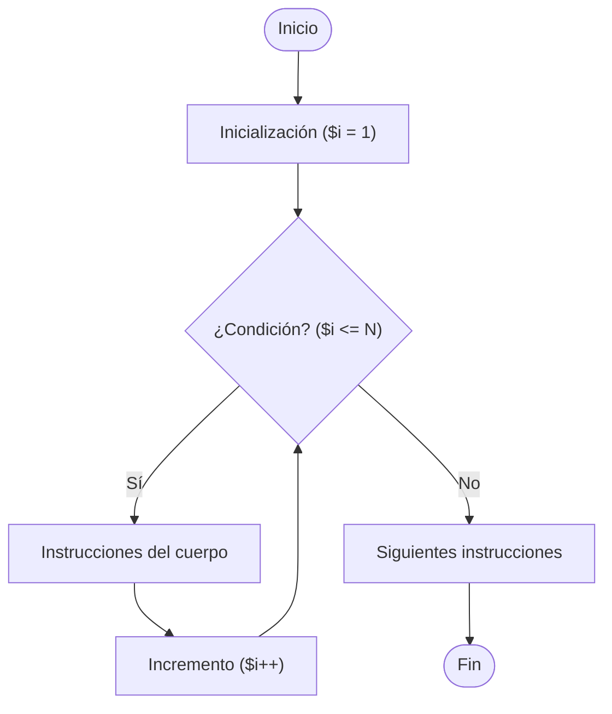

🏠 [← README](../../../README.md) · ⬅️ [← Clase 13](../clase%2013/resumen.md) · Clase 14 · [Clase 15 →](../clase%2015/resumen.md) ➡️ · 🧪 [Ejercicios](ejercicios.md) 

---

# Clase 14 — Ciclo `for` e introducción a tablas en MySQL

**Fecha:** 14-abril-2026  
**Materia:** Bases de datos relacionales

---

# 🎯 Objetivo de la sesión

Que el alumno:

- comprenda la sintaxis y el funcionamiento del ciclo `for` en PHP;
- aplique `for` para resolver problemas con contador creciente, decreciente y con paso variable;
- identifique qué es una **tabla** y un **campo** en una base de datos relacional;
- reconozca los tipos de datos más comunes en MySQL;
- cree su primera tabla desde la consola de MySQL con `CREATE TABLE`.

---

# 🧠 Parte 1: Programación

## 1) Ciclo `for`

El ciclo `for` es ideal cuando **sabes de antemano cuántas veces** se debe repetir un bloque.

## Sintaxis

```php
for (inicialización; condición; incremento) {
	// instrucciones que se repiten
}
```

| Parte | Descripción |
|-------|-------------|
| `inicialización` | Se ejecuta **una sola vez** al inicio. Crea el contador. |
| `condición` | Se evalúa **antes de cada repetición**. Si es `false`, el ciclo termina. |
| `incremento` | Se ejecuta al **final de cada repetición**. Actualiza el contador. |

## Operadores unitarios: `++` y `--`

Antes de ver los ejemplos del `for`, conviene conocer los dos operadores que se usan constantemente para actualizar contadores.

### Operador de incremento `++`

Suma **1** al valor actual de una variable.

```php
$i = 5;
$i++;             // equivale a: $i = $i + 1
echo $i . "\n";   // 6
```

### Operador de decremento `--`

Resta **1** al valor actual de una variable.

```php
$i = 5;
$i--;             // equivale a: $i = $i - 1
echo $i . "\n";   // 4
```

### Tabla comparativa

| Expresión corta | Expresión equivalente | Efecto |
|-----------------|----------------------|--------|
| `$i++` | `$i = $i + 1` | suma 1 |
| `$i--` | `$i = $i - 1` | resta 1 |
| `$i += 3` | `$i = $i + 3` | suma 3 |
| `$i -= 3` | `$i = $i - 3` | resta 3 |
| `$i *= 2` | `$i = $i * 2` | multiplica por 2 |

> En los ciclos `$i++` y `$i--` son la forma más compacta y común de escribir el incremento/decremento del `for`.

## Ejemplo: contar del 1 al 5

```php
<?php
for ($i = 1; $i <= 5; $i++) {
	echo $i . "\n";
}
```

Salida:

```
1
2
3
4
5
```

## `for` con decremento

```php
<?php
for ($i = 5; $i >= 1; $i--) {
	echo $i . "\n";
}
```

## `for` con paso diferente a 1

```php
<?php
// Múltiplos de 5 del 5 al 25
for ($i = 5; $i <= 25; $i = $i + 5) {
	echo $i . "\n";
}
```

## Diagrama de flujo del ciclo `for`



## Ejemplo integrador — tabla de multiplicar

```php
<?php
echo "Ingresa un número para ver su tabla de multiplicar:\n";
$n = (int) readline();

echo "\nTabla del " . $n . ":\n";
for ($i = 1; $i <= 10; $i++) {
	echo $n . " x " . $i . " = " . ($n * $i) . "\n";
}
```

---

## 2) `for` vs `while`

| Característica | `for` | `while` |
|----------------|-------|---------|
| Cuándo usarlo | Cuando sabes cuántas veces se repetirá | Cuando no sabes cuántas veces |
| Control del contador | En una sola línea (init; cond; incr) | En líneas separadas |
| Lectura | Más compacto para contadores | Más flexible para condiciones complejas |

---

# 🗄️ Parte 2: Base de datos relacional

## ¿Qué es una tabla?

En una base de datos relacional, una **tabla** organiza la información en **filas** y **columnas**, similar a una hoja de cálculo.

- Cada **fila** representa un **registro** (un dato completo, por ejemplo: un alumno).
- Cada **columna** representa un **campo** o atributo (por ejemplo: nombre, edad).

Ejemplo conceptual de tabla `alumnos`:

| id | nombre    | edad | promedio |
|----|-----------|------|----------|
| 1  | Ana López | 17   | 8.5      |
| 2  | Luis Mora | 16   | 7.2      |

---

## ¿Qué es un campo?

Un **campo** (o columna) define:

- El **nombre** del dato (ej. `nombre`, `edad`).
- El **tipo de dato** que puede almacenar.
- Restricciones opcionales: `NOT NULL`, `PRIMARY KEY`, `AUTO_INCREMENT`.

---

## Tipos de datos comunes en MySQL

| Tipo | Descripción | Ejemplo de uso |
|------|-------------|----------------|
| `INT` | Número entero | `edad INT` |
| `FLOAT` | Número con decimales | `promedio FLOAT` |
| `VARCHAR(n)` | Texto de hasta n caracteres | `nombre VARCHAR(50)` |
| `TEXT` | Texto largo sin límite fijo | `descripcion TEXT` |
| `DATE` | Fecha (AAAA-MM-DD) | `fecha_nac DATE` |
| `TINYINT(1)` | Booleano (0 = false, 1 = true) | `activo TINYINT(1)` |

---

## Crear una tabla con `CREATE TABLE`

### Sintaxis

```sql
CREATE TABLE nombre_tabla (
	campo1 TIPO restricciones,
	campo2 TIPO restricciones,
	...
);
```

### Ejemplo completo

```sql
CREATE TABLE alumnos (
	id INT AUTO_INCREMENT PRIMARY KEY,
	nombre VARCHAR(50) NOT NULL,
	edad INT,
	promedio FLOAT
);
```

Notas sobre las restricciones usadas:

- `AUTO_INCREMENT`: MySQL asigna el ID automáticamente (1, 2, 3…).
- `PRIMARY KEY`: identifica de forma única cada fila de la tabla.
- `NOT NULL`: el campo no puede quedar vacío al insertar un registro.

---

## Ver tablas y estructura

```sql
-- Ver todas las tablas de la base activa
SHOW TABLES;

-- Ver los campos de una tabla
DESCRIBE alumnos;
```

Salida de `DESCRIBE alumnos`:

```
+-----------+-------------+------+-----+---------+----------------+
| Field     | Type        | Null | Key | Default | Extra          |
+-----------+-------------+------+-----+---------+----------------+
| id        | int         | NO   | PRI | NULL    | auto_increment |
| nombre    | varchar(50) | NO   |     | NULL    |                |
| edad      | int         | YES  |     | NULL    |                |
| promedio  | float       | YES  |     | NULL    |                |
+-----------+-------------+------+-----+---------+----------------+
```

---

## Insertar un registro básico

```sql
INSERT INTO alumnos (nombre, edad, promedio)
VALUES ('Ana López', 17, 8.5);
```

> El campo `id` se omite porque es `AUTO_INCREMENT`; MySQL lo asigna automáticamente.

---

## Consultar los datos de una tabla

```sql
SELECT * FROM alumnos;
```

---

# 📌 Conclusión

El ciclo `for` organiza repeticiones controladas por contador con sintaxis compacta.  
Las tablas en MySQL almacenan datos estructurados en filas y columnas con tipos definidos.  
`CREATE TABLE` es el primer paso para diseñar la capa de persistencia de cualquier aplicación.

---

🏠 [← README](../../../README.md) · ⬅️ [← Clase 13](../clase%2013/resumen.md) · Clase 14 · [Clase 15 →](../clase%2015/resumen.md) ➡️ · 🧪 [Ejercicios](ejercicios.md) 
