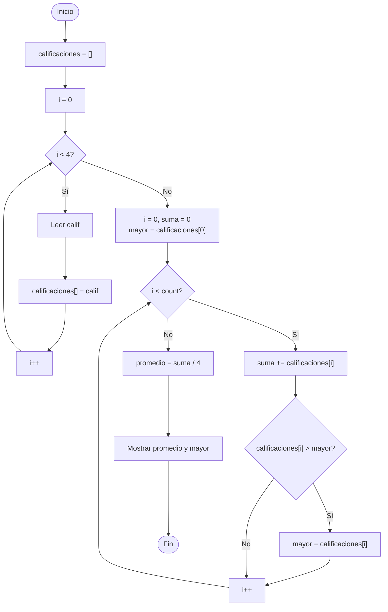

🏠 [← README](../../../README.md) · ⬅️ [← Clase 14](../clase%2014/resumen.md) · Clase 15 · [Clase 16 →](../clase%2016/resumen.md) ➡️ · 🧪 [Ejercicios](ejercicios.md)

---

# Clase 15 — Arreglos (`array`) y `for` en PHP

**Fecha:** 15-abril-2026  
**Materia:** Bases de datos relacionales

---

# 🎯 Objetivo de la sesión

Que el alumno:

- comprenda qué es un arreglo en PHP y cómo agrupa múltiples valores bajo una sola variable;
- declare arreglos y acceda a sus elementos por índice;
- use `count()` para conocer la cantidad de elementos de un arreglo;
- use `$arr[] = valor` para agregar elementos dinámicamente;
- recorra un arreglo completo con el ciclo `for`;
- inserte múltiples registros en MySQL con `INSERT INTO`;
- consulte datos de tabla con `SELECT *` y `SELECT` con campos específicos.

---

# 🧠 Parte 1: Programación

## 1) ¿Qué es un arreglo en PHP?

Hasta ahora una variable guardaba **un solo valor**:

```php
$nombre = 'Ana';
$edad   = 17;
```

Un **arreglo** (`array`) agrupa **múltiples valores** bajo un mismo nombre de variable, organizados por posición.

En lugar de crear una variable por cada dato:

```php
// Sin arreglo — difícil de manejar con muchos datos
$alumno1 = 'Ana';
$alumno2 = 'Luis';
$alumno3 = 'María';
```

Usamos un arreglo:

```php
// Con arreglo — un nombre, múltiples valores
$alumnos = ['Ana', 'Luis', 'María'];
```

### PHP vs JavaScript — diferencia clave

Cuando aprendemos JavaScript (en la materia de No Relacionales) vemos que los arrays tienen `.length` y `.push()`. En PHP el comportamiento es similar, pero la sintaxis es diferente porque PHP maneja los arrays como un **tipo de dato propio**, no como objetos.

| Operación | PHP | JavaScript |
|-----------|-----|------------|
| Contar elementos | `count($arr)` — función global | `arr.length` — propiedad del objeto |
| Agregar al final | `$arr[] = valor;` | `arr.push(valor)` |
| Acceso por índice | `$arr[0]` | `arr[0]` |

> Ambos lenguajes sirven para lo mismo; la diferencia es solo de sintaxis.  
> En PHP nunca escribas `$arr->length` ni `$arr.length` — esas formas no existen para arrays.

---

## 2) Declaración y acceso por índice

```php
$frutas = ['manzana', 'pera', 'uva'];
```

Los valores se escriben entre corchetes `[ ]`, separados por comas.  
Cada elemento tiene una **posición** llamada **índice**, que empieza en **0**.

```
$frutas[0]  →  'manzana'
$frutas[1]  →  'pera'
$frutas[2]  →  'uva'
```

```php
<?php
$frutas = ['manzana', 'pera', 'uva'];

echo $frutas[0] . "\n"; // manzana
echo $frutas[1] . "\n"; // pera
echo $frutas[2] . "\n"; // uva
```

---

## 3) La función `count()`

`count($arreglo)` devuelve el número de elementos que tiene el arreglo.

```php
<?php
$frutas = ['manzana', 'pera', 'uva'];

echo count($frutas) . "\n"; // 3
```

> En PHP es `count($arr)`, **no** `$arr.length`. Es una función que recibe el arreglo como argumento.

---

## 4) Agregar elementos con `$arr[] = valor`

Para añadir un elemento al **final** del arreglo:

```php
<?php
$frutas = ['manzana', 'pera'];
$frutas[] = 'uva';              // agrega 'uva' al final

echo count($frutas) . "\n";    // 3
echo $frutas[2] . "\n";        // uva
```

También existe la función `array_push()`, que hace exactamente lo mismo:

```php
array_push($frutas, 'naranja'); // equivalente a $frutas[] = 'naranja'
```

> La forma recomendada y más común en PHP es `$arr[] = valor`.

---

## 5) Recorrer un arreglo con `for`

El patrón estándar para recorrer todos los elementos:

```php
<?php
$frutas = ['manzana', 'pera', 'uva'];

for ($i = 0; $i < count($frutas); $i++) {
	echo $frutas[$i] . "\n";
}
```

Salida:

```
manzana
pera
uva
```

### ¿Por qué `$i < count($frutas)` y no `<=`?

| Índice | Elemento  |
|--------|-----------|
| 0      | 'manzana' |
| 1      | 'pera'    |
| 2      | 'uva'     |

El último índice siempre es `count - 1`.  
Si `count($frutas) = 3`, el último índice válido es `2`.  
Por eso la condición es `< 3` (equivalente a `< count()`), **no** `<= 3`.

---

## 6) `for` + `readline` + `[]` — guardar entradas en un arreglo

Patrón completo para capturar datos del usuario y almacenarlos:

```php
<?php
echo "¿Cuántos datos vas a ingresar?\n";
$n = (int) readline();

$datos = [];  // arreglo vacío

for ($i = 0; $i < $n; $i++) {
	echo "Dato " . ($i + 1) . ": ";
	$datos[] = readline();
}

echo "\nLos datos ingresados son:\n";
for ($i = 0; $i < count($datos); $i++) {
	echo "- " . $datos[$i] . "\n";
}
```

---

# 🧪 Desarrollo de ejemplo integrador

## Enunciado

Leer 4 calificaciones, guardarlas en un arreglo y al final mostrar: todas las calificaciones, el promedio y la calificación más alta.

## Algoritmo

1. Inicio.
2. Declarar arreglo `$calificaciones` vacío.
3. Repetir 4 veces: leer una calificación y agregarla al arreglo.
4. Mostrar todas las calificaciones con su número de orden.
5. Calcular la suma y encontrar la mayor.
6. Calcular el promedio.
7. Mostrar promedio y calificación más alta.
8. Fin.

## Diagrama de flujo



## Pseudocódigo

```text
Inicio

	calificaciones <- []

	Para i <- 0 Hasta 3 Con Paso 1 Hacer
		Escribir "Calificación " + (i+1) + ":"
		Leer calif
		calificaciones[] <- calif
	FinPara

	Escribir "--- Tus calificaciones ---"
	Para i <- 0 Hasta count(calificaciones)-1 Con Paso 1 Hacer
		Escribir (i+1) + ": " + calificaciones[i]
	FinPara

	suma <- 0
	mayor <- calificaciones[0]
	Para i <- 0 Hasta count(calificaciones)-1 Con Paso 1 Hacer
		suma <- suma + calificaciones[i]
		Si calificaciones[i] > mayor Entonces
			mayor <- calificaciones[i]
		FinSi
	FinPara

	promedio <- suma / count(calificaciones)
	Escribir "Promedio: " + promedio
	Escribir "Calificación más alta: " + mayor

Fin
```

## Código PHP CLI

```php
<?php
$calificaciones = [];

for ($i = 0; $i < 4; $i++) {
	echo "Calificación " . ($i + 1) . ": ";
	$calificaciones[] = (float) readline();
}

echo "\n--- Tus calificaciones ---\n";
for ($i = 0; $i < count($calificaciones); $i++) {
	echo ($i + 1) . ": " . $calificaciones[$i] . "\n";
}

$suma  = 0;
$mayor = $calificaciones[0];

for ($i = 0; $i < count($calificaciones); $i++) {
	$suma += $calificaciones[$i];
	if ($calificaciones[$i] > $mayor) {
		$mayor = $calificaciones[$i];
	}
}

$promedio = $suma / count($calificaciones);
echo "\nPromedio: " . $promedio . "\n";
echo "Calificación más alta: " . $mayor . "\n";
```

---

# 🗄️ Parte 2: Base de datos relacional

## ¿Por qué practicar más INSERT INTO?

En la clase anterior aprendimos a crear una tabla con `CREATE TABLE` y a insertar un primer registro.  
Hoy vamos a insertar **múltiples registros** y a consultar los datos de distintas formas con `SELECT`.

---

## INSERT INTO — insertar múltiples registros

Cada llamada a `INSERT INTO` agrega **una fila** a la tabla.

```sql
-- Suponemos que ya existe la tabla alumnos:
-- CREATE TABLE alumnos (
--     id INT AUTO_INCREMENT PRIMARY KEY,
--     nombre VARCHAR(50) NOT NULL,
--     edad INT,
--     promedio FLOAT
-- );

INSERT INTO alumnos (nombre, edad, promedio) VALUES ('Ana López', 17, 8.5);
INSERT INTO alumnos (nombre, edad, promedio) VALUES ('Luis Mora', 16, 7.2);
INSERT INTO alumnos (nombre, edad, promedio) VALUES ('María Ruiz', 17, 9.1);
INSERT INTO alumnos (nombre, edad, promedio) VALUES ('Carlos Vega', 18, 6.8);
INSERT INTO alumnos (nombre, edad, promedio) VALUES ('Laura Gil', 16, 8.0);
```

> El campo `id` se omite porque es `AUTO_INCREMENT`: MySQL lo asigna automáticamente (1, 2, 3…).

---

## SELECT * — consultar todos los campos

```sql
SELECT * FROM alumnos;
```

El asterisco `*` significa "todos los campos". Resultado esperado:

```
+----+-------------+------+----------+
| id | nombre      | edad | promedio |
+----+-------------+------+----------+
|  1 | Ana López   |   17 |      8.5 |
|  2 | Luis Mora   |   16 |      7.2 |
|  3 | María Ruiz  |   17 |      9.1 |
|  4 | Carlos Vega |   18 |      6.8 |
|  5 | Laura Gil   |   16 |        8 |
+----+-------------+------+----------+
```

---

## SELECT con campos específicos

En lugar de `*`, puedes listar solo los campos que necesitas:

```sql
SELECT nombre, promedio FROM alumnos;
```

Resultado:

```
+-------------+----------+
| nombre      | promedio |
+-------------+----------+
| Ana López   |      8.5 |
| Luis Mora   |      7.2 |
| María Ruiz  |      9.1 |
| Carlos Vega |      6.8 |
| Laura Gil   |        8 |
+-------------+----------+
```

> Útil cuando la tabla tiene muchas columnas y solo te interesan algunas.

---

## Resumen de comandos MySQL de hoy

| Comando | Para qué sirve |
|---------|----------------|
| `INSERT INTO tabla (campos) VALUES (valores);` | Agrega un nuevo registro a la tabla |
| `SELECT * FROM tabla;` | Muestra todos los registros con todos los campos |
| `SELECT campo1, campo2 FROM tabla;` | Muestra todos los registros con los campos indicados |

---

# 📌 Conclusión

Los arreglos permiten manejar **colecciones de datos** con una sola variable, lo que hace el código más limpio y flexible.  
Combinado con `for`, el arreglo es la herramienta base para procesar listas de cualquier tamaño.  
En MySQL, `INSERT INTO` y `SELECT` son los comandos esenciales para **guardar y recuperar** información de una tabla.

---

🏠 [← README](../../../README.md) · ⬅️ [← Clase 14](../clase%2014/resumen.md) · Clase 15 · [Clase 16 →](../clase%2016/resumen.md) ➡️ · 🧪 [Ejercicios](ejercicios.md)
