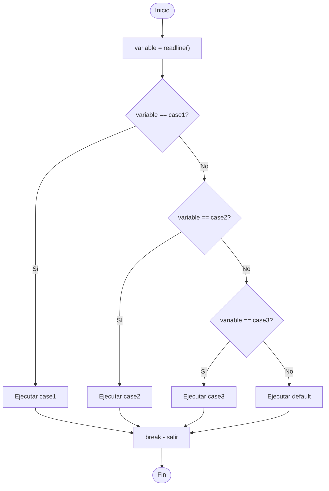

🏠 [← README](../../../README.md) · ⬅️ [← Clase 15](../clase%2015/resumen.md) · Clase 16 · [Clase 17 →](../clase%2017/resumen.md) ➡️ · 🧪 [Ejercicios](ejercicios.md)

---

# Clase 16 — switch/case en PHP y GitHub con VSCode

**Fecha:** 17-abril-2026
**Materia:** Bases de datos relacionales

---

# 🎯 Objetivo de la sesión

Aprender a usar estructuras de control `switch/case` para comparaciones múltiples contra un mismo valor, e introducir el flujo de trabajo profesional: Git + GitHub + VSCode para entregar todas las prácticas del semestre.

---

# 🧠 Parte 1: switch/case en PHP

## ¿Qué es switch/case?

Una estructura de control que compara una variable contra múltiples valores exactos. Es preferible a varios `if/elseif` cuando tienes una misma variable comparada contra muchas opciones.

## Sintaxis completa

```php
<?php

switch ($variable) {
    case "valor1":
        echo "Opción 1\n";
        break;
    case "valor2":
        echo "Opción 2\n";
        break;
    case "valor3":
        echo "Opción 3\n";
        break;
    default:
        echo "Opción no válida\n";
}
```

## ¿Por qué es necesario el break?

Sin `break`, PHP ejecuta todas las líneas siguientes hasta encontrar uno o llegar al final del switch. Esto se llama **fall-through** y casi siempre es un error:

```php
<?php

$dia = 1;

switch ($dia) {
    case 1:
        echo "Lunes\n";
        // ❌ SIN break — sigue ejecutando
    case 2:
        echo "Martes\n";
        // sigue...
    case 3:
        echo "Miércoles\n";
        break; // ✅ aquí se detiene
    default:
        echo "Día no válido\n";
}

// Resultado (sin los breaks de caso 1 y 2):
// Lunes
// Martes
// Miércoles
```

El `default` es el equivalente a `else` — se ejecuta si ningún `case` coincide.

## Comparación con if/elseif

**Cuándo usar switch:**
- Una misma variable contra muchos valores exactos
- Código más legible
- Mejor rendimiento

**Cuándo usar if/elseif:**
- Condiciones complejas: rangos, desigualdades, múltiples variables
- Comparaciones booleanas

```php
<?php

// ❌ Mucho if/elseif (poco legible)
$opcion = readline();
if ($opcion == "1") {
    echo "Sumar\n";
} elseif ($opcion == "2") {
    echo "Restar\n";
} elseif ($opcion == "3") {
    echo "Multiplicar\n";
} else {
    echo "Opción no válida\n";
}

// ✅ switch/case (más limpio)
switch ($opcion) {
    case "1":
        echo "Sumar\n";
        break;
    case "2":
        echo "Restar\n";
        break;
    case "3":
        echo "Multiplicar\n";
        break;
    default:
        echo "Opción no válida\n";
}
```

## Nota importante: comparación suelta (==)

El switch usa `==` (comparación suelta, loose comparison), NO `===`:

```php
<?php

$variable = "1";

switch ($variable) {
    case 1:      // ✅ Coincide: "1" == 1 es true
        echo "Entero 1\n";
        break;
    case "1":    // También coincide
        echo "String '1'\n";
        break;
}
```

## Diagrama de flujo



## Ejemplo 1: Menú de Calculadora

```php
<?php

echo "--- Calculadora Simple ---\n";
echo "1) Sumar\n";
echo "2) Restar\n";
echo "3) Multiplicar\n";
echo "4) Dividir\n";
echo "5) Salir\n";
echo "Elige una opción: ";

$opcion = readline();

echo "Número 1: ";
$n1 = (float) readline();
echo "Número 2: ";
$n2 = (float) readline();

switch ($opcion) {
    case "1":
        echo "Resultado: " . ($n1 + $n2) . "\n";
        break;
    case "2":
        echo "Resultado: " . ($n1 - $n2) . "\n";
        break;
    case "3":
        echo "Resultado: " . ($n1 * $n2) . "\n";
        break;
    case "4":
        if ($n2 == 0) {
            echo "Error: no se puede dividir entre cero\n";
        } else {
            echo "Resultado: " . ($n1 / $n2) . "\n";
        }
        break;
    case "5":
        echo "Hasta luego\n";
        break;
    default:
        echo "Opción no válida\n";
}
```

## Ejemplo 2: Número de día → Nombre del día

```php
<?php

echo "Ingresa un número de día (1-7): ";
$dia = readline();

switch ($dia) {
    case "1":
        echo "Lunes\n";
        break;
    case "2":
        echo "Martes\n";
        break;
    case "3":
        echo "Miércoles\n";
        break;
    case "4":
        echo "Jueves\n";
        break;
    case "5":
        echo "Viernes\n";
        break;
    case "6":
        echo "Sábado\n";
        break;
    case "7":
        echo "Domingo\n";
        break;
    default:
        echo "Número no válido. Ingresa un día entre 1 y 7\n";
}
```

---

# 🐙 Parte 2: Git y GitHub con VSCode

## Concepto: Repositorio

Un **repositorio** es una carpeta versionada en la nube (GitHub). Cada archivo tiene un historial completo de cambios. Todos los cambios se guardan con un mensaje descriptivo (commit).

### ¿Por qué GitHub?

- **Profesional:** formato estándar en la industria
- **Respaldo:** tu código está en la nube, seguro
- **Colaboración:** trabajan en pareja dentro del mismo repo
- **Historial:** puedes ver quién cambió qué y cuándo
- **Entrega:** el maestro ve directamente lo que subiste

## Prerrequisito

Debes tener cuenta de GitHub creada (se asignó como tarea de vacaciones). Si no tienes cuenta: [github.com](https://github.com) → Sign up.

## Estructura de carpetas recomendada para el semestre

Crea una carpeta en tu computadora con esta estructura:

```
[tu-apellido]-programacion-4g/
  dbr/
    clase-16/     ← código de hoy va aquí
    clase-17/     ← próximas clases DBR
  bdnr/
    clase-10/     ← próximas clases BDNR
```

Esta será tu **carpeta local** que sincronizarás con GitHub.

## Pasos en VSCode para inicializar un repositorio

### 1️⃣ Crear repositorio en GitHub

1. Ve a [github.com](https://github.com)
2. Botón **New repository** (arriba a la izquierda o en perfil)
3. Nombre: **`[tu-apellido]-programacion-4g`** (ejemplo: `morales-programacion-4g`)
4. Descripción: "Prácticas de bases de datos relacionales y no relacionales — CETIS 139"
5. Selector: **Private** (solo tú lo ves) o **Public** (el maestro lo ve públicamente)
6. Click en **Create repository**

Copias la URL del repositorio que se muestra (ej: `https://github.com/tu-usuario/morales-programacion-4g.git`)

### 2️⃣ Clonar en VSCode

1. Abre **VSCode**
2. Acceso rápido: `Ctrl+Shift+G` (abre panel Source Control)
3. Click en **Clone Repository**
4. Pega la URL que copiaste
5. Elige una carpeta en tu computadora (puede ser Desktop o Documentos)
6. VSCode descarga el repositorio (está vacío al inicio)

### 3️⃣ Crear estructura de carpetas

1. En la raíz del repositorio clonado, crea carpetas:
   - `dbr/clase-16/`
   - `bdnr/` (para próximas clases)

2. Abre Terminal en VSCode: `Ctrl+`` ` (acento grave)

```bash
mkdir -p dbr/clase-16
mkdir -p bdnr
```

### 4️⃣ Escribir tu código

En VSCode, crea archivos PHP en `dbr/clase-16/`:
- `p501-tu-practica.php`
- `p502-otra-practica.php`
- etc.

### 5️⃣ Hacer Stage (preparar para subir)

1. Panel Source Control (`Ctrl+Shift+G`)
2. Verás tus archivos sin rastrear con una **U** (Untracked)
3. Haz hover sobre el archivo → click en el **+** (Stage this change)
4. Ahora el archivo aparece en "Staged Changes"

**O:** click en **+** junto a "Changes" para stagear todos los cambios

### 6️⃣ Hacer Commit (guardar con mensaje)

1. En el cuadro de texto **Message** (arriba del panel Source Control)
2. Escribe el mensaje del commit:
   ```
   clase-16: p501 switch dia-habil
   ```

   Formato recomendado:
   - `clase-NN: pXXX [tema breve]`
   - Ejemplo: `clase-16: p501 switch dia-habil`, `clase-16: p502 switch estacion`

3. `Ctrl+Enter` para confirmar commit (o click en botón ✓)

El commit se crea **localmente** (en tu computadora).

### 7️⃣ Hacer Push (subir a GitHub)

1. Botón **↑ Sync Changes** (aparece después del commit)
   - O **Publish Branch** si es la primera vez
2. Espera a que termine
3. Abre [github.com](https://github.com) y verifica que ves tu archivo en el repositorio

## Protocolo de cierre en equipo compartido

Cuando termines de trabajar en una computadora compartida (lab de escuela):

1. VSCode → ícono de **persona** abajo a la izquierda → **Sign out**
2. Abre [github.com](https://github.com) en el navegador → tu ícono (arriba derecha) → **Sign out**
3. Inicio de Windows → **Administrador de credenciales**
4. → **Credenciales de Windows**
5. Busca la entrada de Git: `git:https://github.com`
6. Elimínala (Delete)

Esto garantiza que la siguiente persona no tiene acceso a tu cuenta.

## Cuándo hacer Pull

**Regla de oro:** antes de empezar a trabajar cada día, haz Pull para sincronizar tu carpeta local con lo que hay en GitHub.

En VSCode: `Ctrl+Shift+G` → botón **↓ Pull**

Esto descarga cambios de GitHub (útil si trabajaste en otra computadora o si el maestro deja cambios).

## ⚠️ Resumen de comandos VSCode (sin terminal)

| Acción | Atajo |
|--------|-------|
| Source Control | `Ctrl+Shift+G` |
| Stage file | click **+** junto al archivo |
| Unstage file | click **−** junto al archivo |
| Commit | escribir mensaje + `Ctrl+Enter` |
| Push | **↑ Sync Changes** |
| Pull | **↓ Pull** |

---

# 📌 Conclusión

- **switch/case** es ideal para menús y comparaciones exactas contra múltiples valores.
- **GitHub + VSCode** es la forma profesional de entregar código. Todas las prácticas desde hoy se suben a GitHub antes de la siguiente sesión.
- La estructura de tu repositorio organiza el semestre: `dbr/clase-NN/` y `bdnr/clase-NN/`.
- Cada commit cuenta una historia: "clase-16: p501 switch dia-habil" dice exactamente qué hiciste y cuándo.

Hoy iniciamos el flujo de trabajo profesional que usarán todo el semestre. ¡A partir de aquí, todas las prácticas van a GitHub!

---

🏠 [← README](../../../README.md) · ⬅️ [← Clase 15](../clase%2015/resumen.md) · Clase 16 · [Clase 17 →](../clase%2017/resumen.md) ➡️ · 🧪 [Ejercicios](ejercicios.md)
