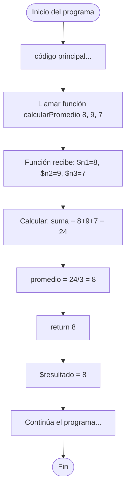

🏠 [← README](../../../README.md) · ⬅️ [← Clase 16](../clase%2016/resumen.md) · Clase 17 · [Clase 18 →](../clase%2018/resumen.md) ➡️ · 🧪 [Ejercicios](ejercicios.md)

---

# Clase 17 — Funciones en PHP

**Fecha:** 22-abril-2026  
**Materia:** Bases de datos relacionales

---

# 🎯 Objetivo de la sesión

Aprender a crear y usar funciones en PHP. Las funciones son bloques de código reutilizable que reciben parámetros y devuelven resultados. Son la base de la programación modular y serán fundamentales cuando conecten a MySQL.

---

# 🧠 Parte 1: Funciones en PHP

## ¿Qué es una función?

Una **función** es un bloque de código que realiza una tarea específica, se puede reutilizar múltiples veces. Sigue el principio **DRY (Don't Repeat Yourself)**: en lugar de escribir el mismo código varias veces, lo escribes una sola vez dentro de una función.

**Analogía:** una función es como una receta de cocina:
- Le das ingredientes (parámetros)
- La receta hace el proceso
- Te devuelve un platillo (return)

## Declaración de funciones

```php
<?php

function nombre($param1, $param2) {
    // código de la función
    return $resultado;
}
```

- **function:** palabra clave
- **nombre:** identificador (sin espacios, camelCase o snake_case)
- **($param1, $param2):** parámetros (puede haber 0 o más)
- **return:** devuelve un valor al que llamó la función

## Llamada de funciones

```php
<?php

function saludar($nombre) {
    return "Hola, " . $nombre;
}

// Llamar la función
$mensaje = saludar("Ana");
echo $mensaje . "\n";  // Hola, Ana
```

## 🔴 Diferencia crítica: return vs echo

Muchos estudiantes cometen este error. Veamos:

```php
<?php

// ❌ Función que hace echo — NO retorna nada utilizable
function sumarMal($a, $b) {
    echo $a + $b;  // Solo imprime, no retorna
}

// Llamada:
$resultado = sumarMal(3, 5);  // $resultado = null (vacío)
echo "El resultado es: " . $resultado . "\n";  // El resultado es:
// No funciona porque no hay nada retornado

// ✅ Función que retorna — el resultado se puede usar
function sumar($a, $b) {
    return $a + $b;  // Retorna para que el que llama decida qué hacer
}

// Llamada:
$resultado = sumar(3, 5);  // $resultado = 8
echo "El resultado es: " . $resultado . "\n";  // El resultado es: 8
```

**Regla de oro:**
- Usa `return` cuando quieras que el resultado se use en el programa
- Usa `echo` cuando quieras mostrar algo directamente al usuario

## Parámetros con valor por defecto

```php
<?php

function saludar($nombre, $saludo = "Hola") {
    return $saludo . ", " . $nombre . "!";
}

echo saludar("Ana");                      // Hola, Ana!
echo saludar("Luis", "Buenos días");      // Buenos días, Luis!
echo saludar("María", "Buenas noches");   // Buenas noches, María!
```

Si no pasas el segundo parámetro, usa "Hola" automáticamente.

## Scope: Variables locales y globales

Las variables dentro de una función son **locales** (no existen afuera):

```php
<?php

$x = 10;  // variable global

function ejemplo() {
    $x = 99;  // Esta NO es la misma variable $x de arriba
    echo $x . "\n";  // 99 (la local)
}

ejemplo();
echo $x . "\n";  // 10 (la global, no cambió)
```

**Importante:** No puedes acceder directamente a variables globales dentro de una función sin usar `global` (pero eso lo veremos después).

## Diagrama de flujo: Llamada y retorno



## Ejemplo integrador: Funciones + switch (Calculadora)

```php
<?php

function sumar($a, $b) {
    return $a + $b;
}

function restar($a, $b) {
    return $a - $b;
}

function multiplicar($a, $b) {
    return $a * $b;
}

function dividir($a, $b) {
    if ($b == 0) {
        return "Error: división entre cero";
    }
    return $a / $b;
}

// Programa principal
echo "--- Calculadora ---\n";
echo "Número 1: ";
$n1 = (float) readline();

echo "Número 2: ";
$n2 = (float) readline();

echo "Operación (1=sumar, 2=restar, 3=multiplicar, 4=dividir): ";
$op = readline();

switch ($op) {
    case "1":
        echo "Resultado: " . sumar($n1, $n2) . "\n";
        break;
    case "2":
        echo "Resultado: " . restar($n1, $n2) . "\n";
        break;
    case "3":
        echo "Resultado: " . multiplicar($n1, $n2) . "\n";
        break;
    case "4":
        echo "Resultado: " . dividir($n1, $n2) . "\n";
        break;
    default:
        echo "Opción no válida\n";
}
```

**Ventajas:**
- Cada operación está en su propia función
- Fácil de entender y mantener
- Reutilizable en otros programas
- Cuando conectes MySQL, cada CRUD será una función así

## Ejemplo 2: Función con validación

```php
<?php

function esNumeroPar($numero) {
    return $numero % 2 == 0;  // retorna true o false
}

echo "Ingresa un número: ";
$num = (int) readline();

if (esNumeroPar($num)) {
    echo "Es par\n";
} else {
    echo "Es impar\n";
}
```

---

# 📌 Conclusión

- Una **función** es un bloque de código reutilizable que recibe parámetros y devuelve un resultado.
- Usa `return` para devolver valores, NO `echo` (a menos que quieras solo mostrar).
- Las variables dentro de funciones son locales.
- En semanas posteriores, cuando conectes a MySQL con `mysqli`, cada operación (INSERT, SELECT, UPDATE, DELETE) será una función.
- La calculadora de hoy es un preludio a una aplicación profesional con funciones.

Las funciones son los bloques constructivos de cualquier programa profesional. ¡Dominalas desde ahora!


---

🏠 [← README](../../../README.md) · ⬅️ [← Clase 16](../clase%2016/resumen.md) · Clase 17 · [Clase 18 →](../clase%2018/resumen.md) ➡️ · 🧪 [Ejercicios](ejercicios.md)
