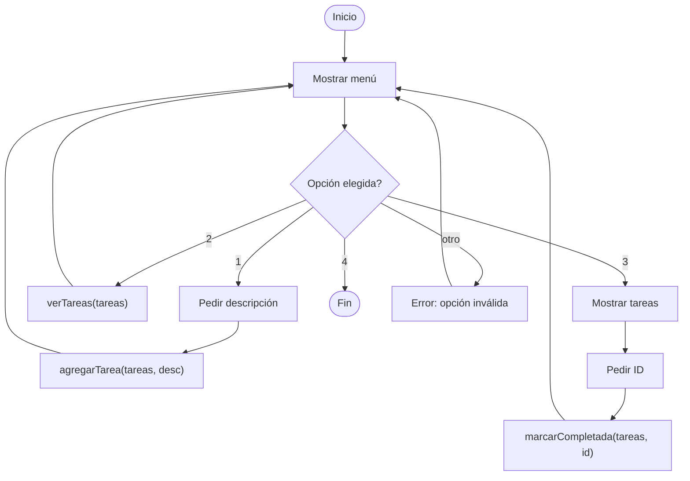

🏠 [← README](../../../README.md) · ⬅️ [← Clase 18](../clase%2018/resumen.md) · Clase 19 · [Clase 20 →](../clase%2020/resumen.md) ➡️ · 🧪 [Ejercicios](ejercicios.md)

---

# Clase 19 — Mini-app integradora PHP (sin base de datos)

**Fecha:** 27-abril-2026  
**Materia:** Bases de datos relacionales  
**Tipo:** 🧪 LAB integrador

---

# 🎯 Objetivo de la sesión

Integrar switch/case, funciones y arrays asociativos en una aplicación CLI completa que funciona en memoria. Esta app es el puente exacto antes de conectar a MySQL: los datos que hoy manejas en arrays, pronto vendrán de la base de datos.

---

# 🧠 Fundamentos de la app

Construiremos una **lista de tareas** interactiva en PHP con menú principal, donde el usuario puede agregar, listar, marcar como completada y salir. Los datos viven en un array de arrays asociativos — exactamente el formato que MySQL devolverá.

---

# 📌 Estructura de datos

Cada tarea es un array asociativo con tres campos:

```php
<?php

$tareas = [];  // Comienza vacío

// Una tarea se ve así:
$tarea_ejemplo = [
    'id'         => 1,
    'descripcion' => 'Estudiar SQL',
    'completada' => false
];

// Varios registros en un array:
$tareas = [
    ['id' => 1, 'descripcion' => 'Estudiar SQL', 'completada' => false],
    ['id' => 2, 'descripcion' => 'Hacer tarea PHP', 'completada' => true],
    ['id' => 3, 'descripcion' => 'Leer clase 20', 'completada' => false],
];
```

Este es el **mismo formato** que `mysqli_fetch_assoc()` devolverá de MySQL.

---

# 🔧 Funciones de la app

## 1. agregarTarea()

Toma el array por **referencia** (`&$tareas`), lo que permite que la función modifique el array original. Sin `&`, solo modificaría una copia local.

```php
<?php

function agregarTarea(&$tareas, $descripcion) {
    // Calcular el siguiente ID (número más alto + 1)
    $max_id = 0;
    for ($i = 0; $i < count($tareas); $i++) {
        $tarea = $tareas[$i];
        if ($tarea['id'] > $max_id) {
            $max_id = $tarea['id'];
        }
    }
    $nuevo_id = $max_id + 1;

    // Crear la tarea
    $tarea_nueva = [
        'id'         => $nuevo_id,
        'descripcion' => $descripcion,
        'completada' => false
    ];

    // Agregar al array (modifica el original por la referencia &)
    $tareas[] = $tarea_nueva;
    echo "✓ Tarea agregada con ID: $nuevo_id\n";
}
```

**¿Qué es el `&`?** El ampersand hace que la función reciba una **referencia** al array, no una copia. Así, cambios dentro de la función afectan el array original. Sin `&`, solo modificaría una copia local.

## 2. verTareas()

Recibe el array (sin modificarlo, así que no necesita `&`) y lo imprime formateado:

```php
<?php

function verTareas($tareas) {
    if (count($tareas) == 0) {
        echo "No hay tareas.\n";
        return;
    }

    echo "\n--- TAREAS ---\n";
    for ($i = 0; $i < count($tareas); $i++) {
        $tarea = $tareas[$i];
        $estado = $tarea['completada'] ? '✓' : '○';
        echo "[$estado] ID {$tarea['id']}: {$tarea['descripcion']}\n";
    }
    echo "\n";
}
```

## 3. marcarCompletada()

Busca una tarea por ID y marca como completada (requiere referencia):

```php
<?php

function marcarCompletada(&$tareas, $id) {
    for ($i = 0; $i < count($tareas); $i++) {
        if ($tareas[$i]['id'] == $id) {
            $tareas[$i]['completada'] = true;
            echo "✓ Tarea $id marcada como completada.\n";
            return;
        }
    }
    echo "✗ Tarea con ID $id no encontrada.\n";
}
```

---

# 💻 Código completo de la app

```php
<?php

// ============ FUNCIONES ============

function agregarTarea(&$tareas, $descripcion) {
    $max_id = 0;
    for ($i = 0; $i < count($tareas); $i++) {
        $tarea = $tareas[$i];
        if ($tarea['id'] > $max_id) {
            $max_id = $tarea['id'];
        }
    }
    $nuevo_id = $max_id + 1;

    $tarea_nueva = [
        'id'         => $nuevo_id,
        'descripcion' => $descripcion,
        'completada' => false
    ];

    $tareas[] = $tarea_nueva;
    echo "✓ Tarea agregada con ID: $nuevo_id\n";
}

function verTareas($tareas) {
    if (count($tareas) == 0) {
        echo "No hay tareas.\n";
        return;
    }

    echo "\n--- TAREAS ---\n";
    for ($i = 0; $i < count($tareas); $i++) {
        $tarea = $tareas[$i];
        $estado = $tarea['completada'] ? '✓' : '○';
        echo "[$estado] ID {$tarea['id']}: {$tarea['descripcion']}\n";
    }
    echo "\n";
}

function marcarCompletada(&$tareas, $id) {
    for ($i = 0; $i < count($tareas); $i++) {
        if ($tareas[$i]['id'] == $id) {
            $tareas[$i]['completada'] = true;
            echo "✓ Tarea $id marcada como completada.\n";
            return;
        }
    }
    echo "✗ Tarea con ID $id no encontrada.\n";
}

// ============ PROGRAMA PRINCIPAL ============

$tareas = [];

while (true) {
    echo "\n=== GESTOR DE TAREAS ===\n";
    echo "1. Agregar tarea\n";
    echo "2. Ver tareas\n";
    echo "3. Marcar como completada\n";
    echo "4. Salir\n";
    echo "Elige opción: ";

    $opcion = trim(readline());

    switch ($opcion) {
        case "1":
            echo "Descripción de la tarea: ";
            $desc = trim(readline());
            agregarTarea($tareas, $desc);
            break;

        case "2":
            verTareas($tareas);
            break;

        case "3":
            verTareas($tareas);
            echo "ID de la tarea a marcar como completada: ";
            $id = (int) readline();
            marcarCompletada($tareas, $id);
            break;

        case "4":
            echo "¡Hasta luego!\n";
            exit;

        default:
            echo "Opción no válida.\n";
    }
}
```

**Para ejecutar:**
```bash
php app.php
```

---

# 🔗 Conexión con MySQL

> **Dato crítico:** El array de arrays asociativos que ves aquí es **exactamente** lo que devolverá MySQL cuando hagas una consulta SELECT.
>
> Hoy trabajas con datos duros en memoria (`$tareas = []`). En próximas clases:
> ```php
> // En lugar de datos duros, estos vendrán de MySQL
> $resultado = mysqli_query($conexion, "SELECT * FROM tareas");
> $tareas = [];
> while ($fila = mysqli_fetch_assoc($resultado)) {
>     $tareas[] = $fila;  // Cada fila ES un array asociativo
> }
> ```
>
> **El cambio es mínimo:** solo cambias dónde vienen los datos. Las funciones, el menú y la lógica permanecen igual.

---

# 🎯 Diagrama de flujo del menú principal



---

# 📌 Conclusión

Hoy construiste tu **primera aplicación completa**. Todo lo que aprendiste hasta ahora converge aquí:

- **Variables y tipos de datos** → los campos de cada tarea
- **Arrays y for** → almacenar y recorrer tareas
- **Switch/case** → menú de opciones
- **Funciones** → modularidad y reutilización
- **Referencias (`&`)** → pasar datos que pueden cambiar

En próximas clases, conectarás esta app a MySQL reemplazando el array inicial con datos de la base de datos. **La aplicación no cambiará; los datos cambiarán de origen.**

Este es el patrón que seguirán todas tus apps web: entrada → procesamiento → almacenamiento/lectura → salida.

---

🏠 [← README](../../../README.md) · ⬅️ [← Clase 18](../clase%2018/resumen.md) · Clase 19 · [Clase 20 →](../clase%2020/resumen.md) ➡️ · 🧪 [Ejercicios](ejercicios.md)
