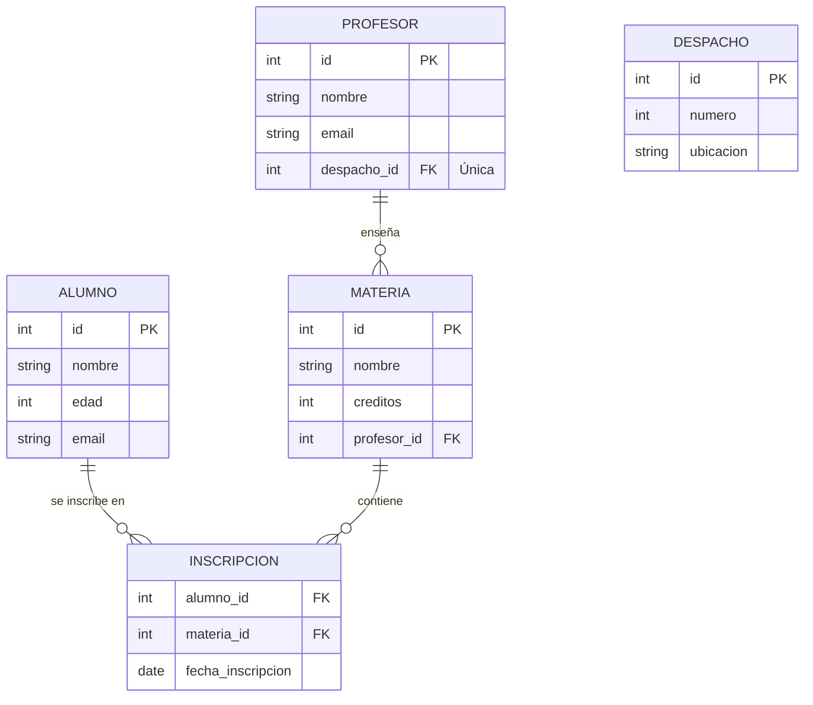

🏠 [← README](../../../README.md) · ⬅️ [← Clase 19](../clase%2019/resumen.md) · Clase 20 · [Clase 21 →](../clase%2021/resumen.md) ➡️

---

# Clase 20 — Modelo Entidad-Relación y tipos de datos MySQL

**Fecha:** 28-abril-2026 (aprox.)
**Materia:** Bases de datos relacionales
**Tipo:** 📚 Teoría

---

# 🎯 Objetivo de la sesión

Aprender a diseñar una base de datos **antes** de crearla. El modelo Entidad-Relación (E-R) es el "plano" de tu BD: define qué entidades (tablas) existen, qué atributos (columnas) tienen, y cómo se relacionan.

Sin un buen diseño, tendrás una BD desorganizada, lenta e inmantenible.

---

# 🧠 Parte 1: ¿Qué es un modelo Entidad-Relación (E-R)?

## Conceptos básicos

Un modelo E-R describe la estructura de una base de datos usando tres conceptos clave:

| Concepto | Definición | Ejemplo |
|----------|-----------|---------|
| **Entidad** | Un objeto o concepto del mundo real que se representa como una tabla. | `alumnos`, `materias`, `profesores` |
| **Atributo** | Una propiedad o característica de una entidad. Se representa como una columna en la tabla. | `nombre`, `edad`, `email` de un alumno |
| **Relación** | Una asociación entre dos o más entidades. Define cómo se conectan. | Un alumno **se inscribe en** una materia |

## Ejemplo simple: Escuela

```
ENTIDAD: alumnos
├─ Atributos: id, nombre, edad, email

ENTIDAD: materias
├─ Atributos: id, nombre, creditos, profesor

RELACIÓN: alumnos "se inscriben en" materias
```

---

# 🗄️ Parte 2: Cardinalidad de relaciones

La **cardinalidad** describe cuántos registros de una entidad se relacionan con cuántos registros de otra.

## Tipos de cardinalidad

### 1:1 (Uno a Uno)

Un registro en la tabla A se relaciona con **exactamente uno** en la tabla B.

**Ejemplo:** Cada profesor tiene un despacho, y cada despacho pertenece a un profesor.

```
PROFESOR (id, nombre)  ─── 1:1 ─── DESPACHO (id, numero, ubicacion)
```

En SQL:
```sql
CREATE TABLE profesor (
    id INT PRIMARY KEY,
    nombre VARCHAR(100),
    despacho_id INT UNIQUE,
    FOREIGN KEY (despacho_id) REFERENCES despacho(id)
);
```

**UNIQUE** asegura que cada despacho tenga como máximo un profesor.

### 1:N (Uno a Muchos)

Un registro en la tabla A se relaciona con **muchos** registros en la tabla B.

**Ejemplo:** Un profesor enseña muchas materias, pero cada materia es enseñada por un profesor.

```
PROFESOR (id, nombre)  ─── 1:N ─── MATERIA (id, nombre, profesor_id)
```

En SQL:
```sql
CREATE TABLE profesor (
    id INT PRIMARY KEY,
    nombre VARCHAR(100)
);

CREATE TABLE materia (
    id INT PRIMARY KEY,
    nombre VARCHAR(100),
    profesor_id INT,
    FOREIGN KEY (profesor_id) REFERENCES profesor(id)
);
```

### N:M (Muchos a Muchos)

Muchos registros en la tabla A se relacionan con muchos registros en la tabla B.

**Ejemplo:** Muchos alumnos se inscriben en muchas materias, y cada materia tiene muchos alumnos.

```
ALUMNO (id, nombre)  ─── N:M ─── MATERIA (id, nombre)
```

Para representar N:M en SQL, necesitas una **tabla intermedia** (tabla de unión):

```sql
CREATE TABLE alumno (
    id INT PRIMARY KEY,
    nombre VARCHAR(100)
);

CREATE TABLE materia (
    id INT PRIMARY KEY,
    nombre VARCHAR(100)
);

-- Tabla intermedia: representa la relación N:M
CREATE TABLE inscripcion (
    alumno_id INT,
    materia_id INT,
    fecha_inscripcion DATE,
    PRIMARY KEY (alumno_id, materia_id),
    FOREIGN KEY (alumno_id) REFERENCES alumno(id),
    FOREIGN KEY (materia_id) REFERENCES materia(id)
);
```

---

# 🔑 Parte 3: Llaves primaria y foránea

## Llave Primaria (Primary Key)

Identifica **de forma única** cada registro en una tabla. No pueden haber dos registros con la misma llave primaria.

**Características:**
- Única para cada registro
- No puede ser NULL
- Generalmente es un número (INT AUTO_INCREMENT)

```sql
CREATE TABLE alumno (
    id INT PRIMARY KEY AUTO_INCREMENT,
    nombre VARCHAR(100)
);
```

## Llave Foránea (Foreign Key)

Establece una relación entre dos tablas. La FK de la tabla hijo apunta a la PK de la tabla padre.

```sql
CREATE TABLE materia (
    id INT PRIMARY KEY AUTO_INCREMENT,
    nombre VARCHAR(100),
    profesor_id INT,
    FOREIGN KEY (profesor_id) REFERENCES profesor(id)
);
```

**¿Qué hace?**
- Asegura **integridad referencial**: no puedes insertar un `profesor_id` que no existe en la tabla `profesor`
- Si eliminas un profesor, la BD te avisa o auto-elimina sus materias (según la regla de cascada)

---

# 📊 Parte 4: Tipos de datos en MySQL

Elegir el tipo correcto de dato es crítico para rendimiento y almacenamiento.

## Números

| Tipo | Rango | Uso |
|------|-------|-----|
| `INT` | -2.1 mil millones a +2.1 mil millones | Enteros: IDs, edades, cantidades |
| `BIGINT` | Hasta 9 quintillones | Números muy grandes (ej: timestamps) |
| `FLOAT` | 6-7 decimales | Números con decimales (ej: precios aproximados) — menos preciso |
| `DECIMAL(10,2)` | Precisión exacta | Dinero, cálculos financieros — exacto |
| `BOOLEAN` | 0 o 1 | Flags de verdadero/falso |

**Ejemplo:**
```sql
CREATE TABLE producto (
    id INT PRIMARY KEY,
    precio DECIMAL(10, 2),  -- Exacto para dinero
    stock INT,              -- Entero
    activo BOOLEAN          -- 0 o 1
);
```

## Texto

| Tipo | Tamaño | Uso |
|------|--------|-----|
| `VARCHAR(n)` | Hasta n caracteres | Strings de longitud variable (nombres, emails, direcciones) |
| `CHAR(n)` | Exactamente n caracteres | Strings fijos (códigos de país "MX", talla de ropa "M") |
| `TEXT` | Hasta 65 KB | Textos largos (descripciones, comentarios, biografías) |
| `LONGTEXT` | Hasta 4 GB | Textos muy largos (documentos completos) |

**Ejemplo:**
```sql
CREATE TABLE alumno (
    id INT PRIMARY KEY,
    nombre VARCHAR(100),           -- Nombres de longitud variable
    email VARCHAR(100),            -- Emails
    estado_civil CHAR(1),          -- S, C, D, V
    biografia TEXT                 -- Texto largo
);
```

## Fechas y hora

| Tipo | Formato | Uso |
|------|---------|-----|
| `DATE` | YYYY-MM-DD | Fechas (nacimiento, fecha de registro) |
| `TIME` | HH:MM:SS | Horas (hora de cita) |
| `DATETIME` | YYYY-MM-DD HH:MM:SS | Fecha y hora completa |
| `TIMESTAMP` | Similar a DATETIME | Auto-registra la fecha/hora actual |

**Ejemplo:**
```sql
CREATE TABLE cita (
    id INT PRIMARY KEY,
    fecha DATE,                   -- 2026-04-27
    hora TIME,                    -- 14:30:00
    fecha_creacion TIMESTAMP      -- Auto-actualiza al insertar
);
```

---

# 🧩 Parte 5: Normalización básica (conceptual)

La **normalización** es el proceso de organizar datos para evitar redundancia y anomalías. Las principales formas normales son:

## Primera Forma Normal (1FN)

**Regla:** No hay grupos repetidos de datos en una columna.

❌ **Mal (no normalizado):**
```
tabla estudiante:
  id | nombre      | calificaciones
  1  | Ana         | 9.5, 8.7, 9.2
  2  | Luis        | 7.2, 8.1, 6.9
```

Aquí `calificaciones` es un grupo repetido (múltiples valores en una celda).

✅ **Bien (1FN):**
```
tabla estudiante:
  id | nombre
  1  | Ana
  2  | Luis

tabla examen:
  id | estudiante_id | calificacion
  1  | 1             | 9.5
  2  | 1             | 8.7
  3  | 1             | 9.2
  4  | 2             | 7.2
```

Cada celda contiene un único valor atómico.

## Segunda Forma Normal (2FN)

**Regla:** No hay dependencias parciales. Todo atributo depende de la llave primaria completa.

❌ **Mal (no normalizado):**
```
tabla venta:
  id | producto_id | producto_nombre | cantidad | precio_unitario
  1  | 10          | Laptop          | 2        | 15000
  2  | 10          | Laptop          | 1        | 15000
```

El `producto_nombre` no depende de la venta; depende solo de `producto_id`.

✅ **Bien (2FN):**
```
tabla producto:
  id | nombre
  10 | Laptop

tabla venta:
  id | producto_id | cantidad | precio_unitario
  1  | 10          | 2        | 15000
  2  | 10          | 1        | 15000
```

Ahora cada tabla tiene una responsabilidad clara.

---

# 🎯 Diagrama E-R de ejemplo: Escuela



---

# 📝 Actividad en clase

**Objetivo:** Diseñar el modelo E-R de la BD de tu proyecto en equipo.

**Pasos:**
1. **Identifica las entidades principales** — ¿Cuáles son los objetos del sistema? (ej: usuarios, productos, pedidos)
2. **Identifica los atributos** — ¿Qué datos tiene cada entidad? (ej: usuario tiene nombre, email, teléfono)
3. **Identifica las relaciones** — ¿Cómo se conectan? (ej: usuario hace pedidos, pedido contiene productos)
4. **Determina la cardinalidad** — ¿Es 1:1, 1:N, o N:M?
5. **Dibuja el diagrama** (en papel, pizarrón, o con una herramienta como Lucidchart)

**Ejemplo de resultado esperado:**
```
USUARIO (1:N)─── PEDIDO (N:M)─── PRODUCTO
  ├─ id           ├─ id
  ├─ nombre       ├─ usuario_id
  ├─ email        └─ fecha_pedido
  └─ telefono

  DETALLE_PEDIDO
  ├─ pedido_id (FK → PEDIDO)
  ├─ producto_id (FK → PRODUCTO)
  └─ cantidad
```

---

# 📌 Conclusión

El modelo E-R es **el plano de tu BD.** Antes de crear una sola tabla, debes saber:

- ¿Qué entidades existen?
- ¿Qué atributos tienen?
- ¿Cómo se relacionan?
- ¿Cuál es la cardinalidad?

Una BD bien diseñada es:
- **Eficiente:** consultas rápidas
- **Mantenible:** fácil de entender y modificar
- **Segura:** integridad referencial con FK
- **Escalable:** crece sin problemas

En próximas clases, convertirás este diseño en sentencias SQL CREATE TABLE con PRIMARY KEY, FOREIGN KEY, y tipos de datos correctos.

---

🏠 [← README](../../../README.md) · ⬅️ [← Clase 19](../clase%2019/resumen.md) · Clase 20 · [Clase 21 →](../clase%2021/resumen.md) ➡️
