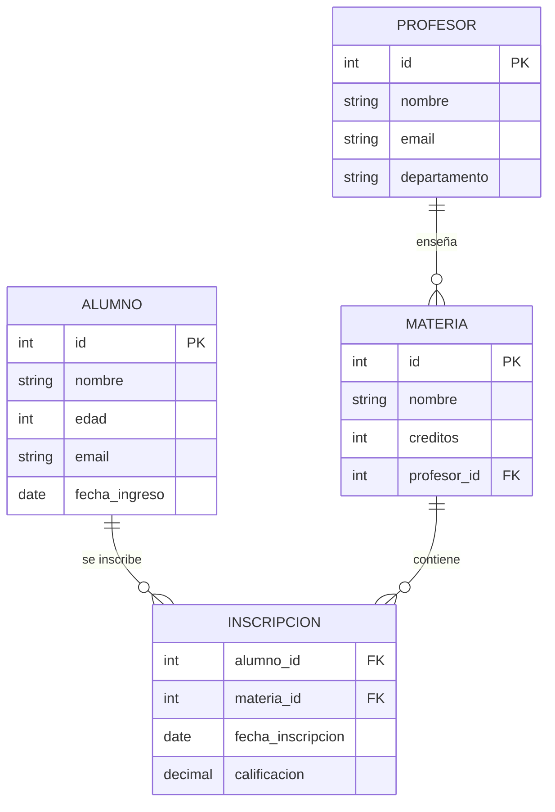

🏠 [← README](../../../README.md) · ⬅️ [← Clase 20](../clase%2020/resumen.md) · Clase 21 · [Clase 22 →](../clase%2022/resumen.md) ➡️ · 🧪 [Ejercicios](ejercicios.md)

---

# Clase 21 — DDL en MySQL: CREATE TABLE y constraints

**Fecha:** 29-abril-2026 (aprox.)  
**Materia:** Bases de datos relacionales  
**Tipo:** 📚 Teoría + 🧪 LAB

---

# 🎯 Objetivo de la sesión

Aprender a crear bases de datos y tablas en MySQL usando DDL (Data Definition Language). Escribirás las sentencias SQL que transforman el diseño E-R en tablas reales con restricciones (constraints) que aseguran la integridad de los datos.

---

# 🧠 Parte 1: Conexión a MySQL desde consola

## Iniciar MySQL

```bash
# En Linux/Mac
mysql -u root -p
# Te pedirá contraseña

# En Windows
mysql.exe -u root -p
```

Una vez conectado, ves el prompt:
```
mysql>
```

## Comandos básicos

```sql
-- Ver todas las BD existentes
SHOW DATABASES;

-- Ver la BD actual
SELECT DATABASE();

-- Listar todas las tablas de la BD actual
SHOW TABLES;

-- Ver la estructura de una tabla
DESCRIBE tabla_nombre;

-- Salir de MySQL
EXIT;
```

---

# 🗄️ Parte 2: CREATE DATABASE y USE

## Crear una base de datos

```sql
CREATE DATABASE nombre_bd;
```

**Ejemplo:**
```sql
CREATE DATABASE escuela;
```

Una vez creada, debes **seleccionarla** para trabajar en ella:

```sql
USE escuela;
```

Confirmación:
```sql
SELECT DATABASE();
-- Devuelve: escuela
```

---

# 📋 Parte 3: CREATE TABLE con constraints

## Sintaxis básica

```sql
CREATE TABLE nombre_tabla (
    columna1 TIPO constraint1 constraint2,
    columna2 TIPO constraint,
    ...
    PRIMARY KEY (columna1)
);
```

## Constraints principales

| Constraint | Descripción |
|-----------|-------------|
| `PRIMARY KEY` | Identifica de forma única cada registro. No puede ser NULL. |
| `AUTO_INCREMENT` | El valor se incrementa automáticamente (solo con INT o BIGINT). |
| `NOT NULL` | La columna debe tener un valor (no puede estar vacía). |
| `UNIQUE` | No pueden haber dos registros con el mismo valor. |
| `DEFAULT valor` | Si no se proporciona un valor, usa este por defecto. |
| `FOREIGN KEY` | Referencia a otra tabla (relación). |

## Ejemplo 1: Tabla simple (ALUMNO)

```sql
CREATE TABLE alumno (
    id INT PRIMARY KEY AUTO_INCREMENT,
    nombre VARCHAR(100) NOT NULL,
    edad INT,
    email VARCHAR(100) UNIQUE
);
```

**Explicación:**
- `id INT PRIMARY KEY AUTO_INCREMENT` — Identificador único, se incrementa automáticamente
- `nombre VARCHAR(100) NOT NULL` — Texto de hasta 100 caracteres, obligatorio
- `edad INT` — Número entero, opcional
- `email VARCHAR(100) UNIQUE` — Texto único (dos alumnos no pueden tener el mismo email)

## Ejemplo 2: Tabla con FOREIGN KEY (MATERIA)

```sql
CREATE TABLE materia (
    id INT PRIMARY KEY AUTO_INCREMENT,
    nombre VARCHAR(100) NOT NULL,
    creditos INT DEFAULT 3,
    profesor_id INT NOT NULL,
    FOREIGN KEY (profesor_id) REFERENCES profesor(id)
);
```

**Explicación:**
- `creditos INT DEFAULT 3` — Si no se especifica, usa 3
- `FOREIGN KEY (profesor_id) REFERENCES profesor(id)` — La columna `profesor_id` debe apuntar a un ID existente en la tabla `profesor`

## Ejemplo 3: Tabla con relación N:M (INSCRIPCION)

Para representar una relación N:M entre ALUMNO y MATERIA:

```sql
CREATE TABLE inscripcion (
    alumno_id INT NOT NULL,
    materia_id INT NOT NULL,
    fecha_inscripcion DATE,
    PRIMARY KEY (alumno_id, materia_id),  -- Llave compuesta
    FOREIGN KEY (alumno_id) REFERENCES alumno(id),
    FOREIGN KEY (materia_id) REFERENCES materia(id)
);
```

**Explicación:**
- `PRIMARY KEY (alumno_id, materia_id)` — La combinación de ambas columnas es única
- Dos FK apuntando a las dos tablas relacionadas

---

# 🔍 Parte 4: DESCRIBE — Ver la estructura de una tabla

Después de crear una tabla, puedes ver su estructura con:

```sql
DESCRIBE alumno;
```

Salida:
```
Field       | Type         | Null | Key | Default | Extra
------------|--------------|------|-----|---------|------
id          | int          | NO   | PRI | NULL    | auto_increment
nombre      | varchar(100) | NO   |     | NULL    |
edad        | int          | YES  |     | NULL    |
email       | varchar(100) | YES  | UNI | NULL    |
```

- **Field:** nombre de la columna
- **Type:** tipo de dato
- **Null:** ¿puede ser NULL?
- **Key:** PRI (Primary Key), UNI (Unique), FK (Foreign Key)
- **Default:** valor por defecto
- **Extra:** información adicional (AUTO_INCREMENT)

---

# ⚠️ Parte 5: DROP TABLE y DROP DATABASE

**¡CUIDADO!** Estas sentencias son **irreversibles.**

```sql
-- Eliminar una tabla (y todos sus datos)
DROP TABLE alumno;

-- Eliminar una BD (y todas sus tablas y datos)
DROP DATABASE escuela;
```

**Buena práctica:** Verificar que realmente quieres eliminar:

```sql
-- Ver si la tabla existe antes de eliminarla
DROP TABLE IF EXISTS alumno;

-- Ver si la BD existe antes de eliminarla
DROP DATABASE IF EXISTS escuela;
```

---

# 🎯 Ejemplo completo: Base de datos escuela

Aquí está el DDL completo para crear la BD escuela con sus tablas:

```sql
-- Crear la BD
CREATE DATABASE IF NOT EXISTS escuela;
USE escuela;

-- Tabla PROFESOR
CREATE TABLE profesor (
    id INT PRIMARY KEY AUTO_INCREMENT,
    nombre VARCHAR(100) NOT NULL,
    email VARCHAR(100) UNIQUE,
    departamento VARCHAR(50)
);

-- Tabla MATERIA (con FK a PROFESOR)
CREATE TABLE materia (
    id INT PRIMARY KEY AUTO_INCREMENT,
    nombre VARCHAR(100) NOT NULL,
    creditos INT DEFAULT 3,
    profesor_id INT NOT NULL,
    FOREIGN KEY (profesor_id) REFERENCES profesor(id)
);

-- Tabla ALUMNO
CREATE TABLE alumno (
    id INT PRIMARY KEY AUTO_INCREMENT,
    nombre VARCHAR(100) NOT NULL,
    edad INT,
    email VARCHAR(100) UNIQUE,
    fecha_ingreso DATE
);

-- Tabla INSCRIPCION (relación N:M entre ALUMNO y MATERIA)
CREATE TABLE inscripcion (
    alumno_id INT NOT NULL,
    materia_id INT NOT NULL,
    fecha_inscripcion DATE,
    calificacion DECIMAL(3, 1),
    PRIMARY KEY (alumno_id, materia_id),
    FOREIGN KEY (alumno_id) REFERENCES alumno(id),
    FOREIGN KEY (materia_id) REFERENCES materia(id)
);

-- Ver la estructura de cada tabla
DESCRIBE profesor;
DESCRIBE materia;
DESCRIBE alumno;
DESCRIBE inscripcion;
```

---

# 🎯 Diagrama de la BD escuela



---

# 💡 Buenas prácticas

1. **Siempre usa PRIMARY KEY** — Cada tabla debe tener un identificador único
2. **AUTO_INCREMENT para IDs** — Dejas que MySQL los genere automáticamente
3. **NOT NULL solo donde sea necesario** — No todas las columnas son obligatorias
4. **UNIQUE para campos únicos** — Email, username, número de documento
5. **FOREIGN KEY para relaciones** — Asegura integridad referencial
6. **Nombres descriptivos** — `profesor_id`, no `p_id`
7. **Documentar el modelo** — El diagrama E-R es tu referencia

---

# 📌 Conclusión

El DDL te permite **crear la estructura** de la BD. Con CREATE TABLE defines:

- **Columnas** y sus tipos de datos
- **Restricciones** (PK, FK, UNIQUE, NOT NULL)
- **Relaciones** entre tablas

Una vez creada la BD, en próximas clases usarás **DML** (INSERT, SELECT, UPDATE, DELETE) para manipular los datos dentro de esas tablas.

El DDL es el **esquema**; el DML es el **contenido.**

---

🏠 [← README](../../../README.md) · ⬅️ [← Clase 20](../clase%2020/resumen.md) · Clase 21 · [Clase 22 →](../clase%2022/resumen.md) ➡️ · 🧪 [Ejercicios](ejercicios.md)
