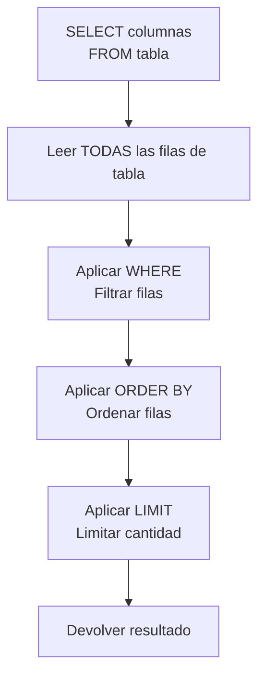

🏠 [← README](../../../README.md) · ⬅️ [← Clase 21](../clase%2021/resumen.md) · Clase 22 · [Clase 23 →](../clase%2023/resumen.md) ➡️ · 🧪 [Ejercicios](ejercicios.md)

---

# Clase 22 — DML en MySQL: INSERT, SELECT con filtros

**Fecha:** 6-mayo-2026 (aprox., May 1 y May 5 son suspensiones)  
**Materia:** Bases de datos relacionales  
**Tipo:** 📚 Teoría + 🧪 LAB

---

# 🎯 Objetivo de la sesión

Aprender a manipular datos en MySQL usando DML (Data Manipulation Language). Hoy escribirás sentencias INSERT para agregar datos y SELECT con filtros (WHERE, ORDER BY, LIMIT) para recuperar información específica de la BD.

---

# 🧠 Parte 1: INSERT — Agregar datos

## Insertar un registro

```sql
INSERT INTO nombre_tabla (columna1, columna2, columna3)
VALUES (valor1, valor2, valor3);
```

**Ejemplo:**
```sql
INSERT INTO profesor (nombre, email, departamento)
VALUES ('Dr. Carlos', 'carlos@escuela.edu', 'Matemáticas');
```

Si la tabla tiene `AUTO_INCREMENT` en el ID, **no necesitas especificar el ID:**

```sql
-- El ID se genera automáticamente
INSERT INTO profesor (nombre, email, departamento)
VALUES ('Dra. María', 'maria@escuela.edu', 'Física');
```

## Insertar múltiples registros en una sentencia

```sql
INSERT INTO profesor (nombre, email, departamento)
VALUES
    ('Dr. Carlos', 'carlos@escuela.edu', 'Matemáticas'),
    ('Dra. María', 'maria@escuela.edu', 'Física'),
    ('Prof. Juan', 'juan@escuela.edu', 'Química');
```

Esto es más eficiente que hacer 3 INSERT separados.

## Insertar con datos NULL

Si una columna permite NULL (no tiene NOT NULL), puedes dejarla vacía:

```sql
INSERT INTO profesor (nombre, email, departamento)
VALUES ('Prof. Ana', NULL, 'Literatura');
-- Email queda NULL
```

O omitir la columna:

```sql
INSERT INTO profesor (nombre, departamento)
VALUES ('Prof. Luis', 'Inglés');
-- Email queda NULL
```

---

# 🔍 Parte 2: SELECT — Recuperar datos

## SELECT básico: traer todo

```sql
SELECT * FROM profesor;
```

Devuelve todas las filas y columnas de la tabla `profesor`.

## SELECT con columnas específicas

```sql
SELECT nombre, email FROM profesor;
```

Devuelve solo las columnas `nombre` e `email`.

## SELECT con alias (renombar columnas)

```sql
SELECT nombre AS "Nombre del Profesor", email AS "Correo"
FROM profesor;
```

En la salida, las columnas se llaman "Nombre del Profesor" y "Correo".

---

# 🔎 Parte 3: WHERE — Filtrar datos

El `WHERE` limita qué filas se devuelven.

## Operadores de comparación

| Operador | Significado |
|----------|-------------|
| `=` | Igual a |
| `!=` o `<>` | No igual a |
| `>` | Mayor que |
| `<` | Menor que |
| `>=` | Mayor o igual |
| `<=` | Menor o igual |
| `LIKE` | Coincidencia parcial (patrones) |
| `IN` | Dentro de una lista |
| `BETWEEN` | Dentro de un rango |

## Ejemplos básicos

```sql
-- Traer el profesor con nombre exacto
SELECT * FROM profesor
WHERE nombre = 'Dr. Carlos';

-- Traer profesores que NO son de Matemáticas
SELECT * FROM profesor
WHERE departamento != 'Matemáticas';

-- Traer profesores cuyo nombre empieza con 'Dr'
SELECT * FROM profesor
WHERE nombre LIKE 'Dr%';
```

Explicación de `LIKE`:
- `'Dr%'` — comienza con "Dr" seguido de cualquier cosa
- `'%aría'` — termina con "aría"
- `'%Car%'` — contiene "Car" en cualquier posición

## WHERE con IN

```sql
-- Traer profesores de Matemáticas O Física O Química
SELECT * FROM profesor
WHERE departamento IN ('Matemáticas', 'Física', 'Química');
```

Equivalente a:
```sql
WHERE departamento = 'Matemáticas'
   OR departamento = 'Física'
   OR departamento = 'Química';
```

Pero `IN` es más legible.

## WHERE con AND / OR

```sql
-- Profesores de Matemáticas que tengan email
SELECT * FROM profesor
WHERE departamento = 'Matemáticas'
  AND email IS NOT NULL;

-- Profesores de Inglés O Matemáticas
SELECT * FROM profesor
WHERE departamento = 'Inglés'
   OR departamento = 'Matemáticas';
```

---

# 📊 Parte 4: ORDER BY — Ordenar resultados

```sql
-- Ordenar por nombre alfabéticamente (ascendente)
SELECT * FROM profesor
ORDER BY nombre ASC;

-- Ordenar por nombre descendente (Z a A)
SELECT * FROM profesor
ORDER BY nombre DESC;
```

También puedes ordenar por múltiples columnas:

```sql
-- Ordenar por departamento (ASC por defecto), luego por nombre
SELECT * FROM profesor
ORDER BY departamento, nombre;
```

---

# 🔢 Parte 5: LIMIT — Limitar cantidad de registros

```sql
-- Traer solo los primeros 5 registros
SELECT * FROM profesor
LIMIT 5;

-- Traer 5 registros a partir del tercero (offset 2)
SELECT * FROM profesor
LIMIT 5 OFFSET 2;
-- O la sintaxis más corta:
LIMIT 2, 5;  -- Salta 2, toma 5
```

---

# 🔗 Parte 6: Combinar SELECT con WHERE, ORDER BY, LIMIT

Es común combinar estas cláusulas en una sola sentencia:

```sql
-- Traer los 3 primeros profesores de Matemáticas, ordenados por nombre
SELECT nombre, email FROM profesor
WHERE departamento = 'Matemáticas'
ORDER BY nombre ASC
LIMIT 3;
```

**Orden de cláusulas (IMPORTANTE):**
1. `SELECT` (qué columnas)
2. `FROM` (de qué tabla)
3. `WHERE` (filtro)
4. `ORDER BY` (orden)
5. `LIMIT` (cantidad)

Si cambias el orden, obtendrás un error.

---

# 💻 Ejemplo práctico: Queries sobre la BD escuela

```sql
-- 1. Ver todos los profesores
SELECT * FROM profesor;

-- 2. Ver solo nombres y emails
SELECT nombre, email FROM profesor;

-- 3. Profesores del departamento de Matemáticas
SELECT * FROM profesor
WHERE departamento = 'Matemáticas';

-- 4. Profesores cuyo nombre contiene 'Dr'
SELECT * FROM profesor
WHERE nombre LIKE 'Dr%';

-- 5. Profesores de Matemáticas O Física, ordenados por nombre
SELECT * FROM profesor
WHERE departamento IN ('Matemáticas', 'Física')
ORDER BY nombre ASC;

-- 6. Los 2 primeros profesores de la tabla
SELECT nombre, departamento FROM profesor
LIMIT 2;

-- 7. Contar cuántos profesores hay
SELECT COUNT(*) FROM profesor;

-- 8. Ver profesores ordenados por departamento
SELECT departamento, nombre, email FROM profesor
ORDER BY departamento, nombre;
```

---

# 🎯 Diagrama de flujo: Ejecución de SELECT



---

# ⚠️ Notas importantes

**Sobre NULL:**
```sql
-- ❌ INCORRECTO: WHERE email = NULL (no funciona)
SELECT * FROM profesor
WHERE email = NULL;  -- NUNCA devuelve resultados

-- ✅ CORRECTO: usar IS NULL
SELECT * FROM profesor
WHERE email IS NULL;

-- ✅ CORRECTO: traer profesores SIN NULL
SELECT * FROM profesor
WHERE email IS NOT NULL;
```

**Sobre tipos de datos:**
```sql
-- VARCHAR se compara como texto (case-insensitive en algunos BD)
SELECT * FROM profesor
WHERE nombre = 'Dr. Carlos';

-- INT se compara numéricamente
SELECT * FROM materia
WHERE creditos = 3;

-- DATE se compara como fecha
SELECT * FROM inscripcion
WHERE fecha_inscripcion > '2026-01-01';
```

---

# 📌 Conclusión

Con SELECT y WHERE ya puedes hacer consultas poderosas:

- **INSERT** agrega datos a la BD
- **SELECT \*** trae todo
- **SELECT columnas** trae columnas específicas
- **WHERE** filtra por condiciones
- **ORDER BY** ordena resultados
- **LIMIT** limita la cantidad

Estas son las operaciones más comunes. En próximas clases usarás UPDATE (para modificar) y DELETE (para eliminar).

---

🏠 [← README](../../../README.md) · ⬅️ [← Clase 21](../clase%2021/resumen.md) · Clase 22 · [Clase 23 →](../clase%2023/resumen.md) ➡️ · 🧪 [Ejercicios](ejercicios.md)
