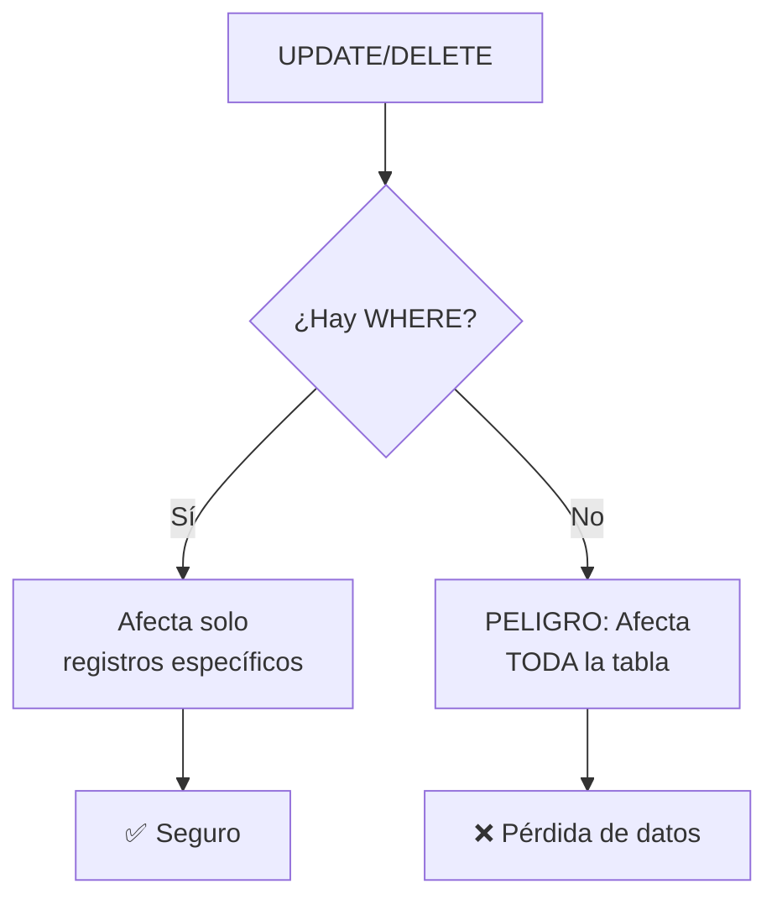

🏠 [← README](../../../README.md) · ⬅️ [← Clase 22](../clase%2022/resumen.md) · Clase 23 · [Clase 24 →](../clase%2024/resumen.md) ➡️ · 🧪 [Ejercicios](ejercicios.md)

---

# Clase 23 — UPDATE, DELETE y diseño de la BD del proyecto

**Fecha:** 7-mayo-2026 (aprox.)  
**Materia:** Bases de datos relacionales  
**Tipo:** 📚 Teoría + 🧪 LAB

---

# 🎯 Objetivo de la sesión

Completar las operaciones DML (Data Manipulation Language) aprendiendo a modificar y eliminar datos. También diseñarás la BD real de tu proyecto en equipo: qué tablas necesitas, qué relaciones tienen, y cómo almacenarás los datos.

---

# 🧠 Parte 1: UPDATE — Modificar datos

## Sintaxis básica

```sql
UPDATE nombre_tabla
SET columna1 = valor1, columna2 = valor2
WHERE condición;
```

**CRÍTICO:** Siempre usa `WHERE`. Sin `WHERE`, actualizas TODA la tabla.

## Ejemplos

```sql
-- Cambiar el departamento de un profesor específico
UPDATE profesor
SET departamento = 'Filosofía'
WHERE nombre = 'Dr. Carlos';

-- Cambiar múltiples campos
UPDATE profesor
SET departamento = 'Sistemas', email = 'nuevo@escuela.edu'
WHERE id = 1;

-- Cambiar datos basado en otra columna
UPDATE materia
SET creditos = creditos + 1
WHERE departamento = 'Matemáticas';
```

## ⚠️ Advertencia crítica: UPDATE sin WHERE

```sql
-- ❌ PELIGROSO: Cambia TODOS los profesores
UPDATE profesor
SET departamento = 'Desconocido';
-- Todas las filas ahora tienen departamento = 'Desconocido'

-- ✅ SEGURO: Cambia solo uno
UPDATE profesor
SET departamento = 'Desconocido'
WHERE id = 5;
```

---

# 🗑️ Parte 2: DELETE — Eliminar datos

## Sintaxis básica

```sql
DELETE FROM nombre_tabla
WHERE condición;
```

**CRÍTICO:** Siempre usa `WHERE`. Sin `WHERE`, eliminas TODA la tabla.

## Ejemplos

```sql
-- Eliminar un profesor específico
DELETE FROM profesor
WHERE id = 5;

-- Eliminar todos los profesores de un departamento
DELETE FROM profesor
WHERE departamento = 'Literatura';

-- Verificar cuántos registros serán eliminados
SELECT COUNT(*) FROM profesor
WHERE departamento = 'Literatura';
-- Luego hacer el DELETE
```

## ⚠️ Advertencia crítica: DELETE sin WHERE

```sql
-- ❌ PELIGROSO: Elimina TODOS los profesores
DELETE FROM profesor;
-- La tabla profesor queda vacía

-- ✅ SEGURO: Elimina solo uno
DELETE FROM profesor
WHERE id = 3;
```

## DELETE con FOREIGN KEY

Si la tabla hija tiene FK que referencian la tabla padre, debes tener cuidado:

```sql
-- Intenta eliminar un profesor que tiene materias
DELETE FROM profesor WHERE id = 1;
-- Resultado: ERROR (integridad referencial violada)

-- Opciones:
-- 1. Eliminar primero las materias del profesor
DELETE FROM materia WHERE profesor_id = 1;
DELETE FROM profesor WHERE id = 1;

-- 2. O configurar la FK con ON DELETE CASCADE (al crear la tabla)
-- CREATE TABLE materia (
--     ...
--     FOREIGN KEY (profesor_id) REFERENCES profesor(id) ON DELETE CASCADE
-- );
```

---

# 🔄 Parte 3: Transacciones básicas

Una **transacción** es un grupo de operaciones que se ejecutan "todo o nada". Si algo falla, se revierte todo.

## Sintaxis

```sql
START TRANSACTION;
-- Operaciones aquí
COMMIT;           -- Guardar cambios
-- O si quieres revertir:
ROLLBACK;         -- Deshacer cambios
```

## Ejemplo

```sql
START TRANSACTION;

UPDATE profesor SET salario = salario + 1000 WHERE id = 1;
UPDATE profesor SET salario = salario - 1000 WHERE id = 2;

-- Si ambas operaciones son exitosas:
COMMIT;

-- Si algo falló, revertir:
ROLLBACK;
```

**Nota:** Para esta clase, las transacciones son conceptuales. No profundizaremos en ACID (Atomicity, Consistency, Isolation, Durability).

---

# 📊 Diagrama del riesgo: UPDATE/DELETE



---

# 🎯 Parte 4: Diseño de la BD del proyecto en equipo

Ahora es momento de pensar en la BD real que usará tu proyecto. No es la escuela de las clases anteriores; es **TU proyecto**.

## Pasos

1. **Identifica las entidades principales**
   - ¿Qué son los objetos centrales del sistema?
   - Ejemplos: Usuarios, Productos, Pedidos, Comentarios

2. **Define los atributos de cada entidad**
   - ¿Qué información necesitas de cada objeto?
   - Ejemplo: Usuario → id, nombre, email, teléfono, fecha_registro

3. **Identifica las relaciones**
   - ¿Cómo se conectan las entidades?
   - Ejemplo: 1 Usuario hace N Pedidos

4. **Determina la cardinalidad**
   - ¿Es 1:1, 1:N, o N:M?

5. **Dibuja el diagrama E-R**
   - En papel, pizarrón, o herramienta online

6. **Escribe el DDL**
   - Crea las tablas con sus columnas, tipos, constraints, y FK

## Ejemplo: Sistema de blog

```
ENTIDAD: Usuario
├─ id (PK)
├─ nombre
├─ email
├─ fecha_registro

ENTIDAD: Artículo
├─ id (PK)
├─ titulo
├─ contenido
├─ usuario_id (FK → Usuario)
├─ fecha_creacion

ENTIDAD: Comentario
├─ id (PK)
├─ contenido
├─ articulo_id (FK → Artículo)
├─ usuario_id (FK → Usuario)
├─ fecha_comentario

RELACIONES:
- 1 Usuario escribe N Artículos (1:N)
- 1 Artículo tiene N Comentarios (1:N)
- 1 Usuario escribe N Comentarios (1:N)
```

**DDL resultante:**

```sql
CREATE DATABASE IF NOT EXISTS blog;
USE blog;

CREATE TABLE usuario (
    id INT AUTO_INCREMENT PRIMARY KEY,
    nombre VARCHAR(100) NOT NULL,
    email VARCHAR(100) UNIQUE NOT NULL,
    fecha_registro DATETIME DEFAULT CURRENT_TIMESTAMP
);

CREATE TABLE articulo (
    id INT AUTO_INCREMENT PRIMARY KEY,
    titulo VARCHAR(200) NOT NULL,
    contenido TEXT NOT NULL,
    usuario_id INT NOT NULL,
    fecha_creacion DATETIME DEFAULT CURRENT_TIMESTAMP,
    FOREIGN KEY (usuario_id) REFERENCES usuario(id)
);

CREATE TABLE comentario (
    id INT AUTO_INCREMENT PRIMARY KEY,
    contenido TEXT NOT NULL,
    articulo_id INT NOT NULL,
    usuario_id INT NOT NULL,
    fecha_comentario DATETIME DEFAULT CURRENT_TIMESTAMP,
    FOREIGN KEY (articulo_id) REFERENCES articulo(id),
    FOREIGN KEY (usuario_id) REFERENCES usuario(id)
);
```

---

# 💻 Actividad de clase: Diseña tu proyecto

En equipo:

1. Elige el dominio del proyecto (ej: tienda online, red social, gestor de tareas)
2. Identifica 2-3 entidades principales
3. Define sus atributos
4. Dibuja el diagrama E-R en papel
5. Escribe el DDL (CREATE TABLE)
6. Guarda el DDL para usar en próximas clases

**Ejemplo de resultado esperado:**

```
Proyecto: Sistema de tienda online

USUARIO (1:N)→ PEDIDO (N:M)→ PRODUCTO
   ├─ id          ├─ id         ├─ id
   ├─ nombre      ├─ usuario_id ├─ nombre
   ├─ email       ├─ fecha      ├─ precio
   └─ teléfono    └─ total      └─ stock

DETALLE_PEDIDO
   ├─ pedido_id (FK)
   ├─ producto_id (FK)
   ├─ cantidad
   └─ precio_unitario
```

---

# 📌 Conclusión

**DML completo:**
- **INSERT:** agrega datos
- **SELECT:** recupera datos (con filtros)
- **UPDATE:** modifica datos (¡siempre con WHERE!)
- **DELETE:** elimina datos (¡siempre con WHERE!)

**Combinados:**
- INSERT llena la BD
- SELECT la consulta
- UPDATE y DELETE la mantienen actualizada

Ahora tienes todo para crear y manipular bases de datos. En próximas clases conectarás esto a PHP o Node.js para hacer aplicaciones web.

**El proyecto de equipo empieza aquí.** Cada miembro debe entender el modelo E-R. Será la base de toda la aplicación.

---

🏠 [← README](../../../README.md) · ⬅️ [← Clase 22](../clase%2022/resumen.md) · Clase 23 · [Clase 24 →](../clase%2024/resumen.md) ➡️ · 🧪 [Ejercicios](ejercicios.md)
